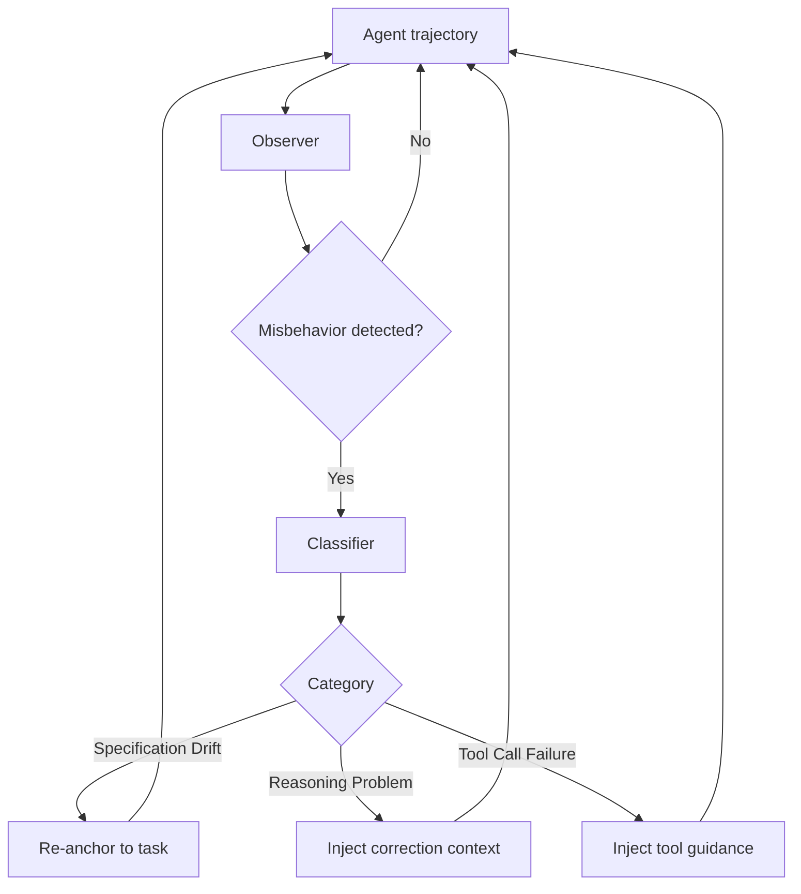

# Wink: Classifying and Auto-Correcting Coding Agent Misbehaviors

> An async trajectory-observer system that classifies misbehaviors into three categories and injects targeted course-corrections.

## Misbehavior Rate in Production Trajectories

Production coding agent trajectories misbehave at a rate that makes manual intervention unscalable. Analysis of 10,000+ real trajectories ([arXiv:2602.17037](https://arxiv.org/abs/2602.17037)) shows ~30% contain at least one misbehavior — normal production behavior, not a tail event.

## Three Misbehavior Categories

Wink classifies misbehaviors into three mutually exclusive categories:

**Specification Drift** — the trajectory diverges from the stated goal. Common causes: ambiguous instructions, long-horizon context dilution, or the agent reprioritizing based on intermediate findings.

**Reasoning Problems** — internal logic fails. Examples: circular reasoning loops, incorrect inferences from tool outputs, and wrong assumptions about codebase state. The agent applies instructions incorrectly rather than ignoring them.

**Tool Call Failures** — incorrect tool invocations: wrong arguments, non-existent file paths, malformed API calls, or tool sequences that violate execution preconditions.

Each category requires a distinct correction strategy. A generic nudge applied to all three degrades performance; classification enables category-specific corrections.

## Async Intervention Architecture

The observer runs asynchronously — it watches the trajectory without blocking execution. On a detected misbehavior signal, it classifies the event and injects a targeted course-correction into the agent's next inference call. The agent continues without a full restart.

Unlike synchronous guardrails that block execution, async intervention preserves trajectory continuity and accumulated context while redirecting the agent.

## Results

From the Wink A/B test on production traffic ([arXiv:2602.17037](https://arxiv.org/abs/2602.17037)):

- **90% resolution rate** for misbehaviors that require a single intervention
- **5.3% reduction in tokens per session** — the agent reaches correct behavior faster without wasted execution
- **4.2% reduction in engineer interventions per session** — most misbehaviors resolve without human involvement

The 10% requiring multiple interventions or human escalation are typically novel failure modes outside the classifier's training distribution.

## Implementation Signals

Three observable signals trigger the observer:

1. **Repetition patterns** — the agent calls the same tool with identical or near-identical arguments three or more consecutive times without progress ([arXiv:2602.17037](https://arxiv.org/abs/2602.17037))
2. **Contradiction signals** — the agent's stated reasoning contradicts a tool output it received in the same session
3. **Precondition violations** — a tool call references a resource (file path, API endpoint, variable) that does not exist or has not yet been created

These signals are detectable from the tool call log and conversation history without access to model internals. Training-time approaches such as Agent-R ([arXiv:2501.11425](https://arxiv.org/abs/2501.11425)) teach agents to self-reflect and recover internally; trajectory observation is the runtime complement when the model will not self-correct.

## Deployment Implication

At a 30% baseline misbehavior rate, a production agent without an observer silently degrades on roughly a third of runs. The minimum viable observer:

- Records each tool call and its arguments
- Detects repetition patterns (same tool + args appearing 3+ times without a successful result)
- Detects precondition violations (e.g., file read before file creation in the same session)
- Injects a single corrective message when triggered; escalates to human on repeated failure

## Why It Works

Category-specific corrections target the actual failure mode rather than issuing a generic nudge. The Wink taxonomy was constructed bottom-up from 10,000+ production trajectories and developer feedback — each category maps to a distinct correction strategy. A Specification Drift correction re-anchors the agent to the original task; a Tool Call Failure correction changes the retrieval or invocation strategy; a Reasoning Problem correction supplies the missing inference step. Applying the wrong correction type (e.g., re-anchoring an agent with a tool invocation error) adds context noise without addressing the root cause.

## When This Backfires

Async injection does not guarantee recovery. The Wink A/B test ([arXiv:2602.17037](https://arxiv.org/abs/2602.17037)) documents these non-recovery patterns:

- **Agent ignores the correction** (37% of non-recovered sessions) — the injected message is processed but the trajectory continues unchanged, often because the correction arrives too late or conflicts with strong prior context.
- **Premature termination** (22%) — the agent exits early, treating the correction as a signal that the task is unresolvable.
- **Mechanical failures** (19%) — IDE, tool, or environment errors prevent the correction from taking effect.
- **Novel failure modes** — out-of-distribution events get misclassified and receive the wrong correction type.
- **Classification latency** — the observer adds an inference step; for short-running agents this overhead can exceed the recovery benefit.

The figures above come from Meta's internal VSCode agent traffic and may not transfer to other platforms or models without re-calibration.

## Example

**Trigger**: Repetition pattern — the agent calls `read_file` on `src/utils.py` three consecutive turns with no write, move, or delete in between. The observer detects the repeated call with identical arguments and no intervening progress signal.

**Classification**: Tool Call Failure — the agent is stuck in a retrieval loop, not drifting from its goal or reasoning incorrectly.

**Injected correction message** (inserted into the next inference call as a system turn):

> You have read `src/utils.py` three times without acting on its contents. If the file does not contain what you need, state what is missing and proceed to a different approach. Do not read the same file again until you have taken an intermediate action.

**Outcome**: On the next turn, the agent identifies that the function it is looking for is in `src/helpers.py` (which it has not yet read) and proceeds there. No human intervention required.

This illustrates the category-specific correction value: a generic "you seem stuck" nudge would not prompt the agent to look elsewhere; the tool-call-specific correction directs it to change its retrieval strategy.

## Key Takeaways

- 30% of production coding agent trajectories contain misbehaviors — trajectory observation is not optional
- Three categories (Specification Drift, Reasoning Problems, Tool Call Failures) require distinct correction strategies
- Async intervention preserves trajectory continuity; synchronous blocking does not
- 90% of single-intervention misbehaviors resolve without engineer involvement
- Observable signals (repetition, contradiction, precondition violations) detect misbehaviors without model-internal access

## Related

- [Circuit Breakers for Agent Loops](../observability/circuit-breakers.md)
- [Loop Detection](../observability/loop-detection.md)
- [Context-Injected Error Recovery](../context-engineering/context-injected-error-recovery.md)
- [Steering Running Agents](steering-running-agents.md)
- [Agent Loop Middleware](agent-loop-middleware.md)
- [Agent Self-Review Loop](agent-self-review-loop.md)
- [Convergence Detection](convergence-detection.md)
- [The Ralph Wiggum Loop](ralph-wiggum-loop.md)
