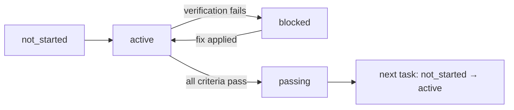

# WIP=1 and Little's Law: Kanban Throughput Theory for Agent Task Design

> Cap an agent's active task count at one until verification passes. Little's Law turns the resulting cycle time into a quantitative property of the harness, not a vibes choice.

## The Queueing Identity

Little's Law states that in any stable queueing system, the average number of items in the system equals the average arrival rate multiplied by the average time each item spends in the system: `L = λ × W`. The result was [proved in full generality by John Little in 1961](https://www.jstor.org/stable/167570) and holds regardless of arrival distribution or service discipline.

Map the variables to an agent's task stream:

| Variable | Meaning for an agent harness |
|----------|-------------------------------|
| `L` | Average number of tasks in `active` or `blocked` state |
| `λ` | Rate at which new tasks enter the active state |
| `W` | Average cycle time per task — start to verified completion |

The harness controls `L` directly through a work-in-progress (WIP) cap. With `λ` set by the user, lowering `L` forces `W` down. The empirical lever — the number you tune — is the WIP limit.

## The WIP=1 Rule

WIP limits come from Kanban, where they exist to expose flow problems and shorten lead time. For a single coding agent, the safest default is `WIP=1`: at most one task may be in `active` state. A new task cannot enter `active` until the current one's status flips to `passing` against its acceptance criteria — the contract from [Feature List Files](../instructions/feature-list-files.md).

Anthropic's harness team reports the same rule from production agent work: "the next iteration of the coding agent was then asked to work on only one feature at a time. This incremental approach turned out to be critical" ([Effective harnesses for long-running agents](https://www.anthropic.com/engineering/effective-harnesses-for-long-running-agents)). The failure mode it prevents — "the agent tended to try to do too much at once—essentially to attempt to one-shot the app" — is the same overreach Little's Law predicts when L grows.

## The State Machine



`active` has cardinality exactly one. `blocked` does not free the slot — a blocked task still holds the WIP=1 token. Only `passing` releases it. This is what makes the rule load-bearing: the agent cannot satisfy `passing` by gesturing at code that looks done; the [backpressure signal](agent-backpressure.md) has to flip green.

## Verified Completion Rate as the Throughput Metric

The metric that proves the harness works is not features-started but verified completion rate (VCR) — features passing end-to-end verification per unit time. The walkinglabs course documents a case study where WIP=1 raised completion from 37.5% to 87.5% across an 8-feature build with *less total code* ([learn-harness-engineering lecture 07](https://github.com/walkinglabs/learn-harness-engineering/blob/main/docs/en/lectures/lecture-07-why-agents-overreach-and-under-finish/index.md)). The course also reports a counter-intuitive empirical claim worth tracking on your own runs: lines-of-code generated correlates weakly *negatively* with feature-completion rate. Track VCR, not LOC.

## When This Backfires

- **Tightly bounded micro-tasks.** Renaming twelve helper functions in lockstep does not benefit from twelve serial verification cycles. Per-task overhead dominates per-task work. Batch the edit; verify once.
- **Cross-cutting refactors.** Changing a public API signature legitimately touches many files in one logical change. Forcing per-file verification leaves intermediate states that do not compile.
- **No verification oracle.** If `passing` collapses to "looks reasonable," WIP=1 still applies but its gating mechanism evaporates. Add a real oracle (test, schema, runbook step) before relying on the rule.
- **Orchestrator-level parallelism.** WIP=1 applies *within* a single verified-completion stream. Multi-agent systems running in parallel ([Anthropic's multi-agent research system](https://www.anthropic.com/engineering/multi-agent-research-system)) deliberately fan out; each sub-agent's *own* stream still runs WIP=1.

## Example

A REST API build with eight features under WIP=1 enforcement in `CLAUDE.md`:

```markdown
## Work Rules
- One feature is in `active` state at any time.
- A feature moves to `passing` only when its verification command exits 0.
- Do not start the next feature until the current one is `passing`.
- Do not "also refactor" a second feature while implementing the first.
```

The agent reads `features.json`, picks `feat-1: user registration`, implements it, runs `curl -X POST /api/register ... | jq .status == 201`, and only on a clean exit moves `feat-1` to `passing` and `feat-2` to `active`. Across the 8-feature run, 7 reach `passing` ([course case study](https://github.com/walkinglabs/learn-harness-engineering/blob/main/docs/en/lectures/lecture-07-why-agents-overreach-and-under-finish/index.md)) — with markedly less total code than the unconstrained run that left 5 of 8 half-built.

## Key Takeaways

- Little's Law (`L = λ × W`) gives a quantitative reason for capping agent WIP: lowering L forces cycle time down.
- WIP=1 is the safe default for a single coding agent — `active` cardinality of exactly one, gated on verified completion.
- `blocked` keeps the WIP slot held; only `passing` releases it. That is what makes the [backpressure](agent-backpressure.md) signal load-bearing.
- Track Verified Completion Rate, not lines-of-code or features-started.
- Parallelism belongs at the orchestrator level across sub-agents; each sub-agent's stream still runs WIP=1.

## Related

- [Feature List Files](../instructions/feature-list-files.md) — the JSON contract whose `status` field is the WIP=1 state machine
- [Agent Backpressure: Automated Feedback for Self-Correction](agent-backpressure.md) — what `passing` means in practice
- [Coding Agent Scope Expansion](coding-agent-scope-expansion.md) — when scope crosses domain boundaries, separate streams each run WIP=1
- [Pre-Completion Checklists](../verification/pre-completion-checklists.md) — verification commands that gate the `passing` transition
- [Frozen Spec File](../instructions/frozen-spec-file.md) — keep the WIP=1 contract surviving compaction
- [Long-Running Agents](long-running-agents.md) — multi-session harness where WIP=1 pays off most
