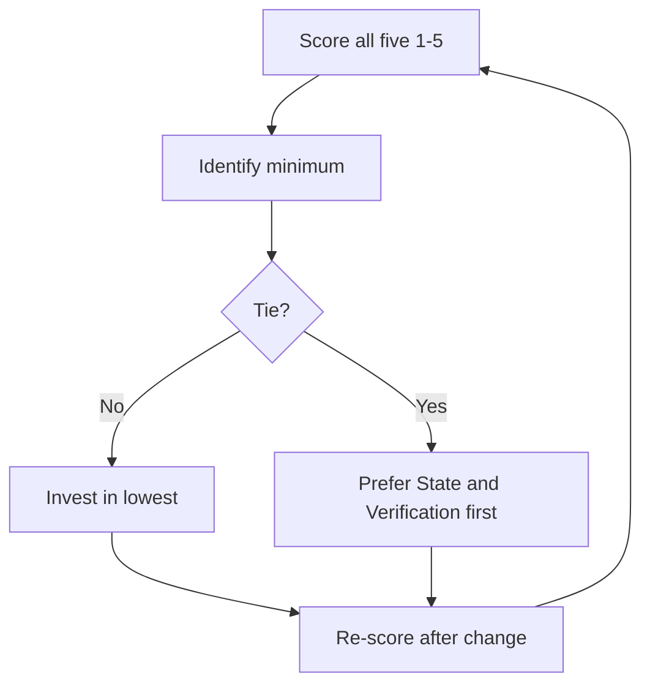

# Five-Subsystem Harness Assessment

> Score an existing harness 1–5 on each of five subsystems to identify the load-bearing bottleneck. No other subsystem upgrade compensates for the lowest-scored one.

The five-subsystem rubric is a one-minute triage on a harness you already have. It is the fast diagnostic that runs *before* the deeper [`assess-agent-readiness`](assess-agent-readiness.md) ladder — different axis, different output, same goal of finding the next investment.

## The Five Subsystems

Each subsystem is one chunk of the harness. The source rubric in [walkinglabs/learn-harness-engineering](https://github.com/walkinglabs/learn-harness-engineering/blob/main/skills/harness-creator/SKILL.md) maps them to the artifact a reader can actually point at:

| Subsystem | What it is | Artifacts to point at |
|-----------|------------|-----------------------|
| **Instructions** | What the agent reads before coding | `AGENTS.md`, `CLAUDE.md`, `docs/` hierarchy |
| **State** | What persists across sessions | `feature_list.json`, `progress.md`, `session-handoff.md` |
| **Verification** | Proof of completion the agent cannot fake | Test suite, linter, type checker, end-to-end checks |
| **Scope** | Task boundary discipline | One-feature-at-a-time policies, explicit definition of done |
| **Lifecycle** | Session start and end rituals | `init.sh`, clean-state checklists, handoff procedures |

The same five components appear without that explicit naming in Anthropic's [Effective Harnesses for Long-Running Agents](https://www.anthropic.com/engineering/effective-harnesses-for-long-running-agents): an initializer agent sets up `init.sh` and `claude-progress.txt` (Lifecycle + State), a JSON feature list with per-feature pass/fail flags drives Scope and Verification, and an `AGENTS.md`-style instruction surface drives Instructions. Two independent sources land on the same decomposition.

## The 1–5 Rubric

The source applies one calibrated scale across all five subsystems ([walkinglabs](https://github.com/walkinglabs/learn-harness-engineering/blob/main/skills/harness-creator/SKILL.md)):

| Score | Anchor |
|------:|--------|
| 5 | Exemplary, documented, consistently followed |
| 4 | Good, mostly complete, occasional gaps |
| 3 | Adequate, covers basics, missing polish |
| 2 | Weak, incomplete, inconsistently applied |
| 1 | Missing or actively harmful |

Apply the strictest matching anchor — a subsystem with one severe gap scores 2, not 3, regardless of how polished the rest is.

## Bottleneck-First Investment

The diagnostic value of the rubric is the ordering rule: *"Identify the lowest-scoring subsystem — that's the bottleneck. Focus improvement efforts there first."* ([walkinglabs](https://github.com/walkinglabs/learn-harness-engineering/blob/main/skills/harness-creator/SKILL.md)).

Subsystem contributions are roughly multiplicative. An agent with a 5-star Instructions surface but a 1-star State subsystem still loses its work each session — the State multiplier is near zero. This matches the aggregate rule in [`assess-agent-readiness`](assess-agent-readiness.md): readiness is the *minimum across dimensions*, not the average. Upgrading anything but the lowest subsystem leaves the ceiling where it was.

When two subsystems tie at the floor, prefer State and Verification first — they unblock multi-session work and prevent premature completion, which gates every other improvement.

## Where the Framework Falls Short

The rubric is a triage tool, not a substitute for the deeper audits. Two gaps to flag:

- **No Security axis.** A repo scoring 5/5/5/5/5 can still leak credentials, miss a lethal-trifecta closure, or run with no permission allowlist. Always pair the rubric with [`audit-secrets-in-context`](audit-secrets-in-context.md) and [`audit-lethal-trifecta`](audit-lethal-trifecta.md) — these run as halt-on-finding gates regardless of subsystem scores.
- **Greenfield repos read 1/1/1/1/1.** The rule "invest in the lowest" gives no ordering when everything is the lowest. Switch to [`assess-agent-readiness`](assess-agent-readiness.md) for greenfield — its L0–L5 ladder weights Security first and produces a prioritized runbook punch list.

The rubric also collapses Scope and Lifecycle for single-script tools or prototypes, the same archetype-edge case noted in [Harness Design Dimensions](../agent-design/harness-design-dimensions.md).

## Example

A team scores their harness:

| Subsystem | Score | Evidence |
|-----------|------:|----------|
| Instructions | 4 | `AGENTS.md` exists, pointer-map, ≤100 lines, audit-clean |
| State | 1 | No progress file; agents lose context across sessions |
| Verification | 3 | Tests + lint in CI; no eval suite; no pre-completion checklist |
| Scope | 3 | Issue-per-feature convention, but no enforced definition of done |
| Lifecycle | 2 | `init.sh` exists; no handoff template; cleanup ad-hoc |

The minimum is State at 1. The bottleneck rule names the next investment unambiguously: write a `progress.md` template, wire a `SessionStart` hook to surface the prior session's state, and re-score. Investing in Instructions (already at 4) or Verification (mid-range) would leave session continuity broken and the agent would still lose work, regardless.

## Key Takeaways

- The five subsystems — Instructions, State, Verification, Scope, Lifecycle — name what to score independently
- Use the verbatim 1–5 anchors so scoring is calibrated rather than vibes
- The lowest-scored subsystem is the next investment target; other upgrades cannot compensate
- The rubric omits Security — always pair with the secrets and lethal-trifecta audits
- For greenfield repos or after the rubric identifies the bottleneck, switch to [`assess-agent-readiness`](assess-agent-readiness.md) for runbook-level prioritization

## Related

- [Assess Agent Readiness](assess-agent-readiness.md)
- [Harness Engineering](../agent-design/harness-engineering.md)
- [Harness Design Dimensions and Archetypes](../agent-design/harness-design-dimensions.md)
- [Audit Secrets in Context](audit-secrets-in-context.md)
- [Audit Lethal Trifecta](audit-lethal-trifecta.md)
