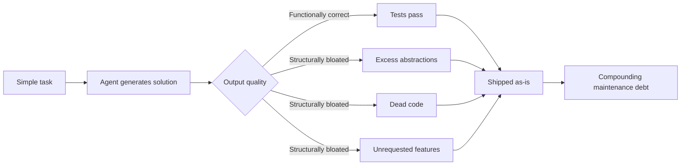

# Abstraction Bloat

> Agents optimize for comprehensive-looking output, not minimal viable implementation. The result is structurally over-engineered code that passes tests but creates maintenance burden through unnecessary class hierarchies, dead code, and unrequested features.

## What It Looks Like

You ask for a notification service. The agent delivers one — plus a rate limiter, an analytics hook, a webhook system, and an abstract factory. None were requested. Together they triple the surface area you maintain.

This is not a prompting failure. It is a training incentive: agents are optimized to look comprehensive, so they produce code that appears thorough rather than sized for the task.

## Measurable Impact

| Metric | Finding | Source |
|--------|---------|--------|
| Lines of code | 76% increase in agent-assisted repos | [Agile Pain Relief](https://agilepainrelief.com/blog/ai-generated-code-quality-problems/) |
| Cognitive complexity | 39% rise | [Agile Pain Relief](https://agilepainrelief.com/blog/ai-generated-code-quality-problems/) |
| Code duplication | 8x spike in duplicated blocks (2021-2024) | [Mason, AI Coding Agents 2026](https://mikemason.ca/writing/ai-coding-agents-jan-2026/) |
| Readability issues | 3x more in AI-generated code | [Stack Overflow / CodeRabbit](https://stackoverflow.blog/2026/01/28/are-bugs-and-incidents-inevitable-with-ai-coding-agents/) |
| Refactoring share | Dropped from 25% to under 10% | [Mason](https://mikemason.ca/writing/ai-coding-agents-jan-2026/) |

## How It Manifests



**Excessive scaffolding** — [1,000 lines where 100 suffice](https://addyo.substack.com/p/the-80-problem-in-agentic-coding). Class hierarchies where a function would do. Abstract base classes for single implementations.

**Dead code accumulation** — Agents regenerate rather than reuse, leaving orphans. Refactoring drops because each task is greenfield.

**Unrequested features** — A [Fowler/Garg case study](https://martinfowler.com/articles/reduce-friction-ai/design-first-collaboration.html) records a notification request returning rate limiting, analytics, and webhooks unprompted.

**Comment saturation** — Inline comments restating the obvious.

## Mitigations

### Explicit simplicity directives

Add to your agent instructions:

```
Write the minimum code that satisfies the requirement.
Prefer functions over classes. Prefer flat over nested.
Do not add features, abstractions, or error handling beyond what is specified.
```

### Design-first collaboration

[Fowler/Garg's five-level design approval](https://martinfowler.com/articles/reduce-friction-ai/design-first-collaboration.html) gates implementation behind sign-off — no code until the approach is agreed. Catches unrequested features before they exist.

### Automated detection

Set thresholds that catch bloat mechanically:

- **Cyclomatic complexity** per function
- **Function length** limits
- **Dead code detection** via static analysis
- **Duplication scanners** in CI

### Post-implementation cleanup

Run a simplification pass — a second agent or human review targeting bloat. [Harness engineering](../agent-design/harness-engineering.md) teams use periodic [entropy reduction agents](../workflows/entropy-reduction-agents.md) — scheduled "garbage collection" of tech debt ([Fowler/Bockeler](https://martinfowler.com/articles/exploring-gen-ai/harness-engineering.html)).

## When This Backfires

Simplicity directives applied unconditionally have costs:

- **Known-growth systems** — A service gaining Slack/SMS channels this sprint benefits from the factory pattern upfront. Flat functions force a refactor days later.
- **Team conventions** — Flat functions in a layered codebase create architectural inconsistency.
- **Security and observability** — Abstractions for audit logging, rate limiting, and auth exist for non-functional reasons. "Minimum code" can strip them silently.

Scope the directive: *"Write minimum code for this task. Do not add abstractions unless named in the requirements."*

## Example

**Before** — You ask: *"Write a notification sender."* The agent delivers:

```python
class NotificationStrategy(ABC):
    @abstractmethod
    def send(self, recipient: str, message: str) -> bool: ...

class EmailStrategy(NotificationStrategy): ...
class SlackStrategy(NotificationStrategy): ...
class SMSStrategy(NotificationStrategy): ...

class NotificationFactory:
    def create(self, channel: str) -> NotificationStrategy: ...

class RateLimiter:
    def check(self, recipient: str) -> bool: ...

class RetryPolicy:
    def execute(self, func: Callable, max_retries: int = 3) -> bool: ...
```

Six classes, ~150 lines after implementation — for a system that only ever sends email.

**After** — Same request with an explicit simplicity directive (*"Write the minimum code. Prefer functions over classes."*):

```python
import smtplib

def send_notification(recipient: str, message: str) -> bool:
    """Send an email notification. Returns True on success."""
    with smtplib.SMTP("smtp.example.com", 587) as server:
        server.starttls()
        server.login("notifications@example.com", os.environ["SMTP_PASS"])
        server.sendmail("notifications@example.com", recipient, message)
    return True
```

Fifteen lines. One function. No dead abstractions waiting to be maintained.

## Key Takeaways

- Agents produce bloated code by training incentive, not by misunderstanding the task
- Explicit simplicity directives and design-first approval are the two highest-leverage mitigations
- Deterministic static analysis enforces what prompts cannot

## Related

- [Framework-First Agent Development](framework-first.md)
- [The Prompt Tinkerer](prompt-tinkerer.md)
- [Yes-Man Agent](yes-man-agent.md)
- [Shadow Tech Debt](shadow-tech-debt.md)
- [Agent Harness](../agent-design/agent-harness.md)
- [Deterministic Guardrails](../verification/deterministic-guardrails.md)
- [Hooks for Enforcement vs Prompts for Guidance](../verification/hooks-vs-prompts.md)
- [Agent-Driven Greenfield Product Development](../workflows/agent-driven-greenfield.md)
- [Comprehension Debt](comprehension-debt.md)
- [Pattern Replication Risk](pattern-replication-risk.md)
