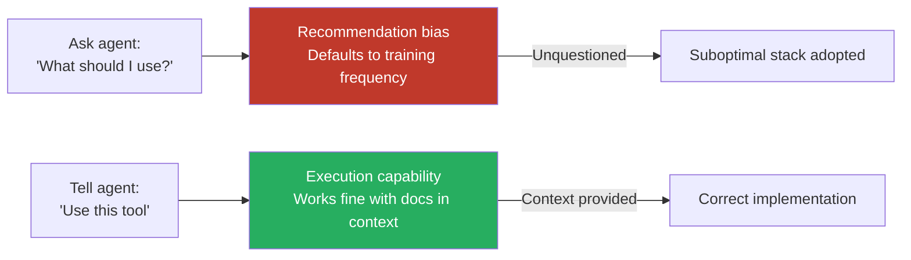
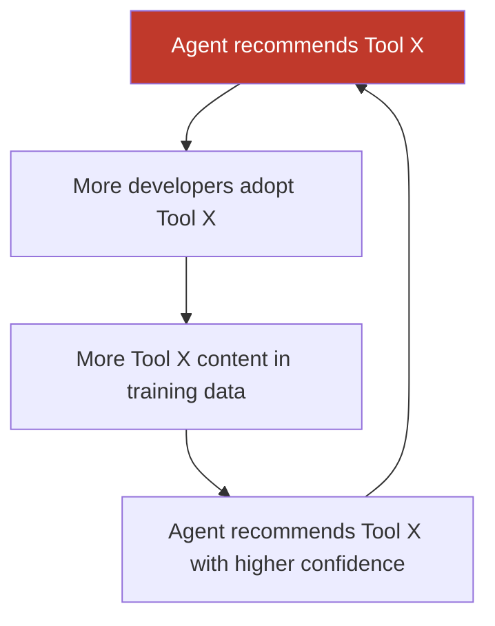

# Boring Technology Bias

> LLMs recommend tools and frameworks proportional to training data frequency, not fitness for the problem. Popular beats optimal by default.

## The Problem

When you ask an agent "what should I use for X?", the answer reflects training frequency. An analysis of 2,430 Claude Code responses reportedly found stark defaults: GitHub Actions 94% for CI/CD, Stripe 91% for payments, shadcn/ui 90% for components `[unverified]`. Cloud deployment went exclusively to Vercel and Railway — AWS, GCP, and Azure received 0% `[unverified]`.

This is a frequency prior, not a reasoning failure. More training examples of popular tools means higher confidence. Greenfield projects converge on the same narrow stack regardless of requirements.

## Two Distinct Risks

The bias manifests differently by interaction mode:



**Recommendation bias** — what the agent suggests when asked to choose; skewed toward training frequency.

**Execution capability** — what the agent builds when told what to use; less biased with documentation in context.

Agents are worse advisors than implementers.

## The Feedback Loop



Training data representation — not product quality — drives greenfield adoption.

## Concrete Failure: Deprecated API Death Spiral

Google's `google-generativeai` Python library was deprecated in favor of `google-genai`. Models trained on the old library generate non-functional code using the deprecated `GenerativeModel()` pattern. Developers conclude the API is broken and switch to competitors — never producing correct-pattern content, starving training data, and deepening the bias. Documented in [googleapis/python-genai#1606](https://github.com/googleapis/python-genai/issues/1606).

## Mitigation

Pin technology choices in project instruction files to override training data defaults.

```markdown
# CLAUDE.md (or AGENTS.md, copilot-instructions.md)

## Technology Stack
- Deployment: AWS CDK (not Vercel/Railway)
- CI/CD: GitLab CI (not GitHub Actions)
- Payments: Paddle (not Stripe)
- Components: Radix primitives (not shadcn/ui)

## Rules
- Do not suggest alternative tools unless asked
- When generating examples, use the stack above
```

For niche tools, provide seed examples. Microsoft research found agent accuracy on domain-specific languages starts below 20% but reaches 85% with 3-5 examples and explicit rules `[unverified]`.

| Mitigation | Mechanism |
|---|---|
| Pin stack in instruction files | Overrides default recommendations |
| Provide seed examples for niche tools | Compensates for limited training data |
| Add compiler/linter validation loops | Catches deprecated API usage automatically |
| Treat tool recommendations like a junior dev's | Verify reasoning, don't accept defaults |

## Unverified Claims

- Reports that Cursor and Copilot show similar technology concentration patterns `[unverified]`
- Claim that 68% of AI-generated snippets reference libraries with known deprecation notices `[unverified]`

## Related

- [Framework-First Agent Development](framework-first.md) — reaching for frameworks too early (distinct from training-data selection bias)
- [Pattern Replication Risk](pattern-replication-risk.md) — agents absorb and reproduce deprecated APIs and stale patterns from existing codebases, compounding training-data bias
- [Trust Without Verify](trust-without-verify.md) — accepting agent output without verification
- [Instruction File Ecosystem](../instructions/instruction-file-ecosystem.md) — the mechanism for overriding agent defaults
- [CLAUDE.md Convention](../instructions/claude-md-convention.md) — pin technology choices in Claude Code's project instruction file
- [Agent-Driven Greenfield Product Development](../workflows/agent-driven-greenfield.md)
