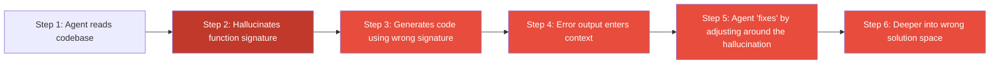

# Context Poisoning: When Hallucinations Become Premises

> A hallucination in step 3 becomes a trusted fact in step 4. The agent remains confident and coherent -- it is just building on a false foundation.

## The Pattern

An agent hallucinates an incorrect detail early in a session -- a wrong API signature, a misidentified file, a nonexistent function. The error is not caught. Each subsequent step treats the hallucination as ground truth, compounding the original mistake.

## How It Differs from Related Failures

| Failure Mode | What Goes Wrong |
|---|---|
| [Context rot (Infinite Context)](infinite-context.md) | Attention degrades as context grows |
| [Objective Drift](objective-drift.md) | Goal lost during summarisation |
| [Distractor Interference](distractor-interference.md) | Wrong instruction attended |
| **Context Poisoning** | Wrong content treated as fact |

## Why Detection Is Hard

Output remains coherent, confident, and internally consistent. The agent does not hedge or self-correct. Early mistakes trigger a cascade: each subsequent token is predicted from previously generated tokens, so an initial error compounds into a snowball of downstream errors ([Chen et al., 2025](https://arxiv.org/abs/2510.06265)).

## Common Causes

| Cause | Mechanism |
|---|---|
| Model hallucination | Wrong API signature generated, then called in later steps |
| Stale code comments | Outdated comment treated as current behaviour |
| Contaminated user input | Hidden control characters or contradictory instructions in pasted text |
| Context overflow | Poisoned content gets disproportionate attention weight ([Roo Code](https://docs.roocode.com/advanced-usage/context-poisoning)) |

## The Propagation Chain

Each step is locally correct. In multi-agent systems the cascade crosses agent boundaries -- one agent's hallucination becomes another's trusted input ([Lin et al., 2025](https://arxiv.org/abs/2509.18970)).

## Example

A Claude Code session is tasked with refactoring a payment module. Early in the session, the agent reads the codebase and hallucinates that `process_payment()` accepts an optional `currency` parameter. It does not. The agent proceeds to:

1. Refactor callers to pass `currency` explicitly
2. Add currency conversion logic that calls the nonexistent parameter
3. Write tests that mock the parameter
4. When tests fail, "fix" by adjusting the mock setup rather than questioning the premise

Forty tool calls deep, the developer reviews a diff full of changes built on a function signature that never existed. Every individual change is internally consistent. The root cause -- a hallucinated parameter in step 1 -- is buried in scroll-back.

## Recovery

Corrective prompts patch the symptom but the poisoned content remains in context, available to re-activate on the next relevant step. The only reliable fix is a clean context: start a new session and re-anchor with verified ground truth before resuming ([Roo Code](https://docs.roocode.com/advanced-usage/context-poisoning)).

## When Mitigation Falls Short

Ground-truth checks and evaluator loops reduce context poisoning but do not eliminate it:

- **Silent hallucinations**: A structurally plausible but wrong value passes schema validation and re-reads without flagging.
- **Multi-agent boundaries**: Sub-agents trust the orchestrator's summary; a hallucination there propagates unchallenged.
- **Context compaction**: Summaries can re-inject the original hallucination, resetting the error clock.

Add human checkpoints at key decision boundaries for high-stakes tasks.

## Mitigation

| Strategy | Mechanism |
|---|---|
| **Ground-truth checks** | Re-read the real file each step; do not trust context memory ([Anthropic](https://www.anthropic.com/engineering/building-effective-agents)) |
| **Evaluator-optimizer** | A second model evaluates output, breaking confirmation bias ([Anthropic](https://www.anthropic.com/engineering/building-effective-agents)) |
| **Pre-completion checklists** | Middleware enforces verification before completion ([LangChain](https://blog.langchain.com/improving-deep-agents-with-harness-engineering/)) |
| **Sub-agent isolation** | Separate context windows prevent cross-task contamination ([FlowHunt](https://www.flowhunt.io/blog/context-engineering-for-ai-agents/)) |
| **Externalise results** | Write to files; disk is ground truth, context is lossy ([FlowHunt](https://www.flowhunt.io/blog/context-engineering-for-ai-agents/)) |
| [**Poka-yoke tool design**](../tool-engineering/poka-yoke-agent-tools.md) | Require absolute paths, reject ambiguous identifiers ([Anthropic](https://www.anthropic.com/engineering/building-effective-agents)) |
| **Hard reset** | New session rather than correcting within poisoned context ([Roo Code](https://docs.roocode.com/advanced-usage/context-poisoning)) |

## Related

- [The Infinite Context](infinite-context.md)
- [Context Window Dumb Zone](../context-engineering/context-window-dumb-zone.md)
- [Objective Drift](objective-drift.md)
- [Distractor Interference](distractor-interference.md)
- [Assumption Propagation](assumption-propagation.md)
- [Session Partitioning](session-partitioning.md)
- [Evaluator-Optimizer](../agent-design/evaluator-optimizer.md)
- [Pre-Completion Checklists](../verification/pre-completion-checklists.md)
- [Incremental Verification](../verification/incremental-verification.md)
- [Trust Without Verify](trust-without-verify.md)
