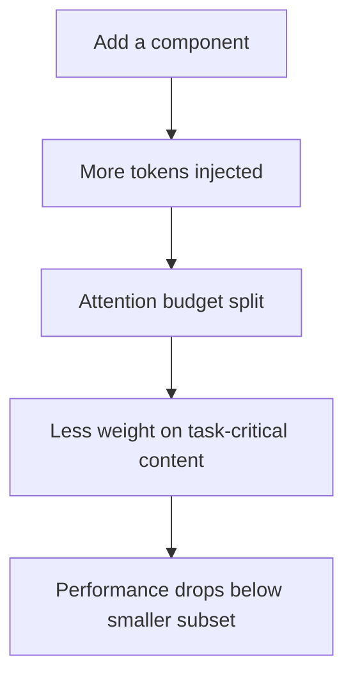

# Cross-Component Interference in Agent Scaffolds

> Stacking planning, memory, retrieval, and self-reflection on top of tool use is rarely the optimum. A full-factorial study finds the maximally-equipped agent loses to smaller subsets in most tasks, with planning and memory the worst offenders, and the gap largest at smaller model scales.

## The Default That Loses

[Liu (2026)](https://arxiv.org/abs/2605.05716) ran a full factorial over all 32 subsets of {Planning, Tools, Memory, Self-Reflection, Retrieval} on HotpotQA, GSM8K, and SWE-bench Lite at Llama-3.1-8B/70B and Claude Haiku. The "All-In" agent bundling every component is consistently suboptimal:

- HotpotQA at 8B: single-tool agent beats All-In by 32% (F1 0.233 vs 0.177, p=0.023).
- GSM8K: a 3-component subset beats All-In by 79% (0.43 vs 0.24, p=0.010).
- 30-50% of larger configurations underperform smaller subsets.
- Submodularity violated in 56.3% of cases (183/325, median gamma=0.52) — greedy "add until marginal turns negative" selection is provably unreliable.

## Worst Offenders

Per-component disruption rate across CCI tasks ([Liu, 2026](https://arxiv.org/abs/2605.05716)):

| Component | Disrupts CCI tasks | Shapley value |
|---|---|---|
| Planning | 84% | -0.029 (95% CI [-0.055, -0.003]) — significantly negative |
| Memory | 68% | -0.016 on HotpotQA |
| Retrieval | 68% | task-dependent |
| Self-Reflection | 58% | task-dependent |
| Tool Use | — | captures 70% of total scaffold value |

Planning and memory are suspect by default. Tool use is the only component that pays for itself across tasks.

## Why It Happens

Components share one substrate: the model's context window and attention budget. Each injects its own tokens — planning traces, retrieved passages, reflection notes, memory excerpts — competing for attention with task-relevant content. Same mechanism as [attention dilution](../agent-design/progressive-disclosure-agents.md).

A main-effects model fits R^2=0.916, beating pairwise interaction models (deltaBIC=25.3) ([Liu, 2026](https://arxiv.org/abs/2605.05716)) — most damage is per-component context cost, not destructive pairs. One positive triple does exist (Tool Use + Self-Reflection + Retrieval, INT_3=+0.175, 95% CI [+0.003, +0.351]), confirming interactions are real when they occur.



## Scale Qualifies, Does Not Eliminate

The All-In gap shrinks with model strength — 32% at 8B, 19% at 70B, ~0% at Claude Haiku — but All-In still never *beats* the best subset at any tested scale ([Liu, 2026](https://arxiv.org/abs/2605.05716)). Frontier models tolerate over-stacking; they do not benefit from it.

Independent evidence on scaffold leverage: harness changes alone swing Terminal Bench 2.0 from 52.8% to 66.5% with no model swap ([LangChain](https://blog.langchain.com/improving-deep-agents-with-harness-engineering/)); on SWE-bench Pro the scaffold accounts for a 22+ point swing while frontier model swaps account for ~1 point ([particula.tech](https://particula.tech/blog/agent-scaffolding-beats-model-upgrades-swe-bench)). The scaffold is the dominant lever — which means it is the dominant way to lose.

Optimal count k* varies by task: k*=1 on HotpotQA, k*=3 on GSM8K ([Liu, 2026](https://arxiv.org/abs/2605.05716)). No universal right number.

## When Over-Stacking Is Defensible

- **Frontier model, no ablation budget** — at Haiku-scale and above the gap is small; shipping All-In and pruning later is rational when a 32-cell ablation is infeasible.
- **Heterogeneous task distributions** — traffic mixing math-like (k*=3) and retrieval-like (k*=1) tasks cannot be served by one fixed minimal subset; per-task routing or All-In may dominate.
- **Binary failure mode** — if missing a component means *task impossible* rather than *task suboptimal*, keep the component even at average performance cost.

These are exceptions. The default failure mode is scaffold inflation that nobody measured.

## Example

**Before — maximally-equipped HotpotQA agent at 8B:**

```python
# All-In: planning + tools + memory + self-reflection + retrieval
agent = Agent(
    model="llama-3.1-8b",
    components=[Planner(), Tools(), Memory(), SelfReflection(), Retrieval()],
)
# F1 = 0.177 on HotpotQA (Liu, 2026, Table 2)
```

**After — single-component agent on the same task:**

```python
# Tools-only — beats All-In by 32%
agent = Agent(
    model="llama-3.1-8b",
    components=[Tools()],
)
# F1 = 0.233 on HotpotQA, p=0.023 vs All-In (Liu, 2026)
```

Four components were removed — Planning, Memory, Self-Reflection, Retrieval — and F1 rose 32%. The win is not from a clever combination; it is from removing components that disrupted 84% and 68% of CCI tasks (Planning and Memory) ([Liu, 2026](https://arxiv.org/abs/2605.05716)).

## How To Avoid It

- **Ablate before shipping.** At minimum, run a leave-one-out sweep. One measured component per release beats four at once.
- **Default-suspect Planning and Memory.** Worst per-task disruption rates. Require positive evidence to include, not the reverse.
- **Anchor on Tool Use.** It captures 70% of scaffold value; build outward from it.
- **Measure on hard tasks.** Easy tasks have high baseline accuracy that hides interference.
- **Re-ablate per model.** Components harmful at 8B can become beneficial at 70B; pin the scaffold to the model and re-run on swaps.

## Key Takeaways

- The maximally-equipped agent is rarely the optimum — 30-50% of larger configurations lose to smaller subsets in a full-factorial study
- Planning and memory are the worst offenders, disrupting 84% and 68% of cross-component-interference tasks
- The mechanism is per-component additive context cost, not specific destructive pairs — main-effects models fit the data with R^2=0.916
- The All-In gap shrinks at frontier scale but never inverts — frontier models tolerate over-stacking, they do not benefit from it
- Optimal component count is task-dependent (k*=1 to k*=3 in this study); there is no universal "right number"
- Default to ablation before shipping, treat Planning and Memory as suspect-by-default, and re-ablate per model

## Related

- [Scaffold Architecture Taxonomy](../agent-design/scaffold-architecture-taxonomy.md) — three-layer framework for the components this anti-pattern over-stacks
- [Harness Engineering](../agent-design/harness-engineering.md) — the broader practice of which scaffold composition is one decision
- [Per-Model Harness Tuning](../agent-design/per-model-harness-tuning.md) — why CCI ablations must be re-run per model
- [Indiscriminate Structured Reasoning](reasoning-overuse.md) — sibling anti-pattern: a specific case of self-reflection added without ablation
- [The Infinite Context](infinite-context.md) — same mechanism (attention dilution) at the context-window layer
- [Progressive Disclosure for Agents](../agent-design/progressive-disclosure-agents.md) — the attention-dilution mechanism behind CCI, applied to instruction surfaces
- [Framework-First Agent Development](framework-first.md) — related anti-pattern: adopting abstractions that bundle scaffold components before measuring whether you need them
