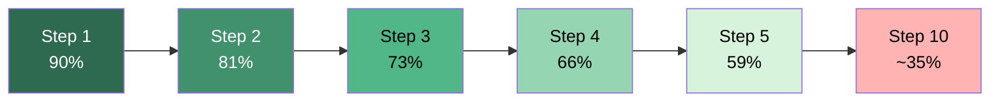

# Demo-to-Production Gap

> Agent demos curate inputs and ignore edge cases. Production requires scale, security constraints, partial context, and failing tools. The gap is systematically underestimated.

## Why Demos Mislead

Demos use curated inputs, full context, and reliable tools. Production exposes what demos hide ([HumAI](https://www.humai.blog/why-your-ai-agent-works-in-the-demo-and-breaks-in-the-real-world/)):

| Demo condition | Production reality |
|---|---|
| Curated, well-formed inputs | Adversarial, malformed, unexpected inputs |
| Small scale, no cost pressure | Rate limiting, concurrency, cost management |
| Tools always succeed | Tool failures, timeouts, partial results |
| Full, fresh context | Partial, stale, or conflicting context |
| Single [happy path](happy-path-bias.md) | Edge cases, error recovery, rollback |
| 80% success rate is impressive | 80% means 1-in-5 requests fails ([ODSC](https://opendatascience.com/the-ai-trends-shaping-2026/)) |

## Compound Error Amplification

Per-step accuracy compounds: 0.9^10 = ~35% end-to-end. Most production workflows have 10+ steps `[unverified]`.

## Failure Modes

Production agents fail in patterns demos never exercise:

- **Doom loops.** Agents fixate on a failed approach, making 10+ repetitive variations without reconsidering, consuming 10x expected cost ([LangChain](https://blog.langchain.com/improving-deep-agents-with-harness-engineering/)).

- **Context rot.** Recall accuracy drops non-linearly as context fills. Compression causes [objective drift](objective-drift.md) where agents declare tasks complete or request unnecessary clarification ([Anthropic](https://www.anthropic.com/engineering/effective-context-engineering-for-ai-agents)).

- **Premature completion.** Agents report "done" on partial work. Long-running tasks hit this reliably ([Anthropic](https://www.anthropic.com/engineering/effective-harnesses-for-long-running-agents)).

- **Tool output injection.** User-provided data, web content, or logs can steer agent actions -- the [Lethal Trifecta](../security/lethal-trifecta-threat-model.md) of private data + untrusted content + exfiltration ([nibzard](https://www.nibzard.com/agentic-handbook)).

## The Numbers

| Metric | Value | Source |
|---|---|---|
| AI PRs: bug rate vs human PRs | 1.7x more bugs | [Stack Overflow](https://stackoverflow.blog/2026/01/28/are-bugs-and-incidents-inevitable-with-ai-coding-agents/) |
| Logic/correctness errors per 100 PRs | 75% more | Stack Overflow |
| Security vulnerabilities | 1.5-2x more | Stack Overflow |
| Teams citing quality as top blocker | 32% | [LangChain Survey](https://www.langchain.com/state-of-agent-engineering) |
| Agents in production with offline evals | 52% | LangChain Survey |
| Enterprise GenAI systems reaching production | 5% | MIT GenAI Divide `[unverified]` |

## Engineering Countermeasures

The fix is [harness engineering](../agent-design/harness-engineering.md), not better prompts:

- **Loop detection.** Monitor for repeated tool calls; force reconsideration on doom loops ([LangChain](https://blog.langchain.com/improving-deep-agents-with-harness-engineering/)).
- **Pre-completion checklists.** Verify completion criteria before reporting done ([Anthropic](https://www.anthropic.com/engineering/effective-harnesses-for-long-running-agents)).
- **Deterministic validation.** Test suites, linters, and type checkers as ground-truth ([Simon Willison](https://simonwillison.net/2025/Oct/25/coding-agent-tips/)).
- **Production-representative evals.** Include malformed inputs, tool failures, and adversarial content.
- **Cost guards.** Per-task token budgets; kill sessions exceeding budget.
- **Bounded sessions.** Checkpoint between steps; avoid unbounded execution.

## Example

A team demos a code-review agent on 5 clean PRs — all pass. Per-step accuracy looks like 95%. They deploy to 200 PRs/day.

Production reality: PRs include merge conflicts and binary files (tool failures), batch runs hit rate limits (concurrency), long PRs overflow context and the agent declares "no issues found" on truncated diffs (context rot), and a malicious PR description instructs the agent to approve all files unconditionally (tool output injection).

At 95% per-step over an 8-step workflow, end-to-end success is 0.95^8 = ~66%. One-third of reviews are wrong. Fixes: eval on production-representative samples, add a pre-completion checklist verifying all files were reviewed, and reject oversized diffs above a token budget.

## Related

- [Objective Drift](objective-drift.md)
- [Trust Without Verify](trust-without-verify.md)
- [Loop Detection](../observability/loop-detection.md)
- [Pre-Completion Checklists](../verification/pre-completion-checklists.md)
- [Circuit Breakers](../observability/circuit-breakers.md)
- [Deterministic Guardrails](../verification/deterministic-guardrails.md)
- [Eval-Driven Development](../workflows/eval-driven-development.md)
- [Context Poisoning](context-poisoning.md)
- [Context Window Management: The Dumb Zone](../context-engineering/context-window-dumb-zone.md)
