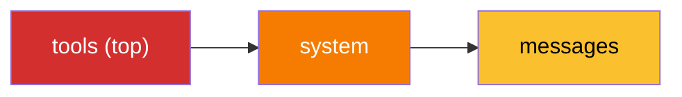

# Dynamic Tool Fetching Breaks KV Cache

> Loading tool definitions dynamically per step seems like good context management but destroys the single most impactful cost optimization available: prompt caching.

## The Intuition Trap

Fewer tools means fewer tokens, so fetching only needed tools per step seems optimal. It is not: savings from removing tools are dwarfed by breaking prompt cache continuity.

## Why It Fails

Tool definitions sit at the **top** of the cache hierarchy. The prefix is computed in order: `tools` → `system` → `messages`. Any change to tool definitions invalidates every subsequent level.



Cached tokens cost **10x less** than uncached (Claude Sonnet: $0.30/MTok cached vs $3/MTok uncached). A single cache break per turn erases all savings from fewer tools.

| Approach | Tools in context | Cache hit rate | Effective cost |
|---|---|---|---|
| Stable tool set (30 tools) | 30 every turn | High | Low |
| Dynamic RAG per step | 5-15, varying | Near zero | High |
| Deferred loading (stable prefix) | 8-10 core + search | High | Lowest |

## The Subtle Variant: Non-Deterministic Serialization

Languages like Swift and Go randomize dictionary key ordering during JSON serialization, so the cache sees a different byte sequence even when tools are identical — the same anti-pattern triggered accidentally.

**Fix**: sort keys deterministically before serialization.

## The Correct Alternative: Deferred Tool Loading

Anthropic's [Tool Search Tool](https://platform.claude.com/docs/en/agents-and-tools/tool-use/tool-search-tool) achieves the same goal without breaking the cache prefix. Tools marked `defer_loading: true` are excluded from the prompt; the agent discovers them on demand.

Anthropic's evaluations:

| Metric | All tools loaded | Deferred + search |
|---|---|---|
| Token usage | ~55K | ~8.7K |
| Accuracy (Opus) | 49% | 74% |

The cache prefix stays **identical** across turns; deferred tools load into message history, invalidating nothing.

## Recommended Tool Architecture

Philipp Schmid's [hierarchical action space](https://www.philschmid.de/context-engineering-part-2):

| Level | Contents | Cache impact |
|---|---|---|
| L1: Core tools (~20) | Stable, always loaded | Cached prefix, never changes |
| L2: General utilities | bash, code execution | Part of stable prefix |
| L3: Specialized tools | Domain-specific, MCP servers | Deferred; loaded via search on demand |

## Key Takeaways

- Any change to tool definitions invalidates the **entire** KV cache — continuity matters more than minimizing tool count.
- Prefer deferred loading with a stable core set over dynamic RAG on tool definitions.
- Audit JSON serialization for non-deterministic key ordering — an accidental cache-breaker.

## Example

**Anti-pattern — tool definitions change each turn, breaking the cache:**

```python
# BAD: tool list rebuilt per step — cache prefix changes every call
for step in plan:
    tools = fetch_tools_for_step(step)          # different subset each time
    response = client.messages.create(
        model="claude-sonnet-4-5",
        tools=tools,                             # cache invalidated every turn
        messages=history,
    )
```

**Fix — stable core tools, deferred discovery via Tool Search:**

```python
# GOOD: stable prefix; agent discovers specialized tools on demand
CORE_TOOLS = load_core_tools()                  # same every call

response = client.messages.create(
    model="claude-sonnet-4-5",
    tools=CORE_TOOLS,                           # never changes → cache hits
    messages=history,
)
# Specialized tools are fetched inside message history via Tool Search Tool,
# invalidating nothing above the messages layer.
```

Sorting tool keys deterministically also prevents accidental cache breaks in languages with non-deterministic dict ordering:

```python
import json

def stable_tool_schema(tool: dict) -> dict:
    return json.loads(json.dumps(tool, sort_keys=True))

CORE_TOOLS = [stable_tool_schema(t) for t in load_core_tools()]
```

## Related

- [Prompt Caching as Architectural Discipline](../context-engineering/prompt-caching-architectural-discipline.md)
- [Token-Efficient Tool Design](../tool-engineering/token-efficient-tool-design.md)
- [Tool Minimalism](../tool-engineering/tool-minimalism.md)
- [Advanced Tool Use: Scaling Agent Tool Libraries](../tool-engineering/advanced-tool-use.md) — full documentation of deferred tool loading and the Tool Search Tool
- [Infinite Context Anti-Pattern](infinite-context.md)
- [Token Preservation Backfire](token-preservation-backfire.md)
- [Cost-Aware Agent Design](../agent-design/cost-aware-agent-design.md)
- [Context Engineering](../context-engineering/context-engineering.md)
- [Static Content First: Maximizing Prompt Cache Hits](../context-engineering/static-content-first-caching.md)
- [Disable Attribution Headers to Preserve KV Cache in Local Inference](../context-engineering/kv-cache-invalidation-local-inference.md)
- [MCP: The Open Protocol Connecting Agents to External Tools](../standards/mcp-protocol.md)
- [Filesystem-Based Tool Discovery](../tool-engineering/filesystem-tool-discovery.md)
