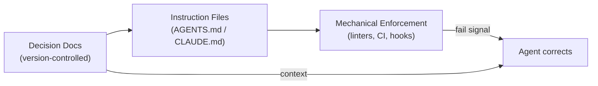

# The Implicit Knowledge Problem

> Knowledge that exists only in Slack threads, meetings, or team memory is invisible to agents -- producing repeating errors that no amount of prompting can fix.

## The Pattern

Team conventions, architectural decisions, and domain rules live in Slack threads, meeting recordings, and institutional memory. An agent violates a rule, the developer corrects it, and the next session repeats the mistake. This is a **[knowledge externalization](../agent-design/externalization-in-llm-agents.md)** problem: each session is a recurring first day with no access to accumulated decisions ([Hodgson](https://blog.thepete.net/blog/2025/05/22/why-your-ai-coding-assistant-keeps-doing-it-wrong-and-how-to-fix-it/)).

## Why It Fails Silently

When a convention is missing, agents infer rather than ask. The inference compiles, passes review, and ships. Across 283 sessions on a 108k-line system, missing specs caused silent failures -- wrong decisions that looked correct ([Vasilopoulos](https://arxiv.org/html/2602.20478v1)).

## What Knowledge Is Invisible

| Knowledge type | Example | Where it actually lives |
|---|---|---|
| Architectural decisions | "We chose Postgres over DynamoDB because..." | Slack thread from 6 months ago |
| Naming conventions | "Services use `-handler` suffix, not `-service`" | A developer's memory |
| Deployment constraints | "Never deploy feature X on Fridays" | Verbal agreement in standup |
| API design taste | "We prefer query params over path params for filters" | Code review comment patterns |
| Tech debt boundaries | "Don't extend module Y -- it's being replaced" | A Jira ticket nobody reads |

## Remediation



### 1. Version-controlled decision artifacts

Push design docs, execution plans, and tech debt trackers into the repository. If it is not in version control, it does not exist for agents ([Lavaee](https://alexlavaee.me/blog/openai-agent-first-codebase-learnings/)).

### 2. Instruction files for non-discoverable context

Use AGENTS.md, CLAUDE.md, or equivalent files to capture conventions not inferable from code. Keep them thin -- entry points to reference directories, not monolithic documents ([Lavaee](https://alexlavaee.me/blog/openai-agent-first-codebase-learnings/)).

!!! tip "Distinguish from discoverable context"
    Only include what agents cannot find via reads and searches. See [Discoverable vs Non-Discoverable Context](../context-engineering/discoverable-vs-nondiscoverable-context.md).

### 3. Mechanical enforcement of taste

Encode conventions as lint rules and CI checks. Agents respond to pass/fail signals, not rationale ([Wadia](https://dev.to/monarchwadia/convention-as-code-enforcing-architecture-with-scripts-ci-and-ai-agents-hgd), [Sng](https://factory.ai/news/using-linters-to-direct-agents)).

## Example

A team's convention is that HTTP handler files use a `-handler` suffix. The convention exists only as tribal knowledge.

**Without externalized knowledge** -- the agent infers from the one file it happens to see:

```text
# Agent creates a new endpoint
src/
  orders-service.ts    # ← wrong suffix, matches nothing in the codebase
```

The file compiles, tests pass, and the naming violation ships undetected.

**With externalized knowledge** -- an `AGENTS.md` entry and a lint rule make the convention discoverable and enforceable:

```markdown
# AGENTS.md
- HTTP handler files must use the `-handler.ts` suffix (e.g., `orders-handler.ts`).
```

```javascript
// eslint rule: enforce-handler-suffix
// Fails CI if a file in src/ uses `-service.ts` instead of `-handler.ts`
```

The agent reads the convention from `AGENTS.md`, and even if it guesses wrong, the lint rule catches the mistake before commit.

## Related

- [Discoverable vs Non-Discoverable Context](../context-engineering/discoverable-vs-nondiscoverable-context.md) -- instruction files vs. what agents find themselves
- [Codebase Readiness](../workflows/codebase-readiness.md)
- [Convention Over Configuration](../instructions/convention-over-configuration.md)
- [AGENTS.md: A README for AI Coding Agents](../standards/agents-md.md) -- externalizing implicit knowledge
- [CLAUDE.md Convention](../instructions/claude-md-convention.md)
- [Hooks for Enforcement vs Prompts for Guidance](../verification/hooks-vs-prompts.md) -- mechanical enforcement over prompting
- [Cargo Cult Agent Setup](cargo-cult-agent-setup.md)
- [Shadow Tech Debt](shadow-tech-debt.md) -- undocumented tribal knowledge agents cannot see
- [Assumption Propagation](assumption-propagation.md) -- misunderstandings compounding without implicit conventions
- [Comprehension Debt](comprehension-debt.md) -- gap between agent-produced code and developer understanding
- [Spec Complexity Displacement](spec-complexity-displacement.md) -- implicit knowledge relocated into overly detailed specs
- [Getting Started: Setting Up Your Instruction File](../workflows/getting-started-instruction-files.md) -- bootstrap an instruction file from zero
- [The Copy-Paste Agent](copy-paste-agent.md) -- embedding tribal conventions in duplicated definitions instead of shared rules
- [The Prompt Tinkerer](prompt-tinkerer.md) -- refining prompts instead of externalizing conventions into structural enforcement
