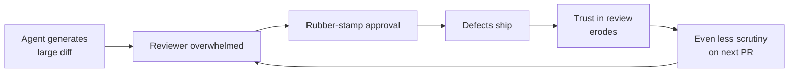

# Law of Triviality in AI PRs

> Reviewers bikeshed small changes and rubber-stamp large ones. AI agents produce large diffs by default, so the code that needs the most scrutiny gets the least.

## The Pattern

Parkinson's Law of Triviality (1957): attention scales inversely with complexity. Small diffs get scrutinized; large diffs get rubber-stamped.

Agents routinely produce PRs past the threshold where review stays effective -- hand-written tweaks attract debate while AI diffs pass unexamined. Distinct from [PR Scope Creep](pr-scope-creep-review-bottleneck.md): this is **reviewer psychology**, not scope.

## Defect Detection Collapses with Size

The [SmartBear/Cisco study](https://mikeconley.ca/blog/2009/09/14/smart-bear-cisco-and-the-largest-study-on-code-review-ever/) (2,500 reviews) puts optimal review at 100-300 LOC in 30-60 minutes; effectiveness drops past 400. [Propel](https://www.propelcode.ai/blog/pr-size-impact-code-review-quality-data-study) quantifies the drop:

| PR Size (lines) | Defect Detection Rate | Review Time | Comments per PR |
|---|---|---|---|
| 1-200 | 87% | ~45 min | 3.2 |
| 101-300 | ~70% | ~60 min | ~4.1 |
| 301-600 | 65% | ~2 hr | 2.4 |
| 1,000+ | 28% | ~4.2 hr | 1.8 |

Four hours on 1,000 LOC yields fewer comments than 45 minutes on 200 -- fatigue drives disengagement, not depth.

## AI Makes It Worse

[CodeRabbit](https://www.coderabbit.ai/blog/state-of-ai-vs-human-code-generation-report) finds AI PRs contain 1.7x more issues than human code -- 3x more readability issues, 75% more logic defects. Three mechanisms compound the problem:

- **Template blindness.** AI output follows familiar patterns; reviewers skim, bugs hide in boilerplate. ([AsyncSquad Labs](https://asyncsquadlabs.com/blog/code-review-bottleneck-ai-era/))
- **AI brain fry.** Sustained AI oversight produces mental fog and higher error rates. ([HBR / Help Net Security](https://www.helpnetsecurity.com/2026/03/09/harvard-business-review-ai-workplace-fatigue-report/))
- **Nyquist under-sampling.** Code production tripled; review sampling stayed flat -- defects alias as passing. ([Bryan Finster](https://bryanfinster.substack.com/p/ai-broke-your-code-review-heres-how))



## Mitigation Stack

### 1. Constrain batch size

Target 100-300 LOC per PR. Split agent work into atomic commits; enforce size gates in CI.

### 2. Tiered review

Use [tiered code review](../code-review/tiered-code-review.md):

| Tier | Reviewer | Scope |
|---|---|---|
| 1 | Automated (lint, SAST, tests) | Syntax, style, known vulnerability patterns |
| 2 | AI-augmented review | Flag risk hotspots, check for common AI mistakes |
| 3 | Human expert | Architecture, business logic, domain context |

See [Agentic Code Review Architecture](../code-review/agentic-code-review-architecture.md).

### 3. Semantic diffing

Review behavior changes, not raw lines. AST diffs and API-contract analysis surface what moved.

### 4. BDD-first specification

Define expected behavior before the agent codes; review becomes validation against pre-agreed criteria. See [Spec-Driven Development](../workflows/spec-driven-development.md).

## When This Backfires

Size limits fail for genuinely atomic changes (cross-cutting refactors, schema migrations), when monorepo coordination exceeds review benefit, or when LOC gates force superficial splits — many small PRs, collectively incoherent.

## Example

An agent completes a feature sprint and opens a single 1,400-LOC PR touching auth, billing, and the data model. The reviewer spends 3 hours skimming and approves with two style comments. A logic error in the billing calculation ships.

The same work split into three PRs -- auth (180 LOC), billing (220 LOC), data model (160 LOC) -- would have received an average of 4+ comments each at 87% defect detection rate. The billing bug would have been caught.

CI enforcement keeps scope in check:

```yaml
# .github/workflows/pr-size.yml
- name: Check PR size
  run: |
    LINES=$(git diff --stat origin/main...HEAD | tail -1 | grep -oP '\d+ insertion' | grep -oP '\d+')
    if [ "${LINES:-0}" -gt 400 ]; then
      echo "PR exceeds 400 LOC. Split into smaller atomic PRs."
      exit 1
    fi
```

## Related

- [The Bottleneck Migration](../human/bottleneck-migration.md) — systemic shift from generation to review as the binding constraint
- [PR Scope Creep as a Human Review Bottleneck](pr-scope-creep-review-bottleneck.md)
- [Comprehension Debt](comprehension-debt.md)
- [LLM Code Review Overcorrection](llm-review-overcorrection.md)
- [Shadow Tech Debt](shadow-tech-debt.md)
- [Agentic Code Review Architecture](../code-review/agentic-code-review-architecture.md)
- [Diff-Based Review Over Output Review](../code-review/diff-based-review.md)
- [Cognitive Load and AI Fatigue](../human/cognitive-load-ai-fatigue.md)
- [Signal Over Volume in AI Review](../code-review/signal-over-volume-in-ai-review.md)
