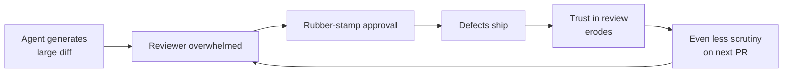

# Law of Triviality in AI PRs

> Reviewers bikeshed small changes and rubber-stamp large ones. AI agents produce large diffs by default, so the code that needs the most scrutiny gets the least.

## The Pattern

Parkinson's Law of Triviality (1957): time spent on an item is inversely proportional to its complexity. In code review, small diffs get thorough attention while large diffs overwhelm reviewers into approval.

AI amplifies this. Agents produce PRs well beyond the threshold where review remains effective -- trivial hand-written changes attract debate while substantial AI-generated diffs pass unexamined. Distinct from [PR Scope Creep](pr-scope-creep-review-bottleneck.md): the law of triviality is about **reviewer psychology**, the cognitive response to diff size.

## Defect Detection Collapses with Size

The [SmartBear/Cisco study](https://mikeconley.ca/blog/2009/09/14/smart-bear-cisco-and-the-largest-study-on-code-review-ever/) (2,500 reviews) found optimal review is 100-300 LOC in 30-60 minutes; effectiveness drops sharply beyond 400 LOC. The [Propel study](https://www.propelcode.ai/blog/pr-size-impact-code-review-quality-data-study) quantifies the drop:

| PR Size (lines) | Defect Detection Rate | Review Time | Comments per PR |
|---|---|---|---|
| 1-200 | 87% | ~45 min | 3.2 |
| 101-300 | ~70% | ~60 min | ~4.1 |
| 301-600 | 65% | ~2 hr | 2.4 |
| 1,000+ | 28% | ~4.2 hr | 1.8 |

Reviewers spending 4.2 hours on large PRs leave fewer comments than those spending 45 minutes -- fatigue drives disengagement, not deeper analysis.

## AI Makes It Worse

[CodeRabbit's report](https://www.coderabbit.ai/blog/state-of-ai-vs-human-code-generation-report) finds AI-generated PRs contain 1.7x more issues than human-written code, with 3x more readability issues and 75% more logic/correctness defects. Three cognitive mechanisms compound the problem:

- **Template blindness.** AI code follows similar structural patterns, causing reviewers to skim; subtle bugs hide inside familiar-looking boilerplate. ([AsyncSquad Labs](https://asyncsquadlabs.com/blog/code-review-bottleneck-ai-era/))
- **AI brain fry.** Sustained AI oversight produces mental fog and increased error rates. ([Help Net Security / HBR](https://www.helpnetsecurity.com/2026/03/09/harvard-business-review-ai-workplace-fatigue-report/))
- **Nyquist under-sampling.** Code production increased 3x+ while review sampling stayed flat -- defects alias as passing. ([Bryan Finster](https://bryanfinster.substack.com/p/ai-broke-your-code-review-heres-how))



## Mitigation Stack

### 1. Constrain batch size

Target 100-300 LOC per PR. Break agent work into atomic commits. Use CI diff-size checks to reject oversized PRs before review.

### 2. Tiered review

Use a [tiered code review](../code-review/tiered-code-review.md) approach:

| Tier | Reviewer | Scope |
|---|---|---|
| 1 | Automated (lint, SAST, tests) | Syntax, style, known vulnerability patterns |
| 2 | AI-augmented review | Flag risk hotspots, check for common AI mistakes |
| 3 | Human expert | Architecture, business logic, domain context |

See [Agentic Code Review Architecture](../code-review/agentic-code-review-architecture.md).

### 3. Semantic diffing

Review abstracted behavior changes rather than raw line diffs. AST-based diffs and API contract analysis surface what actually changed.

### 4. BDD-first specification

Define expected behavior before the agent codes. Review becomes validation against pre-agreed criteria per [Spec-Driven Development](../workflows/spec-driven-development.md).

## When This Backfires

Size limits fail when changes are genuinely atomic (cross-cutting refactors, schema migrations), when coordination overhead exceeds review benefit in tightly coupled monorepos, or when hard LOC gates produce superficial splitting — many small PRs that are individually below threshold but collectively incoherent.

## Example

An agent completes a feature sprint and opens a single 1,400-LOC PR touching auth, billing, and the data model. The reviewer spends 3 hours skimming and approves with two style comments. A logic error in the billing calculation ships.

The same work split into three PRs -- auth (180 LOC), billing (220 LOC), data model (160 LOC) -- would have received an average of 4+ comments each at 87% defect detection rate. The billing bug would have been caught.

CI enforcement keeps scope in check:

```yaml
# .github/workflows/pr-size.yml
- name: Check PR size
  run: |
    LINES=$(git diff --stat origin/main...HEAD | tail -1 | grep -oP '\d+ insertion' | grep -oP '\d+')
    if [ "${LINES:-0}" -gt 400 ]; then
      echo "PR exceeds 400 LOC. Split into smaller atomic PRs."
      exit 1
    fi
```

## Related

- [The Bottleneck Migration](../human/bottleneck-migration.md) — systemic shift from generation to review as the binding constraint
- [PR Scope Creep as a Human Review Bottleneck](pr-scope-creep-review-bottleneck.md)
- [Comprehension Debt](comprehension-debt.md)
- [LLM Code Review Overcorrection](llm-review-overcorrection.md)
- [Shadow Tech Debt](shadow-tech-debt.md)
- [Agentic Code Review Architecture](../code-review/agentic-code-review-architecture.md)
- [Diff-Based Review Over Output Review](../code-review/diff-based-review.md)
- [Cognitive Load and AI Fatigue](../human/cognitive-load-ai-fatigue.md)
- [Signal Over Volume in AI Review](../code-review/signal-over-volume-in-ai-review.md)
