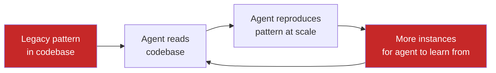

# Pattern Replication Risk

> Agents absorb existing codebase patterns and reproduce them at scale -- including deprecated APIs, inconsistent error handling, and hand-rolled utilities you meant to phase out.

## The Mechanism

Agents learn from what they find. When an agent scans your codebase for patterns, it treats golden-path implementations and legacy workarounds equally. Suboptimal patterns propagate faster than any team can review them.

In practice, this behaves like faithful reproduction rather than a prompting failure — the agent is doing exactly what it was implicitly instructed to do by the surrounding code.



## The Evidence

| Finding | Source |
|---------|--------|
| Copy/paste code rose from 8.3% to 12.3%; refactoring dropped from 25% to under 10% | [GitClear, 211M lines analyzed](https://www.gitclear.com/ai_assistant_code_quality_2025_research) |
| Static analysis warnings rose ~30% post-AI-adoption; code complexity rose 40%+ | [CMU controlled study, 807 repos](https://blog.robbowley.net/2025/12/04/ai-is-still-making-code-worse-a-new-cmu-study-confirms/) |
| AI-authored PRs contain 1.7x more issues than human-only PRs | [CodeRabbit, 470 PRs](https://www.coderabbit.ai/blog/state-of-ai-vs-human-code-generation-report) |
| 67.3% of AI-generated PRs rejected vs 15.6% for manual code | [LinearB via Mike Mason](https://mikemason.ca/writing/ai-coding-agents-jan-2026/) |
| AI magnifies strengths of high-performing orgs and dysfunctions of struggling ones | [DORA Report 2025](https://dora.dev/research/2025/dora-report/) |

## Specific Manifestations

Three recurring failure modes (via [Mike Mason](https://mikemason.ca/writing/ai-coding-agents-jan-2026/)):

**Brute force fixes.** Quick solutions instead of root-cause diagnosis -- increasing Docker memory limits instead of finding the leak, adding retry loops instead of fixing the underlying error.

**Backward compatibility shortcuts.** Thin wrappers around deprecated APIs instead of migrating. The deprecated code persists under an extra layer.

**Excessive mocking.** Test suites that mock so aggressively they validate the mocks rather than the code.

## Why It Happens

Coding agents retrieve context by syntactic and semantic similarity, not by quality. When an agent searches the codebase for "how do we fetch with retry here," the retriever surfaces the nearest matching implementation — it has no signal distinguishing golden-path code from deprecated workarounds. A `# TODO: remove` comment or a 2021 deprecation note is not a weighting feature in the retrieval step.

Generation then amplifies the match. Few-shot conditioning on in-repo examples dominates prose instructions in system prompts or rules files — the model treats the surrounding code as higher-fidelity evidence of "what this codebase does" than any natural-language guidance. Every new usage the agent writes becomes additional training context for the next retrieval, closing the feedback loop shown in the diagram above.

This is why mechanical enforcement outperforms guidance. A linter rejecting the deprecated pattern removes it from the retrieval surface entirely; a prompt asking the agent to "prefer the new API" competes with N existing calls to the old one and usually loses.

## Why This Differs From Related Anti-Patterns

- [Copy-Paste Agent](copy-paste-agent.md): duplicates agent *configuration* across projects; pattern replication risk duplicates *codebase patterns* within a project.
- [Effortless AI Fallacy](effortless-ai-fallacy.md): about user effort. Pattern replication risk occurs even with skilled users -- the agent reproduces what it finds regardless of prompt quality.

## The Fix: Clean the House Before Inviting the Agent

OpenAI's Harness team spent [20% of sprint time cleaning up "AI slop"](https://alexlavaee.me/blog/openai-agent-first-codebase-learnings/) before arriving at a systematic approach:

1. **Encode golden patterns as mechanical rules.** Linters and CI checks that reject known anti-patterns -- prose guidance in prompts is routinely overridden by contradicting examples already in the codebase.
2. **Auto-generate refactoring PRs.** Replace deprecated patterns with approved alternatives before scaling agent usage.
3. **Track quality metrics.** Monitor duplication rates, lint violations, and complexity scores. Degradation signals replication is outpacing remediation.

## When This Backfires

Conditions where clean-first is worse than proceeding directly:

**Mid-migration codebases.** Blanket lint rules fire on valid compatibility shims when two patterns intentionally coexist during a transition. Lint rules require pattern stability to add value.

**Load-bearing deprecated APIs.** Some APIs persist because the replacement isn't available in all deploy targets. Encoding a rejection rule before the replacement is universally reachable creates CI failures with no resolution path.

**Insufficient review bandwidth.** Auto-generated refactoring PRs create review load. If the team can't merge them before scaling agent usage, queued debt compounds the original problem.

**Large legacy codebases.** Pre-remediation spanning months may eliminate the productivity gain before agents are even enabled.

**Metrics without baselines.** Duplication and complexity scores spike when agent adoption rolls out incrementally — comparing against a pre-agent baseline that used different review norms produces misleading signals.

In these cases, narrow lint rules scoped to new files and targeting the highest-frequency anti-patterns reduce blast radius without triggering false positives on existing code or blocking agent usage wholesale.

## Example

A codebase uses a hand-rolled `fetchWithRetry` utility dating from 2019. The team intended to migrate to a standard library wrapper once their HTTP client was upgraded, but the migration never happened.

When an agent is asked to add a new API integration, it scans the codebase for patterns:

```python
# Legacy utility -- flagged for removal in a 2021 TODO comment
def fetchWithRetry(url, retries=3, backoff=1):
    for i in range(retries):
        try:
            return requests.get(url, timeout=5)
        except requests.RequestException:
            time.sleep(backoff * (2 ** i))
    raise RuntimeError(f"Request failed after {retries} retries")
```

The agent finds three existing usages, treats them as the established pattern, and generates five new usages in the new integration -- each calling `fetchWithRetry` with slightly different backoff values.

After two sprints of agent-assisted work, the codebase has 23 usages of `fetchWithRetry`. The team's plan to delete it now requires touching 23 files instead of 3. A CI lint rule rejecting direct calls to `fetchWithRetry` (pointing to the approved alternative) would have blocked the first agent-generated usage, keeping the migration cost manageable.

## Related

- [Copy-Paste Agent](copy-paste-agent.md) -- Agent config duplication across projects
- [Codebase Readiness](../workflows/codebase-readiness.md) -- Preparing a codebase for agent-assisted development
- [Agent-First Software Design](../agent-design/agent-first-software-design.md) -- designing systems where agents are the primary consumers
- [Hooks for Enforcement vs Prompts for Guidance](../verification/hooks-vs-prompts.md) -- Mechanical enforcement over prose instructions
- [Deterministic Guardrails](../verification/deterministic-guardrails.md) -- Linters and CI as agent boundaries
- [Abstraction Bloat](abstraction-bloat.md) -- Over-engineering and unnecessary hierarchies from agent output
- [Comprehension Debt](comprehension-debt.md) -- The growing gap between agent-produced code and developer understanding
- [Shadow Tech Debt](shadow-tech-debt.md) -- Cumulative codebase drift from autonomous agent commits
- [Boring Technology Bias](boring-technology-bias.md) -- LLMs recommend tools by training data frequency, not fitness for the problem
- [Happy Path Bias](happy-path-bias.md) -- Agents produce code that works for the common case but breaks on edge cases and error paths
