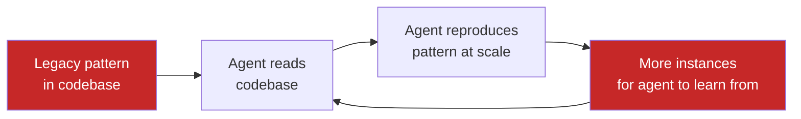

# Pattern Replication Risk

> Pattern replication is an agent absorbing codebase conventions and reproducing them at scale: deprecated APIs, legacy error handling, and hand-rolled utilities you meant to retire.

## The mechanism

Agents learn from what they find. When an agent scans your codebase, it treats golden-path implementations and legacy workarounds the same. Poor patterns spread faster than any team can review them. This is faithful reproduction, not a prompting failure.


```mermaid
graph LR
    A[Legacy pattern<br>in codebase] --> B[Agent reads<br>codebase]
    B --> C[Agent reproduces<br>pattern at scale]
    C --> D[More instances<br>for agent to learn from]
    D --> B
    style A fill:#c62828,color:#fff
    style D fill:#c62828,color:#fff
```

## The evidence

| Finding | Source |
|---------|--------|
| Copy/paste code rose from 8.3% to 12.3%; refactoring dropped from 25% to under 10% | [GitClear, 211M lines analyzed](https://www.gitclear.com/ai_assistant_code_quality_2025_research) |
| Static analysis warnings rose ~30% post-AI-adoption; complexity rose 40%+ | [CMU controlled study, 807 repos](https://blog.robbowley.net/2025/12/04/ai-is-still-making-code-worse-a-new-cmu-study-confirms/) |
| AI-authored PRs contain 1.7x more issues than human-only PRs | [CodeRabbit, 470 PRs](https://www.coderabbit.ai/blog/state-of-ai-vs-human-code-generation-report) |
| 67.3% of AI-generated PRs rejected vs 15.6% for manual code | [LinearB via Mike Mason](https://mikemason.ca/writing/ai-coding-agents-jan-2026/) |
| AI magnifies strengths of high-performing orgs and dysfunctions of struggling ones | [DORA Report 2025](https://dora.dev/research/2025/dora-report/) |

## Specific manifestations

Three failure modes, drawn from [Mike Mason on AI coding agents](https://mikemason.ca/writing/ai-coding-agents-jan-2026/):

Brute-force fixes. The agent raises Docker memory limits instead of finding the leak. It adds retry loops instead of fixing the root error.

Backward-compatibility shortcuts. The agent wraps deprecated APIs in thin layers. The deprecated code then lives on under that extra layer.

Excessive mocking. Test suites end up checking the mocks rather than the code.

## Why it happens

Agents retrieve context by syntactic and semantic similarity, not by quality. The retriever surfaces the nearest matching implementation. A `# TODO: remove` comment does not lower its rank.

Generation then amplifies the match. Few-shot conditioning on in-repo examples outweighs prose instructions. The model treats surrounding code as stronger evidence of what this codebase does than any guidance. Every new usage then becomes retrieval context for the next run.

Mechanical enforcement beats guidance, the case made in [hooks for enforcement over prompts for guidance](../instructions/hooks-vs-prompts.md). A linter that rejects the deprecated pattern removes it from the retrieval surface. A prompt to "prefer the new API" competes with the existing calls and loses.

## The fix: clean the codebase before scaling agents

OpenAI's Harness team spent [20% of sprint time cleaning up "AI slop"](https://alexlavaee.me/blog/openai-agent-first-codebase-learnings/) before arriving at this approach:

1. Encode golden patterns as mechanical rules. Add linters and CI checks that reject known anti-patterns. Contradicting examples routinely override prose guidance.
2. Auto-generate refactoring PRs. Replace deprecated patterns with approved alternatives before you scale agent usage. This is part of reaching [codebase readiness](../agent-design/codebase-readiness.md).
3. Track quality metrics. Monitor duplication rates, lint violations, and complexity scores. Rising numbers signal that replication is outpacing remediation.

## When this backfires

In some conditions, cleaning first is worse than proceeding directly:

Mid-migration codebases. Blanket lint rules fire on valid compatibility shims when two patterns intentionally coexist. Lint rules need pattern stability to work as [deterministic guardrails](../verification/deterministic-guardrails.md).

Load-bearing deprecated APIs. When the replacement is not available in all deploy targets, a rejection rule creates CI failures with no way to resolve them.

Large legacy codebases. Remediation that runs for months may erase the productivity gain before you enable agents. Narrow rules scoped to new files reduce the blast radius.

## Key Takeaways

- Agents replicate whatever patterns they find; legacy code and golden paths propagate at the same rate.
- The risk compounds: each agent-generated instance becomes retrieval context for the next run, accreting into [shadow tech debt](shadow-tech-debt.md).
- Prose guidance loses to codebase examples — encode anti-patterns as CI-enforced lint rules.
- Remediate before scaling, but scope rules narrowly when the codebase is mid-migration or the replacement API isn't universally reachable.

## Example

A codebase uses a hand-rolled `fetchWithRetry` utility dating from 2019. The team intended to migrate to a standard library wrapper once their HTTP client was upgraded, but the migration never happened.

When an agent is asked to add a new API integration, it scans the codebase for patterns:

```python
# Legacy utility -- flagged for removal in a 2021 TODO comment
def fetchWithRetry(url, retries=3, backoff=1):
    for i in range(retries):
        try:
            return requests.get(url, timeout=5)
        except requests.RequestException:
            time.sleep(backoff * (2 ** i))
    raise RuntimeError(f"Request failed after {retries} retries")
```

The agent finds three existing usages, treats them as the established pattern, and generates five new usages in the new integration -- each calling `fetchWithRetry` with slightly different backoff values.

After two sprints of agent-assisted work, the codebase has 23 usages of `fetchWithRetry`. The team's plan to delete it now requires touching 23 files instead of 3. A CI lint rule rejecting direct calls to `fetchWithRetry` (pointing to the approved alternative) would have blocked the first agent-generated usage, keeping the migration cost manageable.

## Related

- [Copy-Paste Agent](copy-paste-agent.md) -- Agent config duplication across projects
- [Codebase Readiness](../agent-design/codebase-readiness.md) -- Preparing a codebase for agent-assisted development
- [Agent-First Software Design](../agent-design/agent-first-software-design.md) -- designing systems where agents are the primary consumers
- [Hooks for Enforcement vs Prompts for Guidance](../instructions/hooks-vs-prompts.md) -- Mechanical enforcement over prose instructions
- [Deterministic Guardrails](../verification/deterministic-guardrails.md) -- Linters and CI as agent boundaries
- [Abstraction Bloat](abstraction-bloat.md) -- Over-engineering and unnecessary hierarchies from agent output
- [Comprehension Debt](comprehension-debt.md) -- The growing gap between agent-produced code and developer understanding
- [Shadow Tech Debt](shadow-tech-debt.md) -- Cumulative codebase drift from autonomous agent commits
