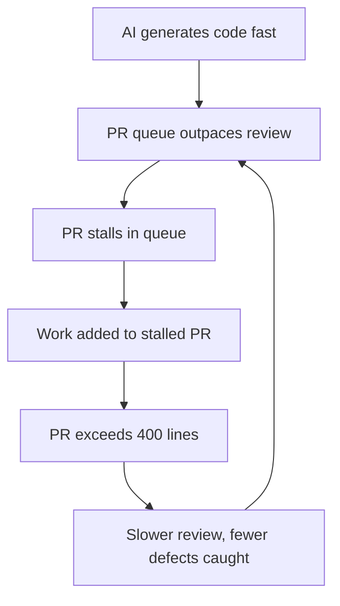

# PR Scope Creep as a Human Review Bottleneck

> When a stalled PR blocks dependent work, you add that work to the same PR — making it larger, slower to review, and harder to merge, compounding the bottleneck AI already created.

## The Pattern

AI coding assistants shift the constraint in software delivery from writing code to reviewing it. [Faros AI telemetry (10,000+ developers)](https://www.faros.ai/blog/ai-software-engineering) shows high-adoption teams merge 98% more PRs but experience 91% longer review times. The bottleneck has moved; reviewer capacity has not [unverified].

When a PR sits unreviewed, adding dependent work to it is your rational local response. On high-adoption teams, Faros reports average PR size increases of 154%, pushing changesets past the cognitive threshold for effective review [unverified].

[SmartBear's study](https://smartbear.com/resources/ebooks/best-kept-secrets-of-code-review/) [unverified: 10-month, 2,500 reviews] establishes the threshold: reviewers detect defects most effectively in 200-400 lines, with effectiveness dropping sharply beyond that.

## The Feedback Loop

The loop is self-reinforcing. [Pullflow's practitioner analysis](https://pullflow.com/blog/when-code-reviews-go-too-far/) describes the mechanism: excessive review scope causes developers to batch changes, further inflating PR size and compounding delay.

[arXiv:2602.19441](https://arxiv.org/abs/2602.19441) finds larger changes reduce merge likelihood in agent-authored PRs. [CodeRabbit's 2026 report](https://www.coderabbit.ai/blog/2025-was-the-year-of-ai-speed-2026-will-be-the-year-of-ai-quality) finds AI-generated code contains 1.7x more issues than human-written code, making each added line more expensive to review [unverified].

## Mitigations

**Stacked PRs.** [Stacked PRs](https://graphite.com/blog/stacked-prs) let you open a new branch on top of an unmerged one, continuing work without adding to the stalled changeset. Development and review run in parallel; no blocking pressure accumulates.

**Atomic PR discipline.** One logical change per PR, under 400 lines. Enforce in CI with diff-size checks. See the [SmartBear study](https://smartbear.com/resources/ebooks/best-kept-secrets-of-code-review/) for threshold evidence.

**AI pre-review.** Use AI pre-review to triage issues and flag high-risk areas before human review, reducing per-PR cognitive load. See [Agentic Code Review Architecture](../code-review/agentic-code-review-architecture.md).

**Distribute review load.** Concentrated review load — a small set of senior reviewers handling all PRs — is the structural cause of the bottleneck [unverified]. Rotate reviewers and use risk-based assignment to reduce queue depth.

## Example

A team runs three AI coding agents in parallel on a feature sprint. Agent A finishes a 350-line authentication refactor and opens PR #101. Two days pass with no reviewer action — the senior engineer is already reviewing two other large PRs from the same sprint.

Agent B finishes the dependent session-management update. Rather than open a new PR that will also sit in the queue, the developer adds the 280-line change onto PR #101, now at 630 lines — exceeding the cognitive review threshold.

When the reviewer opens PR #101, the combined diff takes 90 minutes rather than 30. The reviewer flags two issues and approves the rest; defect detection drops sharply above 400 lines, so the authentication logic carries higher undetected-bug risk.

The structural fix: Agent B opens PR #102 targeting PR #101's branch using stacked PRs. Both PRs stay under 400 lines and can be reviewed independently. Merge order is preserved without blocking pressure accumulating.

## Key Takeaways

- AI moves the bottleneck from code generation to human review; reviewer capacity does not scale with generation velocity
- Scope creep is individually rational but collectively destructive — the natural response to a blocked PR makes the bottleneck worse
- PRs beyond 400 lines have lower defect detection rates and lower merge probability
- Structural mitigations (stacked PRs, atomic discipline) outperform process mitigations because they remove blocking pressure

## Related

- [Law of Triviality in AI PRs](law-of-triviality-ai-prs.md) — reviewer psychology behind rubber-stamping large diffs
- [LLM Code Review Overcorrection](llm-review-overcorrection.md) — how AI reviewers misclassify correct code at scale
- [Shadow Tech Debt](shadow-tech-debt.md) — how AI-accelerated delivery creates invisible debt accumulation
- [Vibe Coding](../workflows/vibe-coding.md)
- [Diff-Based Review Over Output Review](../code-review/diff-based-review.md)
- [Human-in-the-Loop Placement](../workflows/human-in-the-loop.md)
- [Agentic Code Review Architecture](../code-review/agentic-code-review-architecture.md)
- [Agent-Authored PR Integration: Collaboration Signals](../code-review/agent-authored-pr-integration.md)
- [Cognitive Load, AI Fatigue, and Sustainable Agent Use](../human/cognitive-load-ai-fatigue.md) — managing the cognitive costs of sustained AI-augmented work, including review fatigue
