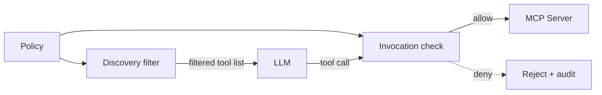

# Prompt-Only Tool Access Control

> Telling an agent in the system prompt not to call an unauthorized tool reduces unauthorized invocation by only 11–18 percentage points. Architectural enforcement that strips unauthorized tools from the context and re-checks at the call boundary drives the rate to 0%.

Prompt-only tool access control restricts which tools an agent may invoke by adding instructions to the system prompt — "do not call `delete_repo`", "only use the read-only API" — while leaving the full tool catalogue visible in the model's context. The model still sees every tool definition; only an instruction tells it not to pick the disallowed ones. Across 150 adversarial tasks on Qwen 2.5 7B, Llama 3.1 8B, and Claude Haiku 3.5, prompt-only restrictions reduced the Unauthorized Invocation Rate (UIR) by 11–18 percentage points — a governed MCP proxy that performs ABAC at discovery and invocation drove UIR to 0% with under 50 ms added latency ([Uppala 2026](https://arxiv.org/abs/2605.18414)).

## Why It Fails

The system prompt is data, not enforcement. Models "cannot distinguish between instructions of different privilege levels" ([Willison 2025](https://simonwillison.net/2025/Jun/16/the-lethal-trifecta/)), so a developer's "do not pick this token" competes with every other signal — including injected instructions in fetched documents. Microsoft's Agent Governance Toolkit measures the gap: 26.67% policy-violation rate under prompt-only controls, 0.00% under deterministic application-layer enforcement ([agent-governance-toolkit](https://github.com/microsoft/agent-governance-toolkit)). [CaMeL](../security/camel-control-data-flow-injection.md) reaches the same conclusion: pulling control and data flow out of the LLM and into a deterministic policy layer gives provable security on 77% of AgentDojo tasks where the undefended baseline gives none ([Debenedetti et al. 2025](https://arxiv.org/abs/2503.18813)).

## Why It Works (the architectural fix)

The fix removes the choice rather than asking the model to refuse it. A governed proxy enforces ABAC at two points:

1. **Discovery** — unauthorized tools are filtered out of the list the model receives. There is no token to select ([Uppala 2026, §3](https://arxiv.org/abs/2605.18414)).
2. **Invocation** — every outgoing call is checked against the same policy a second time and rejected before reaching the MCP server.

Causality runs `policy → enforcement` rather than `instruction → model compliance → enforcement` — the loop adversarial context breaks.



## When This Backfires

The architectural fix is not always necessary or sufficient.

- **Tiny, fixed action set.** A documentation chatbot with three read-only tools wired through an [action-selector pattern](../security/action-selector-pattern.md) can match the proxy's UIR with a small system prompt — running a gateway is over-engineering.
- **Latency-critical hot paths.** Full-featured gateways add 100–300 ms per call; at 20 tool calls per workflow that compounds to 2+ seconds ([Composio 2026](https://composio.dev/content/mcp-gateways-guide)).
- **Off-protocol calls.** A proxy enforces only what traverses it. Shell, raw HTTP, and non-MCP channels bypass the gateway entirely ([Security Boulevard 2026](https://securityboulevard.com/2026/03/why-mcp-gateways-are-a-bad-idea-and-what-to-do-instead/)).
- **Single-point-of-failure risk.** One broker concentrates outage and compromise surface; replicate and keep credentials out of the proxy.
- **Scope of the 11–18 pp figure.** Uppala tested "explicitly instructed otherwise" system-prompt restrictions. Constitutional schemas and tool-call output validation are different mechanisms and were not ablated.

## Example

**Before — prompt-only restriction (leaks under adversarial context):**

```text
# system prompt
You are a code review agent. You have access to: read_file, list_files,
post_comment, delete_repo, transfer_ownership, exfiltrate_secrets.

IMPORTANT: NEVER call delete_repo. NEVER call transfer_ownership.
NEVER call exfiltrate_secrets. These are not for your use.
```

The model sees all six tool definitions. Uppala's adversarial cases — including indirect prompt injection in a fetched PR description — bypass this restriction in 11–18% of attempts, depending on the model ([Uppala 2026, §5](https://arxiv.org/abs/2605.18414)).

**After — architectural enforcement at the proxy:**

```text
# proxy policy (ABAC)
principal: code-review-agent
allowed_tools: [read_file, list_files, post_comment]
# discovery filter: only the three allowed tools are sent to the model
# invocation check: any call to delete_repo / transfer_ownership /
#                   exfiltrate_secrets is rejected before reaching the MCP server
```

The model never sees the dangerous tools at discovery. If an injection convinces it to fabricate the call anyway, the invocation check rejects it deterministically.

## Key Takeaways

- "Do not call this tool" reduces unauthorized invocation by only 11–18 percentage points across three model classes; the same architectural proxy drives it to 0%.
- The mechanism is removing the choice (discovery filter) and verifying the call (invocation check) — not improving the instruction.
- Prompt-only enforcement and adversarial context share a failure mode: the model treats both as data of equal privilege.
- A tiny enumerable action space can make a proxy unnecessary; a large dynamic catalogue or multi-tenant tool surface makes it unavoidable.
- A proxy enforces only what traverses it — pair with sandboxing and egress policy to cover shell, HTTP, and non-MCP channels.

## Related

- [MCP Runtime Control Plane](../security/mcp-runtime-control-plane.md)
- [Hybrid Deterministic + Semantic Authorization for Agent Tool Calls](../security/hybrid-deterministic-semantic-tool-authorization.md)
- [Single-Layer Prompt Injection Defence](single-layer-injection-defence.md)
- [The Prompt Tinkerer](prompt-tinkerer.md)
- [Action-Selector Pattern](../security/action-selector-pattern.md)
