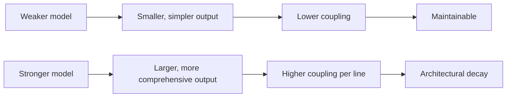

# The Reasoning-Complexity Trade-off

> As LLMs become more capable, they generate increasingly bloated and coupled code. Stronger models do not produce cleaner architecture — they produce more architecture. Volume becomes a near-perfect predictor of structural degradation, and neither passing tests nor detailed prompting reverses the trend.

## The Finding

[Zhu, Tsantalis, and Rigby (2026)](https://arxiv.org/abs/2605.02741) audited technical debt in AI-generated software across single-file tasks and agent-generated systems. Three findings:

- **Machine signature of defects** — AI-generated code carries a distinct flaw pattern, not a smaller version of human flaws.
- **Reasoning-Complexity Trade-off** — capability and architectural quality move in opposite directions.
- **Volume-Quality Inverse Law** — code volume is a near-perfect predictor of structural degradation.

Functional correctness does not predict maintainability. Detailed prompting does not produce smaller, less-coupled code ([Zhu et al.](https://arxiv.org/abs/2605.02741)).

## Why It Matters

The default upgrade path — swap to the next-generation model — buys capability and pays in maintenance debt. AI-assisted repos show the same direction independently: a [76% rise in LOC and 39% rise in cognitive complexity](https://agilepainrelief.com/blog/ai-generated-code-quality-problems/), an [8x spike in duplicated blocks 2021-2024](https://mikemason.ca/writing/ai-coding-agents-jan-2026/), and a [refactoring share that fell from 25% to under 10%](https://mikemason.ca/writing/ai-coding-agents-jan-2026/) of commits.



## What Doesn't Fix It

**Tests passing.** Functional correctness does not predict structural quality ([Zhu et al.](https://arxiv.org/abs/2605.02741)). Green CI is consistent with steeply declining maintainability.

**Longer prompts.** Detailed instructions do not reverse the trend at the model layer. The [Fowler/Garg notification case study](https://martinfowler.com/articles/reduce-friction-ai/design-first-collaboration.html) records a single-channel request returning rate limiting, analytics, and webhooks — features the prompt did not request.

**Bigger models.** This is the trade-off itself ([Zhu et al.](https://arxiv.org/abs/2605.02741)).

## What Does Help

Workflow gates that operate above the prompt layer:

- **Architectural foresight before generation.** [Design-first collaboration](https://martinfowler.com/articles/reduce-friction-ai/design-first-collaboration.html) gates implementation behind explicit approval — no code until the approach is agreed.
- **Volume as a quality signal.** Treat output size as a leading indicator; if line count is high relative to the requirement, structural degradation is the prior.
- **Post-generation cleanup.** [Entropy-reduction agents](../workflows/entropy-reduction-agents.md) and scheduled garbage-collection runs ([Fowler/Boeckeler](https://martinfowler.com/articles/exploring-gen-ai/harness-engineering.html)) target bloat that prompt-time controls miss.
- **Deterministic enforcement.** Cyclomatic complexity, function-length, and duplication thresholds catch what prompts cannot — see [hooks for enforcement vs prompts for guidance](../verification/hooks-vs-prompts.md).

## When This Doesn't Apply

The trade-off framing has narrow applicability where bloat carries no maintenance cost:

- **Greenfield throwaway code.** One-off scripts, demos, and prototypes are not maintained, so volume-quality drift has no observable cost surface.
- **Templated boilerplate.** When LOC inflation comes from explicit scaffolding (CRUD, IaC, test fixtures), volume is not a structural signal — the inverse law's predictive power degrades.
- **Solo small repos.** Without long-running maintenance horizons or shared ownership, structural degradation is local and tolerable.

## Example

A team is choosing between two models for a billing-rules service. Both pass the test suite for the requested feature: apply a tiered discount given a customer plan and order total.

**Model A — smaller capability tier:**

```python
def apply_discount(plan: str, total: float) -> float:
    rates = {"free": 0.0, "pro": 0.05, "enterprise": 0.10}
    return total * (1 - rates.get(plan, 0.0))
```

Eight lines. One function. One responsibility.

**Model B — larger capability tier, same prompt:**

```python
class DiscountStrategy(ABC):
    @abstractmethod
    def calculate(self, total: float) -> float: ...

class FreeDiscount(DiscountStrategy): ...
class ProDiscount(DiscountStrategy): ...
class EnterpriseDiscount(DiscountStrategy): ...

class DiscountCalculator:
    def __init__(self, strategy: DiscountStrategy): ...
    def apply(self, total: float) -> float: ...

class DiscountFactory:
    @staticmethod
    def create(plan: str) -> DiscountStrategy: ...

class DiscountAuditLog:
    def record(self, plan: str, total: float, applied: float): ...
```

Six classes, an abstract base, an unrequested audit log. Tests pass. The result satisfies the requirement and predicts the [Volume-Quality Inverse Law](https://arxiv.org/abs/2605.02741): the stronger model's output is larger and more coupled — the rate-tier change next sprint now touches three files instead of one.

## Key Takeaways

- Capability gains in LLMs do not transfer to architectural quality — they trade against it
- Tests passing and detailed prompting are insufficient countermeasures; the fix is structural, not prompt-level
- Treat output volume as a leading indicator of structural degradation and gate strong-model output behind architecture-aware checks

## Related

- [Abstraction Bloat](abstraction-bloat.md) — the symptom-level pattern; this page covers the directional finding that capability tilts the bloat balance
- [Shadow Tech Debt](shadow-tech-debt.md) — the cumulative effect across many agent commits
- [Comprehension Debt](comprehension-debt.md) — the human-side counterpart: code grows faster than understanding
- [Pattern Replication Risk](pattern-replication-risk.md) — agents amplify whatever is in the repository, including bloat
- [Spec Complexity Displacement](spec-complexity-displacement.md) — why tighter prompts converge toward code rather than fixing structural quality
- [Deterministic Guardrails](../verification/deterministic-guardrails.md) — CI thresholds that catch bloat mechanically
- [Hooks for Enforcement vs Prompts for Guidance](../verification/hooks-vs-prompts.md) — when to move quality controls out of the prompt
- [Entropy Reduction Agents](../workflows/entropy-reduction-agents.md) — scheduled cleanup passes for accumulated bloat
