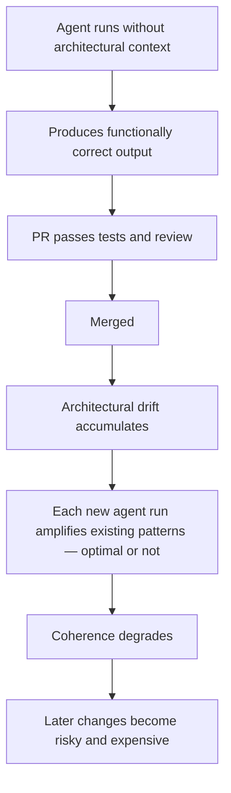
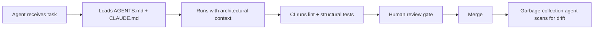

# Shadow Tech Debt

> AI agents complete tasks without architectural context — they don't know *why* a codebase is shaped the way it is, only *what* to change. Each agentic PR looks correct in isolation. The cumulative drift erodes coherence silently.

JetBrains coined the term **Shadow Tech Debt** ([The New Stack](https://thenewstack.io/jetbrains-names-the-debt-ai-agents-leave-behind/)) — debt that is invisible, diffuse, and compounded when agents run without structural codebase understanding.

## What It Looks Like

An agent fixes a bug and the PR passes tests — but the agent skipped ADRs, ignored naming conventions, and replicated a suboptimal pattern. One such PR is invisible. Ten per day compounds into structural incoherence.



## Why It Compounds

**Agents amplify existing patterns.** Suboptimal approaches propagate when agents replicate whatever is in the repository ([Lavaee](https://alexlavaee.me/blog/openai-agent-first-codebase-learnings/)).

**Review burden migrates, not disappears.** High-AI-adoption teams merged 98% more PRs, but review time grew 91% and PR size grew 154% ([Faros AI](https://www.faros.ai/blog/ai-software-engineering); [Osmani](https://addyo.substack.com/p/the-80-problem-in-agentic-coding)).

**Context window blindness is structural.** ADRs, tribal knowledge, and style rationale live outside the context window by default.

## The Risk Escalates in CI/CD

Without review gates, Shadow Tech Debt accumulates at machine speed — JetBrains Air concluded that complex codebases aren't yet ready for pure agentic coding ([JetBrains Air blog](https://blog.jetbrains.com/air/2026/03/air-launches-as-public-preview-a-new-wave-of-dev-tooling-built-on-26-years-of-experience/)).

## When This Backfires

Mitigation overhead may exceed benefit when:

- **Greenfield or throwaway codebases** — no accumulated architectural rationale to violate.
- **Comprehensive automated enforcement** — linting and module-boundary tests catch deviations before merge.
- **Infrequent agentic use** — occasional tasks under close review don't accumulate drift.

## Mitigation Stack

| Step | Effort | Action |
|------|--------|--------|
| 1 | Low | **Machine-readable context files** — [AGENTS.md](https://agents.md/) at the repo root; CLAUDE.md for Claude Code. Scoped files (`docs/CLAUDE.md`) for monorepos. |
| 2 | Medium | **Deterministic enforcement** — linters and structural tests for module boundaries, naming, and duplication ("[rigor relocation](../human/rigor-relocation.md)" — [Fowler/Boeckeler](https://martinfowler.com/articles/exploring-gen-ai/harness-engineering.html)). |
| 3 | Medium | **Review gates** — autonomous agents must not merge without human review on shared repositories. |
| 4 | High | **Garbage-collection agents** — background scans for architectural inconsistencies ([Fowler/Boeckeler](https://martinfowler.com/articles/exploring-gen-ai/harness-engineering.html); [Lavaee](https://alexlavaee.me/blog/openai-agent-first-codebase-learnings/)). Requires step 1. |

## What Good Looks Like



## Example

An agent is asked to fix a bug where deactivated users can still appear in search results. It writes a working fix — but queries the database directly in the handler, bypassing the repository layer the team uses for all data access.

**Without architectural context — the agent takes a shortcut:**

```python
# handlers/users.py
async def handle_search(query: str, db: AsyncSession):
    # Agent-generated fix: exclude deactivated users
    result = await db.execute(
        select(User).where(User.name.ilike(f"%{query}%"), User.active == True)
    )
    return result.scalars().all()
```

The fix passes tests. But it duplicates filtering logic, skips the team's access-control scoping, and sets a precedent that future agent runs will replicate.

**With `AGENTS.md` rule — `All DB access must go through the repository layer`:**

```python
# handlers/users.py
async def handle_search(query: str, user_repo: UserRepository):
    return await user_repo.search(query, include_inactive=False)
```

```python
# repositories/users.py  (existing repository — agent adds the filter here)
async def search(self, query: str, include_inactive: bool = True):
    stmt = select(User).where(User.name.ilike(f"%{query}%"))
    if not include_inactive:
        stmt = stmt.where(User.active == True)
    return (await self.session.execute(stmt)).scalars().all()
```

Same bug fix. No architectural drift.

## Related

- [PR Scope Creep as a Human Review Bottleneck](pr-scope-creep-review-bottleneck.md)
- [Abstraction Bloat](abstraction-bloat.md)
- [Pattern Replication Risk](pattern-replication-risk.md)
- [Agent-First Software Design](../agent-design/agent-first-software-design.md)
- [Comprehension Debt](comprehension-debt.md)
- [The Implicit Knowledge Problem](implicit-knowledge-problem.md)
- [Trust Without Verify](trust-without-verify.md)
- [Context Poisoning](context-poisoning.md)
- [Deterministic Guardrails](../verification/deterministic-guardrails.md)
- [Agent Harness](../agent-design/agent-harness.md)
- [CLAUDE.md Convention](../instructions/claude-md-convention.md)
- [Law of Triviality in AI PRs](law-of-triviality-ai-prs.md)
- [Effortless AI Fallacy](effortless-ai-fallacy.md)
- [Agent-Driven Greenfield Product Development](../workflows/agent-driven-greenfield.md)
- [Framework First](framework-first.md)
- [Boring Technology Bias](boring-technology-bias.md)
- [Cargo Cult Agent Setup](cargo-cult-agent-setup.md)
- [Demo to Production Gap](demo-to-production-gap.md)
- [Happy Path Bias](happy-path-bias.md)
- [Getting Started: Setting Up Your Instruction File](../workflows/getting-started-instruction-files.md)
