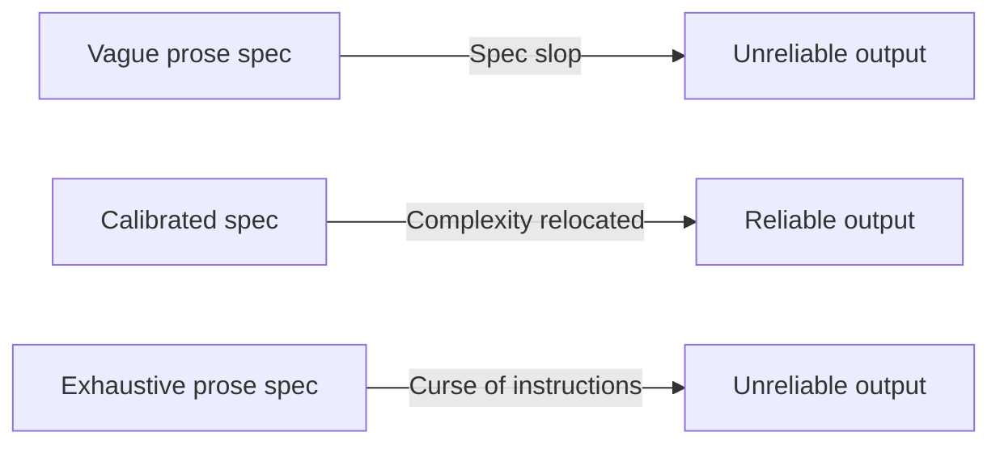

# Spec Complexity Displacement

> Writing a spec doesn’t eliminate engineering precision — it relocates the work. A spec tight enough to drive reliable code generation accumulates schemas, pseudocode, and formal constraints until it becomes code-adjacent. Make it vague and reliability collapses; make it exhaustive and model adherence collapses.

## The Fallacy

“Just write a spec” is framed as a shortcut — describing intent without bearing the cost of implementation. The fallacy is that the cost of precision can be skipped rather than moved.

A spec precise enough to reliably generate correct code must encode type constraints, algorithm logic, schema definitions, and edge case coverage. The OpenAI Symphony “specification” analyzed by Gabriel Gonzalez contains database schemas, algorithm pseudocode, and configuration checklists: it reads as code, not prose ([Gonzalez, 2026](https://haskellforall.com/2026/03/a-sufficiently-detailed-spec-is-code)).

## Two Failure Modes

| Failure | Description | Outcome |
|---|---|---|
| **Spec slop** | Low-precision prose written at speed | Unreliable agent output; assumptions propagate |
| **Over-specification** | Excessive detail accumulates beyond model capacity | Adherence to individual instructions degrades as spec grows |

Scott Logic found Spec Kit produced 2,000+ lines of Markdown per feature — still introducing bugs — while iterative prompting produced working code ten times faster ([Scott Logic, 2025](https://blog.scottlogic.com/2025/11/26/putting-spec-kit-through-its-paces-radical-idea-or-reinvented-waterfall.html)). Addy Osmani names the opposing failure the “curse of instructions”: as detail accumulates, adherence to individual instructions degrades ([Osmani, O’Reilly](https://www.oreilly.com/radar/how-to-write-a-good-spec-for-ai-agents/)). The sweet spot is narrow.

## Complexity Is Conserved

Spec-driven development relocates complexity rather than eliminating it — planning replaces chaos, but total work doesn’t shrink ([Thoughtworks, 2025](https://www.thoughtworks.com/en-us/insights/blog/agile-engineering-practices/spec-driven-development-unpacking-2025-new-engineering-practices)).

## What Replaces Verbose Specs

Formal enforcement gives precision-sensitive work a verification step that prose cannot:

| Mechanism | Encodes | Verifiable |
|---|---|---|
| Type signatures and interfaces | Shape and contract | Yes — compiler |
| Tests as acceptance criteria | Behavioral requirements | Yes — test runner |
| Database schemas | Data structure | Yes — migration |
| Linters and format rules | Style and structure | Yes — CI |
| Prose spec | Intent, rationale | No |

Reserve prose for what has no formal equivalent: business rationale, priority trade-offs, user intent. Delegate the precision work to artifacts that enforce rather than describe ([Anthropic](https://www.anthropic.com/engineering/building-effective-agents)).

## The Nuance: Spec Is Not the Same as Code

A spec covers all possible implementations; code is one. A spec is more abstract and transferable than code, but precision requirements for reliable generation pull it toward code-like structure. The claim is not that specs are useless — it is that specs precise enough to drive reliable generation converge toward code-like structure, and the “simpler than writing code” argument collapses.

## Example

A team writes an initial spec for a user authentication feature:

> "Users should be able to log in with email and password."

After several iterations to improve agent reliability, the spec becomes:

> "POST /auth/login accepts `{ email: string, password: string }`. Validate email format with RFC 5322 regex. Hash password using bcrypt with cost factor 12. Return 200 with `{ token: string, expires_at: ISO8601 }` on success. Return 401 with `{ error: "invalid_credentials" }` for unknown email or wrong password. Rate-limit to 5 attempts per IP per 15 minutes using a sliding window; return 429 on breach. Log all attempts to the auth audit table with timestamp, IP, and outcome."

The second version is precise enough to drive reliable generation — but it is also a type signature, a schema, a rate-limiting algorithm spec, and a logging requirement in prose form. The complexity was not eliminated; it was relocated from code into the spec.

## Related

- [Specification as Prompt](../instructions/specification-as-prompt.md)
- [Spec-Driven Development](../workflows/spec-driven-development.md)
- [Assumption Propagation](assumption-propagation.md)
- [Implicit Knowledge Problem](implicit-knowledge-problem.md)
- [Trust Without Verify](trust-without-verify.md)
- [Effortless AI Fallacy](effortless-ai-fallacy.md)
- [Prompt Tinkerer](prompt-tinkerer.md)
- [Abstraction Bloat](abstraction-bloat.md)
