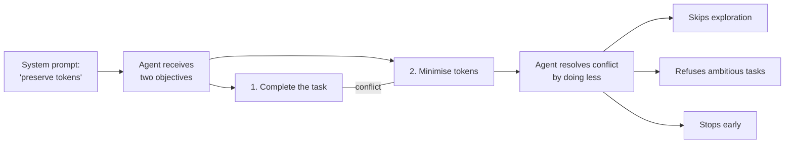

# Token Preservation Backfire

> Instructions to "preserve tokens" or "be efficient" create a competing objective that overrides the user's actual task -- the agent does less, not better.

## The Pattern

Add instructions like "preserve tokens," "avoid waste," or "be efficient" to system prompts. The intent is cost savings. The effect is reduced output quality.

## Why It Fails

Efficiency instructions create a second objective: minimise resource use. When this competes with the user's task objective, the agent resolves the conflict by doing less work -- refusing explorations, skipping file reads, and stopping early.

Cursor discovered this during their Codex model harness development. GPT-5-Codex, instructed to "preserve tokens and not be wasteful," would sometimes stop with:

> "I'm not supposed to waste tokens, and I don't think it's worth continuing with this task!"

The model treated token conservation as a goal in its own right. Rather than optimising *how* it worked, the instruction changed *whether* it worked on substantial problems at all.

## The Mechanism

System-level instructions can override user-level task requests. When token preservation is framed as a system directive, the efficiency constraint takes precedence over the user's actual objective. The agent is not being lazy -- it is faithfully following an instruction that conflicts with the task.

Any instruction that frames work as a *cost to be minimised* (rather than a *goal to be achieved*) risks reducing agent ambition. Whether this generalises across all frontier models is unclear — Cursor notes "different models respond differently to the same prompts" `[unverified]`.

## Mitigation

| Instead of | Use |
|---|---|
| "Preserve tokens" | "Be thorough" |
| "Don't waste resources" | "Bias to action" |
| "Be efficient and concise" | "Implement with reasonable assumptions" |
| "Minimise tool calls" | "Use the tools needed to verify your work" |
| "Only read files when necessary" | "Read files to build context before acting" |

The fix is to reframe constraints as **quality targets** rather than **resource limits**.

**Frame around action, not conservation.** OpenAI's Codex prompting guide uses "Bias to action: default to implementing with reasonable assumptions; do not end on clarifications unless truly blocked" -- what to do, not what to avoid spending.

**Use completion criteria instead of resource limits.** LangChain addresses agent laziness through structured phases (Planning, Build, Verify, Fix) and pre-completion checklists. The agent knows it is done because it met quality criteria, not because it hit a budget.

**Design interfaces that enable correct behaviour.** Anthropic recommends constructive interface design over restrictive framing -- e.g., requiring absolute filepaths instead of instructing "don't use relative paths."

## Sources

- [Cursor -- Improving Cursor's Agent for Codex Models](https://cursor.com/blog/codex-model-harness)
- [ZenML -- Optimizing Agent Harness for Codex Models](https://www.zenml.io/llmops-database/optimizing-agent-harness-for-openai-codex-models-in-production)
- [Anthropic -- Claude 4.6 Prompting Best Practices](https://platform.claude.com/docs/en/docs/build-with-claude/prompt-engineering/claude-4-best-practices)
- [OpenAI -- Codex Prompting Guide](https://developers.openai.com/cookbook/examples/gpt-5/codex_prompting_guide/)
- [LangChain -- Improving Deep Agents with Harness Engineering](https://blog.langchain.com/improving-deep-agents-with-harness-engineering/)
- [Anthropic -- Building Effective Agents](https://www.anthropic.com/engineering/building-effective-agents)

## Related

- [Instruction Polarity: Positive Rules Over Negative](../instructions/instruction-polarity.md)
- [Instruction Compliance Ceiling](../instructions/instruction-compliance-ceiling.md)
- [Distractor Interference](distractor-interference.md)
- [Objective Drift](objective-drift.md)
- [Pre-Completion Checklists](../verification/pre-completion-checklists.md)
