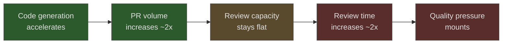

# AI Abundance Reshapes Software Engineering Identity

> Code production is being commoditized. The profession is splitting along a fault line that was always there but never mattered: do you love writing code, or do you love building things?

AI coding assistants have decoupled code-writing from software-building — two activities so tightly fused for decades that separating them felt impossible. The data is already measurable, the displacement already visible, and the identity crisis already underway. Whether AI amplifies or atrophies a practitioner's career depends on a conscious choice about professional identity: do you relocate your rigor, or let the tools erode it?

"Software developer" and "software engineer" were interchangeable titles on the same business card. The distinction was academic — something debated in university hallways and promptly ignored in industry. Writing code *was* building software. That coupling has now broken.

## The Identity Fracture

Andrej Karpathy framed it cleanly: "LLM coding will split up engineers based on those who primarily liked coding and those who primarily liked building." This is not a statement about competence. It is a statement about identity — about what practitioners find meaningful in their work ([Karpathy analysis](https://www.finalroundai.com/blog/karpathy-ai-builders-vs-coders)).

The split matters because it predicts behavior. Engineers who identify as coders — who find satisfaction in the craft of writing elegant implementations, mastering language idioms, building deep expertise in a runtime — experience AI code generation as a threat. It automates the activity that gives their work meaning. Engineers who identify as builders — who view code as instrumental, a means to ship products and solve problems — experience the same tools as liberation. They can move faster toward the outcome they actually care about.

Geoffrey Huntley pushes the argument further: "AI erases traditional developer identities — backend, frontend, Ruby, or Node.js. Anyone can now perform these roles." The specialization identities that organized careers for twenty years — the React expert, the Kubernetes specialist, the PostgreSQL wizard — lose their protective moat when a coding agent can produce competent implementations in any of these domains ([ghuntley.com](https://ghuntley.com/real/)).

This is not a clean binary. Most practitioners sit somewhere on the spectrum, and many feel the pull of both sides. But the direction of travel is clear: the market is repricing what each orientation is worth.

## What Is Actually Changing

The anecdotal arguments are compelling but insufficient. What does the data show?

### Adoption Is Near-Universal

The Pragmatic Engineer's 2026 survey found that 95% of professional engineers use AI tools weekly. 56% report doing 70% or more of their engineering work with AI assistance. 55% regularly use AI agents — not just autocomplete, but autonomous multi-step tools ([Pragmatic Engineer](https://newsletter.pragmaticengineer.com/p/ai-tooling-2026)).

This is not an early-adopter phenomenon. It is baseline professional practice.

### The Bottleneck Has Migrated

Faros AI data reveals a striking pattern in teams with high AI adoption: they merged 98% more pull requests while experiencing 91% longer review times. Code production accelerated dramatically. The human capacity to review that code did not ([Osmani: The 80% Problem](https://addyo.substack.com/p/the-80-problem-in-agentic-coding)).

The bottleneck has not disappeared. It has migrated from creation to review, from writing to reading, from production to judgment. This migration is the structural shift underneath all the identity arguments. Large-scale empirical data confirms the volume-vs-value tension: agent PR acceptance rates run 13–42 percentage points below human baselines despite 10× speed gains — see [Agent PR Volume vs. Value](../code-review/agent-pr-volume-vs-value.md).

### Quality Metrics Are Under Pressure

GitClear's data quantifies the downstream effect: a 17.1% increase in copy-pasted code, an 8-fold rise in duplicated code blocks, and a 26% increase in code churn — code that gets revised within two weeks of being written. More code is being produced. More of it is being thrown away ([Vella: Software Engineering Identity Crisis](https://annievella.com/posts/the-software-engineering-identity-crisis/)).

Stack Overflow's 2025 Developer Survey found that 66% of developers report spending more time fixing "almost-right" AI-generated code. The time freed from boilerplate production has not been absorbed by leisure. It has been absorbed by review, debugging, and integration — the work that remains stubbornly human ([Stack Overflow 2025 Developer Survey](https://survey.stackoverflow.co/2025/ai)).

## Industry Parallels

Software engineering is not the first profession to face the commoditization of its core production activity. The historical parallels are instructive, not because they predict outcomes perfectly, but because they illuminate the patterns of displacement and adaptation.

**Manufacturing craftsmen** faced a similar fracture during industrialization. Factory production progressively displaced artisanal skill across nineteenth- and early-twentieth-century England, compressing demand for hand-craft expertise as machine outputs became cost-competitive. The craftsmen who survived were those who moved into design, quality control, and process engineering — the judgment layer above production.

**Journalism** is a more recent and more uncomfortable parallel. AI is not merely automating distribution or layout (as earlier technology waves did) but intervening directly in the core creative process — writing. Journalists who redefined their value around investigation, source relationships, and editorial judgment have adapted. Those whose identity was tied to prose production face the same displacement software developers now confront.

**Graphic design** offers perhaps the closest analogy. Tools like Canva democratized execution — anyone can produce competent layouts. The premium shifted to taste, brand thinking, and creative direction. The designers who thrived were those who were never really selling pixel-pushing in the first place. They were selling judgment.

In each case, the pattern is the same: production skill gets commoditized, and value migrates to the judgment layer above it.

## The Skill Atrophy Trap

The identity shift would be manageable if practitioners could simply decide to become "builders" and move on. But there is a trap: the very tools enabling the transition also erode the skills required to supervise them.

A 2025 Microsoft and Carnegie Mellon study found that "the more people leaned on AI tools, the less critical thinking they engaged in." This is not laziness. It is a well-documented cognitive phenomenon — when a tool handles a task reliably enough, the brain deprioritizes the neural pathways associated with that task ([Osmani: Avoiding Skill Atrophy](https://addyo.substack.com/p/avoiding-skill-atrophy-in-the-age)).

Osmani identifies four warning signs of atrophy in practice:

1. **Debugging despair** — reaching for the AI immediately when code breaks, without forming a hypothesis first
2. **Blind copy-paste** — accepting generated code without reading it, treating the agent as an oracle
3. **Weakened architecture thinking** — deferring system design decisions to the model rather than reasoning through tradeoffs
4. **Diminished recall** — inability to write basic implementations in languages you use daily

The METR study adds a particularly troubling data point: developers using AI estimated they were 20% faster, when they were actually 19% slower. A 39-point perception gap. You cannot correct for atrophy you cannot detect ([METR](https://metr.org/blog/2025-07-10-early-2025-ai-experienced-os-dev-study/)).

This is the central paradox of the transition. Moving from coder to builder requires maintaining enough coding skill to evaluate what the AI produces. Delegate too aggressively and you lose the ability to supervise the delegation.

## Rigor Relocation

Martin Fowler, drawing on Chad Fowler's framing, offers what may be the most useful mental model for navigating this transition: **rigor relocation**. Engineering discipline does not vanish in an AI-augmented workflow. It moves ([Fowler: Harness Engineering](https://martinfowler.com/articles/exploring-gen-ai/harness-engineering.html)).

Where rigor previously lived in careful implementation — choosing the right algorithm, handling edge cases, writing defensive code — it now lives in:

- **Constraint design** — defining the rules, schemas, and guardrails that keep AI output within acceptable bounds
- **Verification systems** — building automated checks that catch what human review will miss at scale
- **Architectural judgment** — making the structural decisions that AI agents cannot yet reason about reliably
- **Intent specification** — learning to communicate requirements with enough precision that agents produce correct output

The engineer who thrives is not the one who stops caring about code quality. It is the one who applies that same obsessive care to the harness around the AI rather than to the code the AI produces. Osmani draws the line sharply: agentic engineering is a professional discipline; vibe coding is not — and conflating the two accelerates the identity confusion ([Osmani: Agentic Engineering](https://addyosmani.com/blog/agentic-engineering/)).

This maps directly to the maturity model GitHub identified in their Octoverse data. Developers progress through four stages: **Skeptic** (refuses AI tools), **Explorer** (experiments cautiously), **Collaborator** (integrates AI into daily workflow), **Strategist** (orchestrates AI agents as "creative director of code"). At the Strategist level, the practitioner focuses on defining intent, guiding agents, resolving ambiguity, and validating correctness — not on writing implementations ([GitHub Blog](https://github.blog/news-insights/octoverse/the-new-identity-of-a-developer-what-changes-and-what-doesnt-in-the-ai-era/)). A more granular seven-phase practitioner model — including the trust trough at Phase 4 — is explored in [The AI Development Maturity Model](../workflows/ai-development-maturity-model.md).

## The Abundance Paradox

More code. Longer reviews. Higher churn. Threatened open-source ecosystems. The abundance created by AI coding assistants produces counterintuitive problems.

Huntley identifies one of the sharpest: developers increasingly bypass dependency management entirely, generating solutions on-demand rather than integrating maintained libraries. Why add a dependency with its maintenance burden, security surface, and upgrade treadmill when an agent can generate the equivalent functionality inline? ([ghuntley.com](https://ghuntley.com/libraries/))

This logic is seductive and corrosive. Open-source libraries encode years of edge-case discovery, security patches, and community review. Generated-on-demand code encodes none of this. The short-term efficiency gain creates a long-term resilience loss — trading a maintained commons for throwaway implementations.

The broader abundance paradox: when code is cheap to produce, the skills that become expensive are the ones that prevent you from drowning in it. Curation, review, architectural coherence, and the judgment to know when *not* to generate more code become the scarce resources.

## The Junior Developer Crisis

The identity shift hits hardest at the entry level. Employment for software developers aged 22-25 fell nearly 20% from its 2022 peak. Seventy percent of hiring managers report that AI performs intern-level work. Computer science graduates face 6.1% unemployment — higher than liberal arts majors ([Stack Overflow](https://stackoverflow.blog/2025/12/26/ai-vs-gen-z/)).

This is not merely a hiring cycle. It is a structural change in how the profession onboards new practitioners. The traditional pipeline — junior developer writes boilerplate, learns patterns through repetition, gradually takes on design responsibilities — assumed that someone needed to write that boilerplate. When agents handle it, the first rung of the ladder disappears.

The profession has not yet figured out how to replace it. Apprenticeship models, AI-paired learning, and "strategist-track" onboarding are all being tried. None have proven themselves at scale.

## What This Means for Practitioners

The honest assessment: this transition is a genuine loss for some and a genuine opportunity for others. The determining factor is whether practitioners consciously develop the skills that AI cannot replicate.

**If your identity is anchored in code-writing craft**, the path forward requires grief and adaptation. The craft is not worthless — deep implementation skill remains essential for reviewing AI output, debugging complex systems, and understanding performance characteristics. But it is no longer sufficient as a career moat on its own.

**If your identity is anchored in building**, you are entering a period of unprecedented leverage. The gap between what you can envision and what you can ship has never been smaller. The constraint is no longer "can I implement this?" but "should I build this, and can I verify that it works?"

**Regardless of orientation**, the following investments compound:

| Investment | Why it matters |
|-----------|---------------|
| Architectural judgment | AI cannot yet reason reliably about system-level tradeoffs |
| Review discipline | The bottleneck has migrated here; this is where quality lives |
| Constraint design | Guardrails, schemas, and verification harnesses are the new implementation |
| Deliberate manual practice | Maintains the capability required to supervise AI output |
| Taste and product sense | With execution commoditized, knowing *what* to build becomes the differentiator |

Huntley's summary is blunt: "Execution is now cheap. All that matters now is brand, distribution, ideas and retaining people who get it" ([ghuntley.com](https://ghuntley.com/dothings/)). This overstates the case — execution quality still matters, and someone has to ensure it — but the directional claim is correct. The center of gravity has shifted.

## The Choice

The split between coder and builder is not something that happens to you. It is a choice you make, repeatedly, in how you engage with these tools.

Every time you accept generated code without reading it, you move toward atrophy. Every time you design a constraint system that prevents an entire class of errors, you move toward engineering. Every time you form a hypothesis before asking the AI to debug, you maintain the skill to supervise it. Every time you reflexively generate more code instead of questioning whether the code is needed, you contribute to the abundance problem rather than solving it.

The profession is not dying. It is differentiating. And the practitioners who navigate the transition successfully will be the ones who understand that the most important engineering decision in the AI era is not which model to use or which agent framework to adopt. It is deciding what kind of engineer you want to be — and then doing the deliberate work to become that person.

## Key Takeaways

- The coder/builder split is an identity question, not a competence ranking — both orientations can thrive if practitioners consciously relocate their rigor.
- The production bottleneck has migrated: code generation accelerated ~2x, but review capacity stayed flat, shifting where quality work actually happens.
- Skill atrophy is self-concealing: developers in the METR study estimated they were 20% faster while actually running 19% slower — you cannot correct for degradation you cannot detect.
- Rigor relocation means applying engineering discipline to the harness — constraint design, verification systems, and intent specification — rather than to the code the AI produces.
- The most durable career investments are architectural judgment, review discipline, and deliberate manual practice, because these are the skills required to supervise AI output.

## Sources

- [Karpathy: Builder vs. Coder Split](https://www.finalroundai.com/blog/karpathy-ai-builders-vs-coders) — identity fracture framing
- [Geoffrey Huntley: AI Erases Developer Identities](https://ghuntley.com/real/) — specialization displacement
- [Geoffrey Huntley: Execution Is Cheap](https://ghuntley.com/dothings/) — competitive moat relocation
- [Geoffrey Huntley: What Is the Point of Libraries?](https://ghuntley.com/libraries/) — open-source sustainability threat
- [Pragmatic Engineer: AI Tooling 2026](https://newsletter.pragmaticengineer.com/p/ai-tooling-2026) — adoption data
- [Addy Osmani: The 80% Problem](https://addyo.substack.com/p/the-80-problem-in-agentic-coding) — bottleneck migration, review capacity data
- [Addy Osmani: Avoiding Skill Atrophy](https://addyo.substack.com/p/avoiding-skill-atrophy-in-the-age) — atrophy warning signs, Microsoft/CMU study
- [Addy Osmani: Agentic Engineering](https://addyosmani.com/blog/agentic-engineering/) — professional distinction from vibe coding
- [Annie Vella: Software Engineering Identity Crisis](https://annievella.com/posts/the-software-engineering-identity-crisis/) — GitClear quality data, role fluidity analysis
- [GitHub Blog: New Identity of a Developer](https://github.blog/news-insights/octoverse/the-new-identity-of-a-developer-what-changes-and-what-doesnt-in-the-ai-era/) — four-stage maturity model
- [Martin Fowler: Harness Engineering](https://martinfowler.com/articles/exploring-gen-ai/harness-engineering.html) — rigor relocation framework
- [Stack Overflow: AI vs Gen Z](https://stackoverflow.blog/2025/12/26/ai-vs-gen-z/) — junior developer employment data
- [Stack Overflow: 2025 Developer Survey — AI](https://survey.stackoverflow.co/2025/ai) — code quality and time allocation data
- [METR: AI Developer Study](https://metr.org/blog/2025-07-10-early-2025-ai-experienced-os-dev-study/) — perception gap data

## Related

- [Skill Atrophy](../human/skill-atrophy.md) — detailed treatment of the cognitive offloading mechanism
- [Rigor Relocation](../human/rigor-relocation.md) — the pattern of discipline migrating from implementation to constraint design
- [Bottleneck Migration](../human/bottleneck-migration.md) — how AI shifts constraints rather than removing them
- [Harness Engineering](../agent-design/harness-engineering.md) — building the verification layer around AI agents
- [Vibe Coding](../workflows/vibe-coding.md) — the workflow pattern where identity risks are highest
- [Addictive Flow State of Agent-Assisted Development](../human/addictive-flow-agent-development.md) — the psychological mechanisms driving compulsive engagement with AI tools
