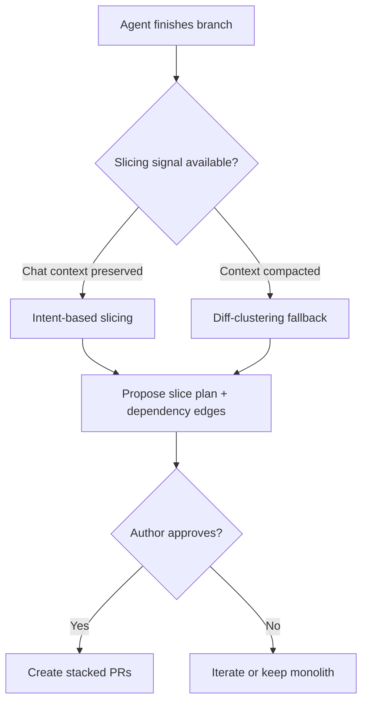

# Agent-Driven PR Slicing

> The agent that produced a branch proposes its own split into smaller, reviewable PRs — using session intent, not diff clustering, as the slicing signal.

## The Pattern

Defect detection drops sharply once a single review exceeds 200–400 lines or 60–90 minutes of attention, per the SmartBear/Cisco study of ~2,500 reviews across 3.2M lines ([SmartBear](https://support.smartbear.com/collaborator/docs/working-with/concepts/optimal-size.html)). Slicing a 2,000-line branch into four 500-line PRs lands inside that envelope — and reviewer attention is the dominant cost on agent-authored PRs ([Agent PR Volume vs. Value](agent-pr-volume-vs-value.md)).

What sets agent-driven slicing apart is who decides where to cut: the same agent that built the change, holding the chat-context record of which edits belonged to which sub-task and where the dependency edges are.

| Mechanism | Slicing signal | Failure mode |
|----------|---------------|--------------|
| Manual reviewer split | File or directory boundaries | Misses semantic groupings |
| Stacked-diff tooling (`gh-stack`, Graphite) | Commit boundaries | Only as good as the history |
| Diff-clustering tools (`pr-splitter`) | Hunk embeddings + LLM grouping | Fails on cross-cutting refactors |
| Agent-driven slicing | Session intent + dependency graph | Degrades when context was compacted |

Cursor 3.3 (2026-05-07) ships this as a "Split PRs" quick action: chat context identifies the slices, dependencies set the ordering, and a plan goes to the author for approval before any PR is created ([Cursor changelog](https://cursor.com/changelog/05-07-26)). The open-source `pr-splitter` CLI is the diff-only alternative ([DiffEnder/pr-splitter](https://github.com/DiffEnder/pr-splitter)).

## Slicing Signals

The agent cuts along axes the diff alone does not encode — the `commit-work` skill catalogues the same axes for commit-level splitting ([softaworks/agent-toolkit](https://github.com/softaworks/agent-toolkit/blob/main/skills/commit-work/SKILL.md)):

- **Feature vs. refactor** — endpoint and supporting interface change land separately
- **Backend vs. frontend** — server contract first, client consumer second
- **Formatting vs. logic** — mechanical reformatting splits from behavior
- **Tests vs. production code** — the test PR can land alongside or after
- **Dependency bumps vs. behavior changes** — version updates separate from usage

Intent-driven slicing adds a sixth axis: which task in the chat session each edit belonged to. This turns a shallow file-based split into a semantically coherent set.

## Stacking and Dependency Order

Independent slices land as parallel PRs against the same base. Dependent slices stack — each targets the one before it. GitHub's native Stacked PRs (`gh-stack` CLI, private preview 2026-04-13) makes this first-class: branch protection enforces against the final base, CI runs every layer, and the CLI is "designed for use by AI agents" ([GitHub Stacked PRs](https://github.github.com/gh-stack/), [InfoQ](https://www.infoq.com/news/2026/04/github-stacked-prs/)).

Dependency-aware slicing has two parts: identify the slices, then their partial order. Without it, dependent slices look independent and reviewers merge them out of order, leaving broken intermediate states ([Graphite](https://graphite.com/guides/github-pr-dependency)).

## When Not to Slice

A single PR is preferable when:

- **Cross-cutting refactor** — a rename or interface migration touches many files but is one semantic unit; file or hunk boundaries produce clusters that each break the build.
- **Atomic-revert requirements** — feature flags, schema-and-code changes, migrations that must land or roll back together; a revert across N stacked PRs is harder than reverting one.
- **Security-sensitive paths** — splitting a security fix widens the partial-protection window and risks out-of-order merges.
- **Small total diffs** — a 200-line change sliced into three 60-line PRs adds queue overhead without lowering per-PR load; below the ~200-LOC floor the SmartBear data suggests slicing is net-negative.
- **Thin chat context** — when the agent did not author the branch or context was compacted, slicing falls back to diff-only signals and misses intent.

## When Splits Are Worse Than the Original

A 1,500-line refactor sliced by directory becomes four PRs that each touch one layer; reviewing one means opening the others, so everyone holds *more* context than the monolith forced. Two signs the slicing was wrong:

- **No PR is independently mergeable.** If every PR merges in lockstep, the slicer found syntactic boundaries, not semantic ones — `pr-splitter`'s hunk-clustering surfaces this on cross-cutting refactors.
- **Reviewers ask for the original diff.** Review threads keep referencing files outside the slice ([renovate #14628](https://github.com/renovatebot/renovate/discussions/14628)).

Stacking carries its own cost. Practitioner consensus puts the ceiling at three to four PRs per stack: beyond that, feedback on an early slice forces a rebase cascade through every downstream slice — enough that some teams abandon stacking once the cascade cost exceeds the blocking waits it replaced ([dev.to](https://dev.to/alanwest/how-to-stop-drowning-in-giant-pull-requests-with-stacked-prs-2o9d)). The OAuth example below sits at that ceiling; if any layer is likely to churn, a shallower split costs less.

The mitigation is the author's approval gate — Cursor surfaces the proposed split before creating PRs, not after.

## Example

A developer asks an agent to "add OAuth login to the dashboard" on a feature branch. The agent ships ~1,200 lines across 18 files: a new `/auth/oauth` route, a refactored session middleware, three new database columns with a migration, a config schema change, frontend login handling, and a test suite. Pre-split, this is one PR.

**Naive slicing** (file-based): one PR per directory — `routes/`, `middleware/`, `db/`, `frontend/`, `tests/`. Reviewers cannot review any in isolation; the tests reference an endpoint defined in another PR, and the middleware breaks against `main` because the route doesn't exist yet.

**Intent-based slicing** (the agent's chat context):

1. **Migration + config schema** — runs first, no behavior change, mergeable independently
2. **Session middleware refactor** — depends on (1), preserves existing behavior, mergeable on its own with full coverage
3. **OAuth route + provider plumbing** — depends on (2), adds the new endpoint with tests
4. **Frontend login UI** — depends on (3), exercised by integration tests against the staged stack

Each PR is independently reviewable against its own base. Each lands inside the 200–400 LOC reviewer envelope. The dependency graph is explicit. A reviewer engaging only with PR (3) does not need to load the frontend changes into working memory.

## Key Takeaways

- The slicer's edge is intent context — the same agent that produced the branch knows which edits belong to which sub-task; a separate diff-analysis tool does not
- Slicing only helps when the resulting PRs each fit within the SmartBear 200–400 LOC envelope and each is independently meaningful
- Dependency-aware slicing produces a stack, not a flat set; flat slicing on dependent work produces broken intermediate states
- The pattern fails on cross-cutting refactors, atomic-revert paths, security-sensitive changes, and small diffs
- Keep the author's approval gate before PRs are created; the proposed split is a hypothesis, not a result

## Related

- [Agent PR Volume vs. Value](agent-pr-volume-vs-value.md) — reviewer-attention pressure that motivates slicing
- [Predicting Reviewable Code](predicting-reviewable-code.md) — upstream signal on which code is worth reviewing
- [Tiered Code Review](tiered-code-review.md) — routing review effort by risk; complementary to intent slicing
- [Cloud Parallel Review Pattern](cloud-parallel-review-pattern.md) — fan-out review across one PR
- [Diff-Based Review](diff-based-review.md) — the review-the-delta scope slicing makes tractable
