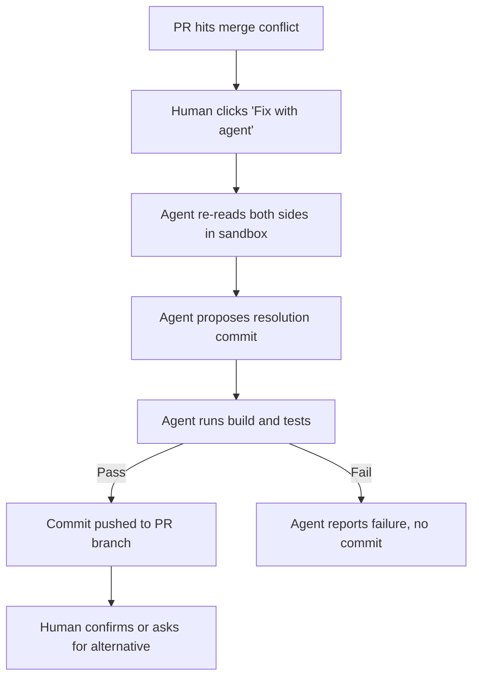

# Agent-Proposed Merge Resolution

> Merge conflicts are the dominant seam between agent-authored PRs and the rest of the codebase. The working interaction contract is agent-proposes-and-validates, human-confirms — not auto-merge.

## The Contract

Agent-proposed merge resolution is a specific division of labour:

- **Agent** re-reads both sides of the conflict, produces a single resolution commit, and validates that builds and tests still pass in an isolated environment.
- **Human** reviews the proposal and either confirms it or asks for an alternative. The action is bounded to a few clicks, not a full branch rebuild.

The human stays in the decision loop. The agent does the expensive cognitive step — rebuilding both sides' intent — but cannot ship the merge unilaterally.

GitHub's Copilot cloud agent implements this pattern as a "Fix with Copilot" button on the PR conflict view. The flow is three clicks: click the button, review a pre-populated comment, submit ([GitHub Changelog, 13 April 2026](https://github.blog/changelog/2026-04-13-fix-merge-conflicts-in-three-clicks-with-copilot-cloud-agent/)). The same interaction generalises to any agent that can open a sandbox, resolve, validate, and push.

## Why This Contract Works

Merge conflict resolution decomposes into two asymmetric steps: propose a resolution (re-read both sides, pick a merge candidate, produce the code) and confirm it (check the proposal does what you expect). A human-only flow pays the proposal cost every time. The agent-proposes / human-confirms contract moves that cost to the agent, in a sandbox with build and test validation — leaving the human to confirm. The build/test gate is load-bearing: it is the minimum signal that the proposal is type- and test-consistent, not a silent pick-a-side ([GitHub Changelog](https://github.blog/changelog/2026-04-13-fix-merge-conflicts-in-three-clicks-with-copilot-cloud-agent/)).

The result lands as a single new commit, not a rebase. Force pushes during active review are the strongest negative predictor of merge success in a study of 33,596 agent-authored PRs ([arXiv:2602.19441](https://arxiv.org/abs/2602.19441), summarised in [Agent-Authored PR Integration](agent-authored-pr-integration.md)). A fresh commit preserves reviewer context; a rebase destroys it.

## Why This Matters at the PR Boundary

Merge conflicts appear at the seam between agent-authored PRs and the rest of the codebase — the surface where parallel agent work grows fastest. Existing patterns already identify conflict surface as the scaling bottleneck for parallel agents: rebases "burn agent context" and conflict surface scales with concurrent branches ([Single-Branch Git for Agent Swarms](../workflows/single-branch-git-agent-swarms.md)).

As parallel agent use increases, more PRs stall waiting for conflict triage. Lowering the conflict tax through a bounded interaction is higher-leverage than it appears — not because each conflict takes long, but because the friction compounds across PR volume.

## The Design Contract, Step by Step

The critical transitions:

| Step | Must surface to human |
|---|---|
| Agent proposes | A short rationale for the chosen side — not just a diff |
| Agent validates | Build and test status, explicitly |
| Agent commits | A new commit, never a force push |
| Human confirms | An accept/reject action, not a silent auto-merge |

## When This Backfires

The low-friction interaction is the pattern's strength and its weakness. Four conditions degrade it:

- **Semantic merges that pass the gate silently**: build and test passing is necessary but not sufficient. A test gap lets a wrong-side-chosen resolution ship without any signal. Existing content notes that "logical conflicts survive textual merges" ([Single-Branch Git for Agent Swarms](../workflows/single-branch-git-agent-swarms.md)) — the same risk applies to agent resolutions, just packaged more smoothly.
- **Large, deeply intertwined conflicts**: the three-click model assumes the agent can bound the conflict and propose a single merge candidate. Sprawling conflicts need human decomposition first; a one-shot agent proposal on them is more likely to hide disagreement than resolve it.
- **Click-through acceptance bias**: the cheaper the accept action, the more it invites rubber-stamping. If the pre-populated comment does not surface the trade-off — why this side, not the other — the "human confirms" step degrades into a reflex.
- **Reviewer is not the original author**: low-friction accept assumes shared context between the reviewer and both sides of the conflict. Unfamiliar reviewers need more context, not fewer clicks. This is the same failure mode identified for large changesets in [Agent-Authored PR Integration](agent-authored-pr-integration.md).

## Availability

Copilot cloud agent's three-click conflict resolution is included with all paid Copilot plans. Copilot Business and Enterprise administrators must explicitly enable the cloud agent before team members can use it ([GitHub Changelog](https://github.blog/changelog/2026-04-13-fix-merge-conflicts-in-three-clicks-with-copilot-cloud-agent/)). The design contract generalises to any agent platform that can open a sandbox and push a resolution commit — [Agent HQ](../tools/copilot/agent-hq.md) is the host for the pattern on github.com across Copilot, Claude, and Codex.

## Example

A feature branch targets `main`. While the PR was in review, `main` moved forward and now conflicts with a refactor on the branch. On github.com the reviewer sees the conflict banner and a "Fix with Copilot" button. One click opens a pre-populated PR comment. A second click submits it. The Copilot cloud agent clones the PR in its cloud environment, resolves the conflict, runs the repository's CI workflows, confirms they pass, and pushes a single commit titled `Resolve merge conflicts with main` onto the PR branch ([GitHub Changelog](https://github.blog/changelog/2026-04-13-fix-merge-conflicts-in-three-clicks-with-copilot-cloud-agent/)). The reviewer sees the new commit, reads the diff, and — because the resolution came in as a new commit rather than a rebase — review context from earlier rounds is preserved. One further approval merges the PR.

Contrast with the failure mode: the same conflict is resolved by a one-shot prompt that asks the agent to "pick whichever side works," the agent chooses, tests pass because the test suite does not cover the affected path, and a subtle logic bug ships. The difference is not automation — it is whether the proposal, its rationale, and its validation all surface to the human before confirmation.

## Key Takeaways

- The working contract is agent-proposes-and-validates, human-confirms — not auto-merge.
- Build and test validation inside the agent's sandbox is load-bearing; without it the interaction collapses into pick-a-side.
- Resolution must land as a new commit, not a force push; rebases destroy review context and correlate with lower merge rates.
- Low click-count is a feature only when the rationale is surfaced; otherwise the human step degrades into a rubber stamp.
- The pattern compounds in value with parallel agent work — more parallel agents means more conflict-boundary interactions, each of which is individually cheap but collectively expensive.

## Related

- [Agent-Authored PR Integration](agent-authored-pr-integration.md) — why force-push-free resolution matters; reviewer engagement and merge predictors.
- [Single-Branch Git for Agent Swarms](../workflows/single-branch-git-agent-swarms.md) — why conflict surface is the scaling bottleneck for parallel agents.
- [Parallel Agent Sessions](../workflows/parallel-agent-sessions.md) — the decision-making shift that makes conflict friction a high-leverage target.
- [Worktree Isolation](../workflows/worktree-isolation.md) — sandbox primitive for resolving conflicts without touching `main`.
- [Agent HQ](../tools/copilot/agent-hq.md) — platform host for agent-proposed changes on github.com, including conflict resolution.
