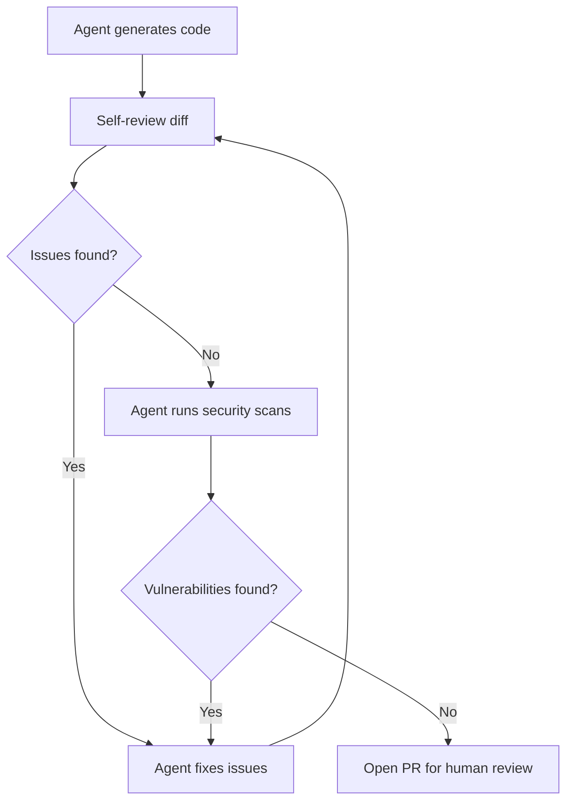

# Agent Self-Review Loop

> An agent self-review loop runs code review, security scanning, and quality checks on its own output before submitting work for human review.

!!! info "Also known as"
    Review-Then-Implement Loop, Agent Review Loops

## The pattern

An agent that generates code runs a review pass on its own changes before it opens a pull request. It iterates on the findings and fixes issues before a human ever sees the PR.

This differs from the [Committee Review Pattern](committee-review-pattern.md), where separate reviewer agents evaluate an implementer's output. In a self-review loop, the same agent evaluates and iterates on its own work as a built-in phase before submission. A tightly integrated review step in the agent's workflow counts as the same agent here.

## How it works



### GitHub Copilot coding agent

GitHub's [Copilot coding agent](../tools/copilot/coding-agent.md) implements this pattern natively. The agent [reviews its own changes using Copilot code review before it opens the pull request](https://github.blog/ai-and-ml/github-copilot/whats-new-with-github-copilot-coding-agent/). It takes the feedback and revises the patch. It requests human review only after it finishes its own review cycle.

The agent also runs security checks during its workflow:

- Code scanning — static analysis for vulnerability patterns
- Secret scanning — detects accidentally committed credentials
- Dependency vulnerability checks — flags dependencies with known CVEs

As GitHub documents: ["If a dependency has a known issue, or something looks like a committed API key, it gets flagged before the pull request opens."](https://github.blog/ai-and-ml/github-copilot/whats-new-with-github-copilot-coding-agent/) Code scanning, normally part of GitHub Advanced Security, is included at no additional cost.

Copilot code review has processed [over 60 million reviews](https://github.blog/ai-and-ml/github-copilot/60-million-copilot-code-reviews-and-counting/) since its April 2025 launch.

## What human reviewers gain

Self-review removes the issues humans should not spend time on: style violations, unused imports, common vulnerability patterns, and accidental secret exposure. This shifts their attention to the areas where judgment is irreplaceable.

GitHub identifies [three functions that remain exclusively human](https://github.blog/ai-and-ml/generative-ai/code-review-in-the-age-of-ai-why-developers-will-always-own-the-merge-button/):

1. Architectural decisions. A question like "should we split this service?" needs contextual judgment.
2. Mentorship. Experience transfers through PR review comments, from senior engineers to junior ones.
3. Ethical evaluation. People decide whether features align with organizational values.

Self-review [reduces back-and-forth by roughly a third](https://github.blog/ai-and-ml/generative-ai/code-review-in-the-age-of-ai-why-developers-will-always-own-the-merge-button/) by removing trivial corrections, and the merge button stays a human decision.

## Implementing the pattern

For agents without built-in self-review:

1. Add a review step before PR creation. After the agent finishes code generation, run a separate review prompt or subagent against the diff. Use `git diff` to scope the review to changes only.
2. Include security tooling. Run linters, static analysis (for example, CodeQL, Semgrep, Bandit), and secret scanners as shell commands in the agent's workflow. Parse the results and fix findings before proceeding.
3. Cap the iteration rounds. Set a maximum of 2 to 3 self-review cycles. If the agent cannot resolve its own findings within that limit, open the PR with the remaining issues documented for human review.
4. Maintain independence where you can. A fresh context for the review step reduces confirmation bias, and full independence is the [committee review](committee-review-pattern.md) alternative. If you use a subagent for review, give it read-only tool access and a review-focused prompt distinct from the implementation prompt.

## Limitations

Confirmation bias. An agent that reviews its own output in the same context tends to validate the same assumptions it made during generation. This is structurally less independent than cross-agent or cross-model review, because a single-context reviewer shares the same training biases and blind spots as the generator. The pattern is simpler to run and faster than coordinating separate reviewers, at the cost of that independence. When you add an external LLM reviewer, a separate failure mode applies: LLMs systematically flag correct code as non-compliant, and adding explanation requirements worsens the false positive rate. See [LLM Code Review Overcorrection](../patterns/anti-patterns/llm-review-overcorrection.md).

Scope ceiling. Self-review catches mechanical issues: style, known vulnerability patterns, and dependency problems. It does not catch architectural misjudgments, incorrect business logic, or design problems that need domain knowledge beyond the agent's context.

Diminishing returns. After 2 to 3 rounds of self-review iteration, more rounds rarely surface new issues. The agent converges on its own interpretation of correctness.

## Key Takeaways

- Removing mechanical issues from the review queue does not touch the three functions GitHub calls exclusively human: architectural decisions, mentorship, and ethical evaluation
- GitHub's Copilot coding agent implements self-review natively: code review, security scanning, and dependency checks all run before the PR opens
- The roughly one-third cut in reviewer back-and-forth comes specifically from removing trivial corrections, not from skipping the human merge decision
- Cap self-review at two to three rounds and document remaining findings before opening the PR, because further rounds rarely surface anything new
- Adding an external LLM reviewer trades one failure mode for another: LLMs over-flag correct code as non-compliant, especially when asked to justify each flag

## Example

A Claude Code agent implementing a feature branch runs a self-review loop before opening a PR.

Review step prompt, which runs after code generation:

```
Review the following diff for issues before I open a pull request.

Check for:
- Logic errors and off-by-one mistakes
- Unused imports or variables
- Hardcoded credentials or secrets
- Missing error handling
- Test coverage gaps

Output a JSON array: [{"file": "...", "line": N, "severity": "high|medium|low", "issue": "..."}]
If no issues found, return [].

<diff>
$(git diff main)
</diff>
```

Agent workflow:

```python
MAX_ROUNDS = 3

for round in range(MAX_ROUNDS):
    findings = run_review_prompt(git_diff())
    if not findings:
        break
    fix_findings(findings)

if findings:
    # Could not resolve all findings — open PR with issues documented
    open_pr(unresolved=findings)
else:
    open_pr(unresolved=[])
```

Security scan step, which runs in parallel with the review:

```bash
# Static analysis
semgrep --config=auto --json > semgrep-findings.json

# Secret scanning
trufflehog filesystem . --json > secrets-findings.json

# Dependency vulnerabilities
pip-audit --format=json > audit-findings.json
```

The agent parses each JSON output and fixes findings before the PR opens. If findings remain after the iteration cap, they are documented in the PR body for human review.

## FAQ

**How does self-review differ from committee review?**

In a self-review loop the same agent evaluates and iterates on its own work as a built-in phase before submission; in the [committee pattern](committee-review-pattern.md) separate reviewer agents evaluate an implementer's output. Self-review is simpler to run and faster than coordinating separate reviewers, at the cost of independence. A single-context reviewer shares the generator's assumptions, training biases, and blind spots.

**How do I add self-review to an agent that lacks it?**

Add a review step before pull-request creation: run a separate review prompt or subagent against `git diff` so the review is scoped to the changes only. Wire linters, static analysis such as CodeQL, Semgrep, or Bandit, and secret scanners in as shell commands, parse their results, and fix findings before proceeding. A fresh context for the review step reduces confirmation bias.

**What does self-review fail to catch?**

It catches mechanical issues: style, known vulnerability patterns, and dependency problems. It does not catch architectural misjudgments, incorrect business logic, or design problems requiring domain knowledge beyond the agent's context. Architectural decisions, mentorship through pull-request threads, and ethical evaluation remain exclusively human functions, which is why GitHub frames the merge button as a human decision.

## Related

- [Review-Then-Implement Loop](review-then-implement-loop.md)
- [Committee Review Pattern](committee-review-pattern.md) — cross-agent alternative where independent reviewers evaluate an implementer's output
- [Agent-Assisted Code Review](agent-assisted-code-review.md)
- [Evaluator-Optimizer Pattern](../patterns/agent-design/evaluator-optimizer.md)
- [Convergence Detection](../loop-engineering/convergence-detection.md) — deciding when self-review iterations have stopped surfacing new issues
- [Loop Strategy Spectrum](../loop-engineering/loop-strategy-spectrum.md) — accumulated vs fresh context tradeoffs across iteration loops
- [Agent Harness](../patterns/agent-design/agent-harness.md) — the initializer + coding agent pattern that self-review integrates into as a built-in phase
- [Pre-Completion Checklists](../verification/pre-completion-checklists.md)
