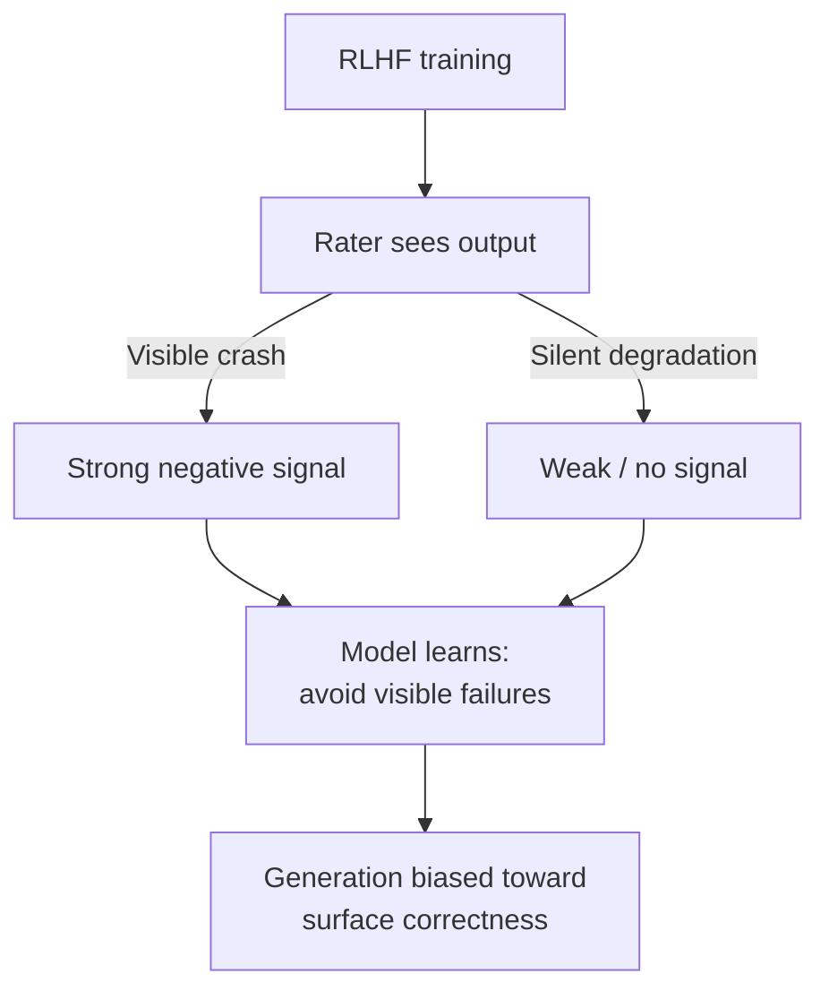

# AIRA: Inspection Framework for AI-Generated Code

> A deterministic 15-check inspection framework that targets the patterns where AI-generated code preserves the appearance of functionality while silently degrading guarantees.

## The Failure Mode AIRA Targets

The [AIRA paper (Parris, 2026)](https://arxiv.org/abs/2604.17587) defines **failure truthfulness** as "the property that a system's observable outputs accurately represent its internal success or failure state, without suppression, ambiguity, or degradation masking."

A matched-control replication (955 AI-attributed files vs 955 human controls across JavaScript, Python, TypeScript) found **0.435 high-severity findings per AI file vs 0.242 for human controls — a 1.80x differential**, concentrated in exception-handling patterns ([AIRA paper §Study 3](https://arxiv.org/html/2604.17587v1)). Independent work converges: an empirical study of AI-generated build code across 387 PRs and 945 files identifies lack of error handling as a recurring maintainability smell ([Mudbhari et al., arxiv:2601.16839](https://arxiv.org/abs/2601.16839)), and a 304,362-commit longitudinal study finds AI-authored code accumulates technical debt faster than human-authored code ([arxiv:2603.28592](https://arxiv.org/abs/2603.28592)).

## The Reward-Shaped Failure Hypothesis

AIRA proposes the pattern is an artifact of optimisation through human feedback rather than random bug distribution ([AIRA paper](https://arxiv.org/html/2604.17587v1)).



Visible crashes receive stronger negative feedback than silent failures because the former are legible to raters and the latter are not. Optimising against this asymmetric signal biases the model toward code that *looks* correct under shallow inspection — broad `except:` blocks, fallback paths that always succeed, retry loops that mask contract violations.

An LLM-based reviewer inherits the same training bias and is blind to the same patterns. AIRA is deterministic by design — resistant to the failure mode it detects.

## The 15 Checks

AIRA defines 15 deterministic checks, each mapped to a specific failure-truthfulness pattern ([AIRA paper §Framework](https://arxiv.org/html/2604.17587v1)). Thirteen are automatable; C07 and C12 require human review.

| Code | Check | What it catches |
|------|-------|-----------------|
| C01 | Success Integrity | Code paths returning success without verifying the operation completed |
| C02 | Audit / Evidence Integrity | Logging that omits or misrepresents failure state |
| C03 | Broad Exception Suppression | `except:`, `catch(Exception)`, empty catches that swallow errors |
| C04 | Distributed Fallback | Scattered fallback paths that accumulate into unconditional success |
| C05 | Bypass / Override Paths | Hidden flags or env vars that disable safety checks |
| C06 | Ambiguous Return Contracts | Returning `None`, empty, or sentinel values that conflate success and failure |
| C07 | Parallel Logic Drift | Duplicated branches that diverge silently (human review only) |
| C08 | Unsupervised Background Tasks | Fire-and-forget work with no error propagation |
| C09 | Environment-Dependent Safety | Checks that pass only because of a test-environment artifact |
| C10 | Startup Integrity | Initialisation that proceeds past partial failure |
| C11 | Deterministic Reasoning Drift | Logic that depends on non-deterministic ordering |
| C12 | Source-to-Output Lineage | Unclear data provenance in derived outputs (human review only) |
| C13 | Confidence Misrepresentation | Hard-coded or miscalibrated confidence values |
| C14 | Test Coverage Asymmetry | Happy-path coverage with no adversarial cases |
| C15 | Retry / Idempotency Drift | Retries that duplicate side effects or mask root cause |

Each check resolves to **PASS**, **FAIL**, or **UNKNOWN**. PASS indicates pattern absence, not system safety.

## Where AIRA Fits in a Review Stack

AIRA is a deterministic inspection layer, not a replacement for LLM-based review:

- Run AIRA as an early-pipeline gate before LLM review. Findings enter [tiered code review](tiered-code-review.md) at the tier matching the check (C03, C05, C08 escalate to human; C06, C14 route to AI+human).
- Combine with [deterministic guardrails around probabilistic agents](../verification/deterministic-guardrails.md) — AIRA is the rule layer; LLM review is the context layer.
- Feed accepted findings into [learned review rules](learned-review-rules.md) to avoid re-flagging legitimate patterns.

## Scope and Limits

The framework targets "governance, compliance, and safety-critical systems where fail-closed behavior is required" ([AIRA paper](https://arxiv.org/html/2604.17587v1)) — not general-purpose review. Limitations acknowledged in the paper:

- **Cross-file semantic reasoning is limited** — checks work on single files or short spans.
- **False positives are unavoidable** — broad exception handling is legitimate in resilience engineering and low-level systems code. False-positive rates are a [documented trade-off for rule-based static analysis](https://arxiv.org/abs/2310.08837).
- **PASS is not safety** — measures pattern absence, not correctness.
- **Measures patterns, not authorship** — the 1.80x figure describes a population difference, not an individual-file classifier.
- **UNKNOWN on governance-critical paths requires manual verification**.

Outside governance/safety-critical contexts (prototypes, research code, small teams with strong CI), process cost likely outweighs findings volume.

## Example

The core pattern AIRA catches under **C03 (Broad Exception Suppression)** combined with **C01 (Success Integrity)**:

**Before** — fails untruthfully:

```python
def save_user(user):
    try:
        db.insert(user)
        notify_search_index(user)
        return {"ok": True}
    except Exception:
        return {"ok": True}
```

AIRA flags C03 (broad exception) and C01 (returns success on failure). The caller sees `ok: True` regardless of what happened; search index divergence accumulates silently.

**After** — failure-truthful:

```python
def save_user(user):
    db.insert(user)
    try:
        notify_search_index(user)
    except SearchIndexError as e:
        logger.error("search index update failed", extra={"user": user.id, "err": str(e)})
        return {"ok": True, "degraded": "search_index"}
    return {"ok": True}
```

The database failure now propagates. The degraded search index is explicit in the return contract. `ok: True` means what it claims.

## Key Takeaways

- AIRA targets the gap between observable output state and internal success state — the specific failure mode amplified by RLHF reward shaping.
- Empirical signal is real and cross-language: AI-attributed files show ~1.80x high-severity findings vs human controls, concentrated in exception handling.
- Deterministic checks resist the training bias that would blind an LLM reviewer to the same patterns.
- The framework scopes to governance, compliance, and safety-critical systems — PASS means pattern absent, not system safe.

## Related

- [Tiered Code Review](tiered-code-review.md) — route AIRA findings to the appropriate review tier
- [Deterministic Guardrails Around Probabilistic Agents](../verification/deterministic-guardrails.md) — the rule layer AIRA fits into
- [Anti-Reward-Hacking: Rubrics That Resist Gaming](../verification/anti-reward-hacking.md) — the same reward-shaping concern from the eval-design side
- [Exception Handling and Recovery Patterns](../agent-design/exception-handling-recovery-patterns.md) — legitimate patterns AIRA must distinguish from suppression
- [Agentic Code Review Architecture](agentic-code-review-architecture.md) — where LLM-based review complements rule-based inspection
