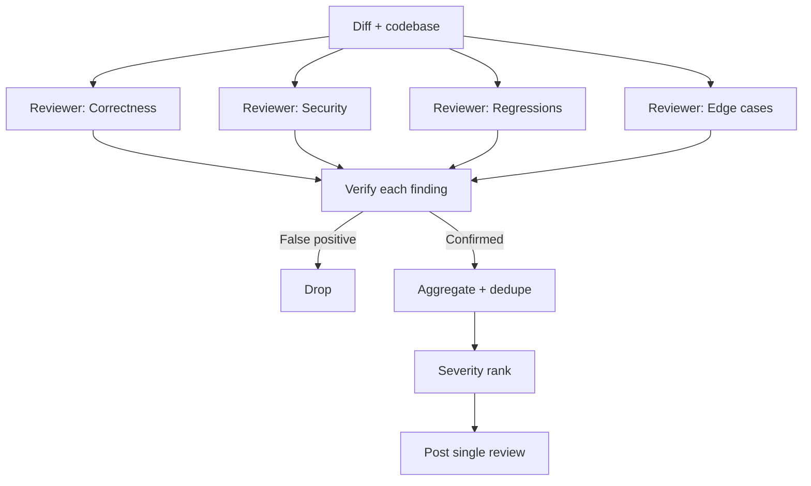

# Cloud Parallel Review Pattern

> Fan out code review across multiple agents in a remote sandbox, verify each candidate finding against actual code behavior, then aggregate into a single severity-ranked review posted back to the PR.

Multiple reviewer agents examine the diff in parallel — each scoped to a different defect class — a verification step reproduces each candidate finding against code behavior, and the orchestrator deduplicates and severity-ranks results before posting a single consolidated review. Unlike [committee review](committee-review-pattern.md) (voting with implementer iteration) and [tiered code review](tiered-code-review.md) (escalation by risk class), fan-out + verify + aggregate runs off the developer's machine as a single review artifact.

## Structure

Four stages: **fan-out** across defect classes (correctness, security, regressions, edge cases), **verify** each candidate against actual code behavior, **aggregate** surviving findings with deduplication and severity ranking, and **post** a single review with inline comments and a severity-tagged summary.



## Canonical Implementation

Claude Code's `/ultrareview` launches "a fleet of reviewer agents in a remote sandbox" ([ultrareview docs](https://code.claude.com/docs/en/ultrareview)), added in v2.1.111 (2026-04-16) per the [changelog](https://code.claude.com/docs/en/changelog). Anthropic's managed GitHub Code Review runs the same shape as a webhook service: "multiple agents analyze the diff and surrounding code in parallel on Anthropic infrastructure. Each agent looks for a different class of issue, then a verification step checks candidates against actual code behavior to filter out false positives. The results are deduplicated, ranked by severity, and posted as inline comments" ([Code Review docs](https://code.claude.com/docs/en/code-review)).

## Why Verification Is Load-Bearing

Fan-out without verification amplifies noise: each agent contributes its own false positives and aggregation cannot distinguish real findings from hallucinated ones. Verification reproduces each candidate against actual code behavior, converting a high-recall/low-precision fan-out into a high-precision output.

Per the [EMNLP 2024 peer-review simulation study](https://aclanthology.org/2024.emnlp-main.70), dimension-scoped reviewers activate narrower reasoning pathways so their error populations are largely non-overlapping. Fan-out captures more real defects; verification discards the non-overlapping false positives each reviewer introduces.

## Cloud Execution Trade-Offs

- **Latency is asynchronous.** `/ultrareview` takes 5 to 10 minutes; managed Code Review averages 20 minutes ([Code Review docs](https://code.claude.com/docs/en/code-review)). The developer's session is not blocked.
- **Cost is per-review.** `/ultrareview` "typically costs \$5 to \$20" ([ultrareview docs](https://code.claude.com/docs/en/ultrareview)); managed Code Review averages "\$15-25 in cost, scaling with PR size, codebase complexity, and how many issues require verification" ([Code Review docs](https://code.claude.com/docs/en/code-review)).
- **Trust boundary expands.** Cloud execution is unavailable for "Amazon Bedrock, Google Cloud Vertex AI, or Microsoft Foundry" and for Zero Data Retention organizations ([ultrareview docs](https://code.claude.com/docs/en/ultrareview)).

## When to Trigger

Three trigger modes: **once per PR** (fixed cost), **every push** (cost multiplied by push count), and **manual** (`/ultrareview` or `@claude review`). Push-triggered review "runs the most reviews and costs the most" ([Code Review docs](https://code.claude.com/docs/en/code-review)); for high-iteration PRs, `@claude review once` runs a single non-subscribing review to bound cost.

## Relationship to CI Gates

The check run "always completes with a neutral conclusion so it never blocks merging through branch protection rules" ([Code Review docs](https://code.claude.com/docs/en/code-review)). Cloud parallel review is a signal layer, not a pipeline gate. Teams that want merges gated on findings parse the machine-readable severity breakdown from the check run in their own CI.

## Comparison to Related Patterns

| Pattern | Shape | Artifact |
|---------|-------|----------|
| [Committee review](committee-review-pattern.md) | Fan-out + vote/defer, implementer iterates | Accept/revise loop |
| [Tiered code review](tiered-code-review.md) | Risk classification routes to different reviewers | Per-tier approval gate |
| [Fan-out synthesis](../multi-agent/fan-out-synthesis.md) | Parallel generation + synthesis merge | Merged output |
| **Cloud parallel review** | Fan-out + verify + aggregate, cloud-executed | Single posted review |

Load-bearing differentiators: the verification step, cloud execution, and a single posted review rather than an iteration loop.

## When This Backfires

- **Small diffs.** A 5-to-10-minute, \$5-to-\$20 review is wasted on typo fixes. A local `/review` is cheaper for sub-hundred-line diffs with clear scope.
- **Low-diversity reviewer axes.** If "correctness" and "bugs" surface the same findings, aggregation dedupes most of the parallel work and the pattern buys nothing.
- **High-iteration PRs with push triggers.** A 30-push PR at \$15-\$25 per review exceeds most review budgets; use manual or once-per-PR triggers for long-running branches.
- **Air-gapped or ZDR environments.** Cloud execution is not optional — the pattern is unavailable for Zero Data Retention organizations and non-Anthropic hosting providers ([ultrareview docs](https://code.claude.com/docs/en/ultrareview)).

## Tuning

Anthropic's managed Code Review reads two files. `CLAUDE.md` contributes project context; new violations surface as nit-level findings. `REVIEW.md` is "injected directly into every agent in the review pipeline as highest priority" ([Code Review docs](https://code.claude.com/docs/en/code-review)) — the surface for severity recalibration, skip rules, per-repo checks, and nit caps.

## Example

A team enables the managed Code Review on a backend service repo with push-triggered reviews on PRs under 500 lines and manual triggers above that threshold. They add `REVIEW.md` at the root:

```markdown
# Review instructions

## What Important means here

Reserve Important for findings that would break behavior, leak data,
or block a rollback: incorrect logic, unscoped database queries, PII
in logs or error messages, and migrations that aren't backward
compatible. Style, naming, and refactoring suggestions are Nit at
most.

## Cap the nits

Report at most five Nits per review. If you found more, say "plus N
similar items" in the summary instead of posting them inline.

## Do not report

- Anything CI already enforces: lint, formatting, type errors
- Generated files under `src/gen/` and any `*.lock` file

## Always check

- New API routes have an integration test
- Log lines don't include email addresses, user IDs, or request bodies
- Database queries are scoped to the caller's tenant
```

A 400-line PR that adds a new API route triggers review on push. The fleet of agents fans out: a correctness agent flags a missing tenant scope on one query; a regression agent flags a changed response shape for an existing endpoint; a security agent flags a new log line that includes the user ID. Each finding is verified against the code before posting. The aggregated review posts three inline comments with severity markers and a summary: "2 Important, 1 Nit." The check run completes with a neutral conclusion — branch protection is not triggered, but the team's own CI parses the machine-readable severity counts and blocks merge while `normal > 0`.

## Key Takeaways

- Cloud parallel review is parallel-decompose + verify + aggregate, distinct from committee voting and tiered escalation
- The verification step is load-bearing — without it the pattern amplifies false positives rather than reducing them
- Cloud execution decouples review from the developer's terminal; 5-to-20-minute latency becomes an asynchronous background cost, not a blocked session
- Cost scales with PR size and trigger mode; push-triggered review on long PRs is the primary budget risk
- The default check run is neutral — gate on findings in your own CI by parsing the severity breakdown
- `REVIEW.md` is the intended tuning surface for severity, skip rules, and nit caps; `CLAUDE.md` contributes general project context

## Related

- [Committee Review Pattern](committee-review-pattern.md) — voting-style multi-agent review with implementer iteration, the canonical contrast
- [Tiered Code Review](tiered-code-review.md) — risk-based escalation across review depths
- [Fan-Out Synthesis Pattern](../multi-agent/fan-out-synthesis.md) — parallel generation with a synthesis merge step, the generative cousin
- [Agentic Code Review Architecture](agentic-code-review-architecture.md) — tool-calling reviewer architecture that many of these agents use
- [Signal Over Volume in AI Review](signal-over-volume-in-ai-review.md) — the precision principle the verification step enforces
- [Agent-Assisted Code Review](agent-assisted-code-review.md) — the broader context of routing review work to agents
- [Review-Then-Implement Loop](review-then-implement-loop.md) — iteration pattern after review findings land
