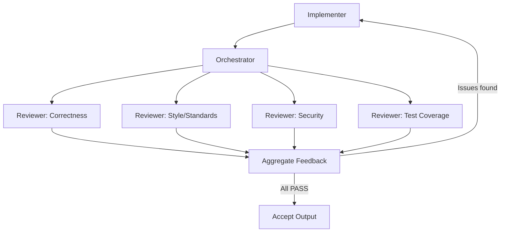

# Committee Review Pattern

> Route agent-produced work through a panel of specialized reviewer agents — each applying a distinct lens — before accepting or iterating on the output.

The committee review pattern routes agent-produced work through multiple specialized reviewer agents running in parallel, each evaluating a single dimension (correctness, security, test coverage). An orchestrator aggregates structured verdicts and either accepts the output or routes feedback to the implementer for revision.

## Structure

The pattern has three roles:

- **Implementer agent** — produces the initial output (code, document, plan)
- **Reviewer panel** — multiple agents, each scoped to a single review dimension
- **Orchestrator** — runs reviewers in parallel, aggregates verdicts, routes feedback back to the implementer

Each reviewer returns structured output (JSON with verdict and issues) so the orchestrator can triage programmatically rather than parsing prose.



## Why Multiple Reviewers Beat Self-Review

A single agent reviewing its own output exhibits confirmation bias — it agrees with decisions it already made. Separate implementer and reviewer prompts remove this bias. Domain-split reviewers (correctness, style, security, test coverage) narrow each reviewer's scope so attention applies to one dimension rather than competing concerns.

Per [OpenAI's Harness engineering post](https://openai.com/index/harness-engineering/), the Harness team pushed almost all code review to agent-to-agent, with humans as the final optional check.

### Why It Works

The mechanism is attentional narrowing plus role-induced perspective shift. Research on LLM peer-review simulation ([EMNLP 2024](https://aclanthology.org/2024.emnlp-main.70)) shows distinct reviewer personas reliably shift which defects they surface — a security-scoped reviewer activates different reasoning pathways than a correctness-scoped one on the same diff. Running them in parallel makes their error populations largely non-overlapping, so the committee catches defects any single reviewer would miss.

## Reviewer Design

Each reviewer should have:

- A single-focus system prompt that defines exactly what it evaluates
- A structured output schema (e.g., `{"verdict": "PASS|FAIL", "issues": [...], "notes": [...]}`)
- Explicit pass criteria — what counts as PASS must be unambiguous

Reviewers run in parallel. The orchestrator waits for all verdicts before aggregating. If any reviewer returns FAIL, the issue list goes back to the implementer.

## Loop Termination

Set a maximum round limit — two to three rounds covers most cases. If the implementer cannot satisfy all reviewers within the limit, escalate to human review. Unresolved loops signal underspecified tasks or conflicting reviewer criteria.

## When This Backfires

The committee pattern adds cost, latency, and orchestration complexity that can outweigh its benefits in specific conditions:

- **Low-risk or trivial changes** — typo fixes, config tweaks, and one-liners rarely benefit from multi-reviewer overhead. A single scoped reviewer or no agent review costs less and finishes faster.
- **Misaligned reviewer criteria** — when two reviewers evaluate overlapping dimensions (e.g., both correctness and security flag the same auth logic from different angles), the orchestrator receives contradictory feedback that is harder to act on than a single consolidated review.
- **High-frequency iteration loops** — many small revisions with three or more reviewers per round multiply token cost and latency; consolidate reviewers until the implementation stabilizes.
- **Underspecified tasks** — without clear acceptance criteria, reviewers FAIL for different reasons across rounds with no convergence. Fix task specification before scaling reviewer count.

## Cross-Model Adversarial Review

A committee where every reviewer runs on the same model shares the same blind spots. Cross-model review assigns each reviewer to a different provider (e.g., GPT, Gemini, Claude) so failure modes are independent.

The [Anvil agent](https://github.com/burkeholland/anvil/blob/main/agents/anvil.agent.md) implements this: three review subagents run in parallel on different models, each receiving the same staged diff. Verdicts are stored as structured data with the model name attached. Review prompts focus on bugs, security, logic errors, and edge cases — style is excluded to reduce noise.

### Risk-Proportional Scaling

The [Anvil agent](https://github.com/burkeholland/anvil/blob/main/agents/anvil.agent.md) scales reviewer count by risk:

| Risk | Reviewers | Trigger |
|------|-----------|---------|
| Low | 0 | Typos, config, one-liners |
| Medium | 1 | Bug fixes, features, refactors |
| High | 3 (cross-model) | Auth, crypto, payments, schema migrations |

File-level risk classification drives automatic escalation — changes to authentication or data-deletion code trigger the high tier regardless of task scope. Unresolved findings after two rounds escalate to human review.

## Key Takeaways

- Separate implementer and reviewer roles — [self-review](../agent-design/agent-self-review-loop.md) has inherent blind spots
- Assign each reviewer a single evaluation dimension; do not combine concerns in one reviewer
- Run reviewers in parallel and aggregate before routing feedback back
- Require structured output (JSON) from reviewers so the orchestrator can triage without parsing prose
- Set a maximum round limit and escalate to human review if unresolved
- Use different model providers for reviewers so blind spots do not overlap
- Scale reviewer count to task risk — one for medium tasks, three cross-model for high-risk changes
- Focus review prompts on bugs, security, and logic; exclude style to reduce noise

## Example

A security-focused code review committee for a Python web service. Three reviewers run in parallel on the same diff; the orchestrator aggregates and routes.

**Correctness reviewer system prompt:**

```
You review Python code for logic errors, off-by-one errors, and incorrect assumptions.
Return JSON only: {"verdict": "PASS|FAIL", "issues": [{"line": N, "description": "..."}], "notes": []}
PASS if no logic errors are found. Do not comment on style or security.
```

**Security reviewer system prompt:**

```
You review Python code for security vulnerabilities: injection, auth bypass, secrets in code, insecure deserialization.
Return JSON only: {"verdict": "PASS|FAIL", "issues": [{"line": N, "cwe": "CWE-N", "description": "..."}], "notes": []}
PASS if no vulnerabilities are found. Do not comment on correctness or style.
```

**Orchestrator aggregation logic (pseudocode):**

```python
results = await asyncio.gather(
    correctness_reviewer.review(diff),
    security_reviewer.review(diff),
    test_coverage_reviewer.review(diff),
)

all_issues = []
for result in results:
    if result["verdict"] == "FAIL":
        all_issues.extend(result["issues"])

if all_issues:
    implementer.revise(diff, issues=all_issues, round=round + 1)
else:
    accept(diff)
```

Each reviewer receives only the diff, not prior verdicts, so opinions are independent. The orchestrator merges issue lists by line number and deduplicates overlapping findings before sending consolidated feedback to the implementer.

## Related

- [Task-Specific vs Role-Based Agents](../agent-design/task-specific-vs-role-based-agents.md)
- [Evaluator-Optimizer Pattern](../agent-design/evaluator-optimizer.md)
- [Fan-Out Synthesis Pattern](../multi-agent/fan-out-synthesis.md)
- [Pre-Completion Checklists](../verification/pre-completion-checklists.md)
- [Diff-Based Review Over Output Review](diff-based-review.md)
- [Cost-Aware Agent Design](../agent-design/cost-aware-agent-design.md)
- [Tiered Code Review](tiered-code-review.md)
- [Agentic Code Review Architecture](agentic-code-review-architecture.md)
- [Review-Then-Implement Loop](review-then-implement-loop.md)
- [Agent-Assisted Code Review](agent-assisted-code-review.md)
- [Signal Over Volume in AI Review](signal-over-volume-in-ai-review.md)
- [Adversarial Multi-Model Development Pipeline](../multi-agent/adversarial-multi-model-pipeline.md) — extends cross-model review into a full six-phase pipeline with a dedicated adversary role
- [Agent-Authored PR Integration](agent-authored-pr-integration.md)
- [Harness Engineering](../agent-design/harness-engineering.md) — environment design discipline that enables agent-to-agent code review
- [Predicting Which AI-Generated Functions Will Be Deleted](predicting-reviewable-code.md)
- [Agent PR Volume vs. Value](agent-pr-volume-vs-value.md)
- [Human-AI Review Synergy](human-ai-review-synergy.md)
- [PR Description Style as a Lever](pr-description-style-lever.md)
- [Self-Improving Code Review Agents — Learned Rules](learned-review-rules.md) — adaptive rule extraction to reduce noise across review rounds
- [CRA-Only Review and the Merge Rate Gap](cra-merge-rate-gap.md) — empirical data on how reviewer composition affects merge outcomes
