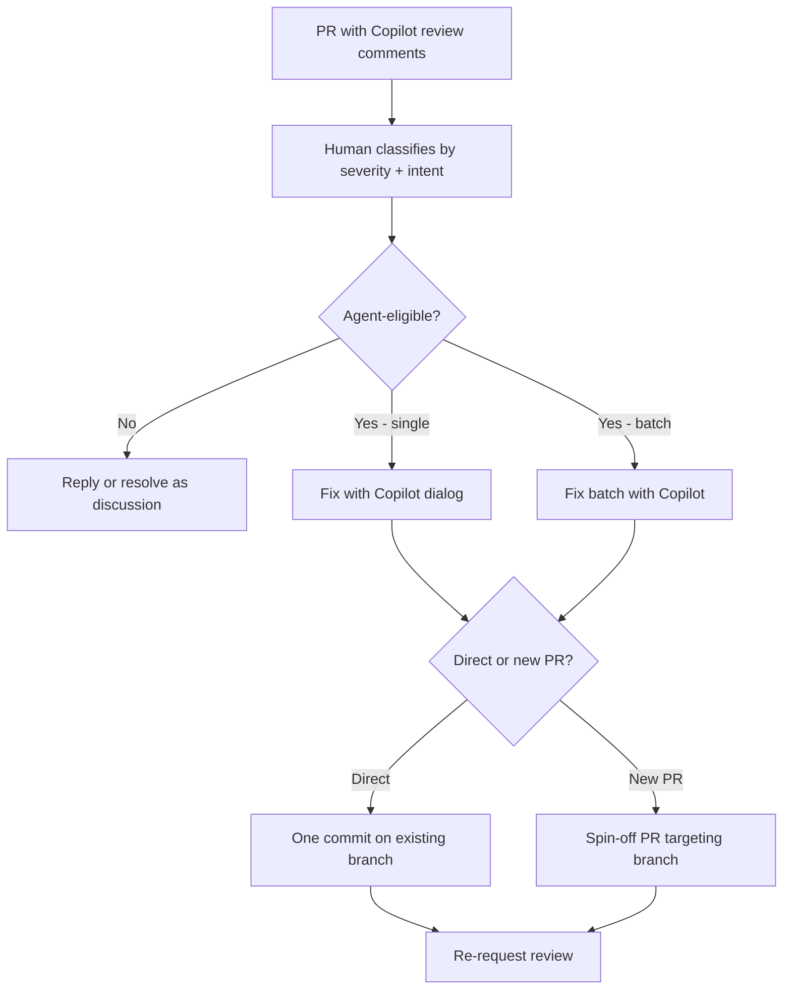

# Direct-Apply Review Comments via Cloud Agent

> Direct-apply review comments let a human classify agent-eligible comments, a cloud agent push one fix commit and re-request review, with no self-retrigger.

## When This Applies

Three conditions must hold:

- **Comment classification is human-set, not agent-inferred.** The best published comment-intent classifier reaches 59.3% accuracy on a 1,828-comment dataset ([arXiv:2307.03852](https://arxiv.org/abs/2307.03852)) — a ~40% misclassification rate is the upper bound on automated routing.
- **The agent pushes a new commit, never a rebase or force push.** Force pushes are the strongest negative predictor of merge across 33,596 agent-authored PRs ([arXiv:2602.19441](https://arxiv.org/abs/2602.19441)).
- **The contract terminates after one push and re-requests review.** Re-triggering the agent on its own commits produces unbounded iteration — the same circuit-breaker problem documented for [one-click CI auto-fix](../workflows/one-click-ci-auto-fix.md).

Outside these conditions the pattern erodes the merge-rate signal it protects.

## The Contract

GitHub shipped the direct-apply variant on 2026-05-19 by renaming "Implement suggestion" to "Fix with Copilot" and adding a pre-action dialog with three controls: apply directly to the PR vs. open a new PR targeting the branch, model selection, and optional steering instructions ([GitHub Changelog, 19 May 2026](https://github.blog/changelog/2026-05-19-easily-apply-copilot-code-review-feedback-with-copilot-cloud-agent)). The same dialog adds "Fix batch with Copilot" in the PR Overview comment, which dispatches a tick-selected set of Copilot review comments in one cloud agent run.

The interaction has four steps:

1. **Classify.** The maintainer reads the Copilot review comments — now tagged with High / Medium / Low severity and grouped to remove duplicates ([GitHub Changelog, 12 May 2026](https://github.blog/changelog/2026-05-12-copilot-code-review-comment-experience-improvements)) — and decides which comments are agent-eligible.
2. **Dispatch.** The maintainer clicks Fix with Copilot on a single comment or Fix batch with Copilot on a selection. The dialog selects direct-apply vs. spin-off PR.
3. **Push.** The cloud agent applies the change in its sandbox and pushes one commit to the existing PR branch (or opens a separate fix PR targeting the branch if that option was chosen) ([GitHub Changelog, 19 May 2026](https://github.blog/changelog/2026-05-19-easily-apply-copilot-code-review-feedback-with-copilot-cloud-agent)).
4. **Re-request review.** The maintainer sees the new commit, reads the diff, and either approves or comments again. The agent does not run a second pass on its own output.

## Why It Works

The mechanism is context-switch elimination on a bounded surface. Review-fix latency is dominated by per-comment context switches — reopen branch, reload code, write patch, push, mark resolved. Reviewer engagement is the strongest positive predictor of merge across the [arXiv:2602.19441](https://arxiv.org/abs/2602.19441) cohort, so anything that widens the gap between comment and fix erodes the signal that determines outcome. Direct-apply collapses that gap to one click while keeping classification human — the 59.3% intent-classifier ceiling ([arXiv:2307.03852](https://arxiv.org/abs/2307.03852)) means automated routing would re-add the engagement-erosion the pattern was meant to remove.

The single-commit push is the second load-bearing piece. The cross-tool equivalent — anthropics/claude-code-action, invoked by `@claude` on a PR — pushes to the existing branch and updates a single status comment, and explicitly cannot submit formal PR reviews or approvals ([claude-code-action capabilities-and-limitations.md](https://github.com/anthropics/claude-code-action/blob/main/docs/capabilities-and-limitations.md)). Both vendors converge on this shape because preserving the reviewer's branch context is what makes re-review tractable.

## When This Backfires

Five conditions degrade the pattern:

- **Ambiguous-intent comments dispatched directly.** "Use a switch here" or "make this safer" underspecify scope; the agent picks one interpretation and silently commits. The 59.3% intent-classifier ceiling ([arXiv:2307.03852](https://arxiv.org/abs/2307.03852)) bounds this risk — dispatch ambiguous comments as spin-off PRs so the interpretation is reviewable as a discrete diff.
- **Comments that look local but cross-cut.** A comment on a single sanitiser may correctly touch all callers. Batch-apply ships one commit that obscures which comment caused which line — the [batched suggestion application](batched-suggestion-application.md) audit-trail risk, amplified.
- **Design-disagreement comments treated as mechanical.** Design disagreements are the dominant failure mode for unmerged agentic PRs (10 of 32 qualitatively analysed in [arXiv:2602.19441](https://arxiv.org/abs/2602.19441)). A dispatched design comment produces a fix the reviewer must argue against from the position of "you already wrote it."
- **High-volume dispatch inflating the comment loop.** Each extra reviewer comment on an agentic PR decreases merge odds by 2.8% — versus +2.7% for human PRs ([arXiv:2602.19441](https://arxiv.org/abs/2602.19441)). The pattern is net-negative if dispatch is the default rather than a triage choice.
- **Prompt injection through PR comments without a human-click gate.** Agentic GitHub Actions that consume PR comments are an injection surface — 519 such vulnerabilities were found across 10,792 repos ([arXiv:2605.07135](https://arxiv.org/abs/2605.07135)). The human click is the load-bearing mitigation; policies that let non-maintainer comments auto-dispatch remove it.

## Example

A pull request has 14 Copilot review comments — three High, six Medium, five Low ([GitHub Changelog, 12 May 2026](https://github.blog/changelog/2026-05-12-copilot-code-review-comment-experience-improvements)). The maintainer triages:

- Two of the three Highs are mechanical (missing null check, unused import) — dispatched one at a time via Fix with Copilot in **direct-apply** mode, each landing as its own commit so the diff lines up against the original finding.
- The third High is "extract this into a service-layer helper" — a design comment, replied to as discussion.
- Five Mediums share a rule (consistent error wrapping). Fix batch with Copilot ticks those five and selects **spin-off PR** — the batch lands as one PR targeting the branch, reviewable as a single diff that exercises the same rule across five sites.
- The remaining comments are resolved as discussion or deferred to a follow-up issue.

The maintainer re-requests review. The agent does not run a second pass on its own commits.

Contrast the failure mode: the maintainer clicks Fix with Copilot on all 14 without classifying, accepts direct-apply for each, and one commit silently misreads "use a switch here" as a refactor of the surrounding function. Re-review must untangle 14 fix commits plus one scope creep — and per [arXiv:2602.19441](https://arxiv.org/abs/2602.19441) the inflated comment count from the misread fix has already reduced merge probability.

## Key Takeaways

- The contract is human-classifies / agent-applies / human-re-reviews — not agent-auto-routes.
- Direct-apply mode pushes one commit to the existing PR branch; spin-off PR mode opens a separate fix PR. Both preserve reviewer context — neither rewrites history.
- Comment classification stays human because the published intent-classifier ceiling is ~59% accuracy; automated routing imports a 40% error rate.
- Use direct-apply for unambiguous mechanical comments; use spin-off PR for ambiguous or cross-cutting changes the reviewer needs to inspect as a discrete diff.
- Severity labels and grouping make triage decisions tractable; without them, batch-dispatch degrades into a rubber stamp.
- The agent does not retrigger on its own commit — the bounded-completion contract is one push, then re-request review.
- The cross-tool equivalent (Claude Code Action and similar) converges on the same shape: read comment, push to existing branch, single status update, no PR-approval authority.

## Related

- [Review-Then-Implement Loop](review-then-implement-loop.md) — the spin-off-PR variant of the same loop; this page covers the newer direct-apply and batch modes
- [Batched Suggestion Application](batched-suggestion-application.md) — cluster-construction rules that govern which comments are batch-eligible before dispatch
- [Agent-Proposed Merge Resolution](agent-proposed-merge-resolution.md) — the same single-commit / re-request-review contract applied to merge conflicts
- [One-Click CI Auto-Fix](../workflows/one-click-ci-auto-fix.md) — the same dispatch shape applied to failing GitHub Actions; shares the bounded-completion constraint
- [Agent-Authored PR Integration](agent-authored-pr-integration.md) — the empirical merge-likelihood baselines (force pushes, reviewer engagement, comment-volume penalty) that direct-apply must respect
