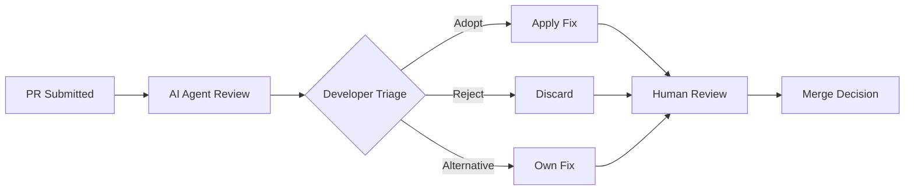

# Human-AI Review Synergy

> AI reviewer suggestions are adopted at 16.6% versus 56.5% for humans — but the gap is a design input, not a failure. Structure collaboration around measured strengths.

## The Evidence

An empirical study of 278,790 code review conversations across 300 GitHub projects (2022-2025) quantifies how AI and human reviewers differ ([arxiv:2603.15911](https://arxiv.org/abs/2603.15911)). The findings replace intuition with numbers.

### Adoption Rate Gap

Human suggestions are adopted 56.5% of the time versus 16.6% for AI — a 39.9 percentage point gap. Over half of unadopted AI suggestions are incorrect or addressed through alternative developer fixes ([arxiv:2603.15911](https://arxiv.org/abs/2603.15911)).

AI review output requires triage — you cannot treat it as equivalent to a human review comment.

### Complexity Cost

Adopted AI suggestions produce larger increases in cyclomatic complexity (+0.085 vs -0.002 for humans) and code size (+0.216 statements vs +0.108 for humans) ([arxiv:2603.15911](https://arxiv.org/abs/2603.15911)). AI suggestions may introduce technical debt even when correct — human reviewers tend toward simplification while AI agents tend toward addition.

### Verbosity and Focus

AI agents produce 29.6 tokens per line of code reviewed versus 4.1 for humans — a 7x difference ([arxiv:2603.15911](https://arxiv.org/abs/2603.15911)). Over 95% of AI comments target code improvement or defect detection, while humans spread across understanding questions (17-31%), knowledge transfer (4-6%), testing feedback, and social communication ([arxiv:2603.15911](https://arxiv.org/abs/2603.15911)). AI review misses entire categories of review value: mentoring, architectural questioning, and team knowledge sharing.

### Conversation Dynamics

85-87% of AI-initiated reviews terminate without follow-up discussion, with 7.1-25.8% rejection rates versus 0.9-7.8% for human conversations. Reviews of AI-generated code require 11.8% more review rounds than human-written code ([arxiv:2603.15911](https://arxiv.org/abs/2603.15911)).

## Structuring the Collaboration

The data supports a specific model:

**AI first, human last.** AI agents handle the mechanical first pass — defect detection, code improvement suggestions. The human reviewer provides the final decision, covering design judgment, knowledge transfer, and architectural fit that AI misses ([arxiv:2603.15911](https://arxiv.org/abs/2603.15911)).

**Triage AI output, don't rubber-stamp it.** With a 16.6% adoption rate and over half of rejections due to incorrect suggestions, treating AI review output as a todo list is counterproductive. Evaluate each suggestion independently.

**Monitor complexity impact.** Track whether adopted AI suggestions increase cyclomatic complexity or code size disproportionately — technically correct suggestions can still be architecturally harmful.

**Constrain AI verbosity.** At 7x the tokens per line of code, unconstrained AI review output creates the same alert fatigue that [signal-over-volume design](signal-over-volume-in-ai-review.md) addresses. Configure review agents with confidence thresholds and severity filters.

**Use multi-agent verification.** A second AI agent validating the first agent's findings can filter incorrect suggestions before they reach the developer, potentially improving the 16.6% adoption rate [unverified]. This connects to the [committee review pattern](committee-review-pattern.md).

## Unverified Claims

- The dataset (2022-2025) may include periods before agentic review tools matured, potentially depressing AI adoption metrics
- Whether the complexity increase finding holds for newer models with better code understanding
- Whether multi-agent verification improves AI suggestion adoption rates

## Key Takeaways

- AI review suggestions are adopted at one-third the rate of human suggestions (16.6% vs 56.5%) — design workflows around this reality
- Adopted AI suggestions increase code complexity more than human suggestions — monitor for technical debt accumulation
- AI review covers only two categories (defects and improvements) while humans provide mentoring, knowledge transfer, and architectural feedback
- The human-last principle ensures design judgment and team context inform the merge decision
- 85-87% of AI reviews end without discussion — AI review is a broadcast, not a conversation

## Related

- [Signal Over Volume in AI Review](signal-over-volume-in-ai-review.md) — design principle for the verbosity problem quantified here (29.6 vs 4.1 tokens/LOC)
- [Agent-Assisted Code Review](agent-assisted-code-review.md) — prescriptive guide for AI-first review that this page provides empirical backing for
- [Agent PR Volume vs. Value](agent-pr-volume-vs-value.md) — PR authoring acceptance rates, complementary to the review suggestion adoption rates here
- [Committee Review Pattern](committee-review-pattern.md) — multi-agent verification approach suggested by the study
- [Tiered Code Review](tiered-code-review.md) — risk-based routing that aligns with the human-last principle
- [Agentic Code Review Architecture](agentic-code-review-architecture.md) — tool-calling architecture for the AI review stage
- [Agent-Authored PR Integration](agent-authored-pr-integration.md) — reviewer engagement as merge predictor, complementary to the adoption rate findings here
- [Predicting Reviewable Code](predicting-reviewable-code.md) — pre-flagging AI-generated functions reviewers will delete, addressing review burden from the AI side
- [Review-Then-Implement Loop](review-then-implement-loop.md) — closing the loop between AI review findings and automated fixes
- [Diff-Based Review](diff-based-review.md) — focusing review on changes rather than full outputs, relevant to managing AI review verbosity
- [PR Description Style as a Lever](pr-description-style-lever.md) — PR description structure as a configurable parameter affecting reviewer engagement
