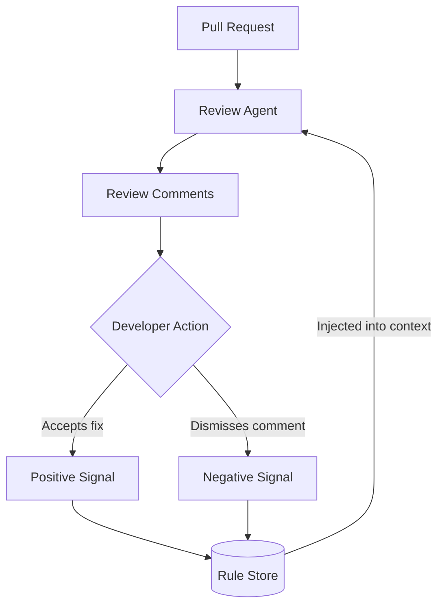

# Self-Improving Code Review Agents — Learned Rules

> Code review agents that persist rules extracted from accepted and rejected PR feedback, improving future reviews without manual reconfiguration.

## The Problem

A first-generation review agent treats every PR as a fresh start. It flags the same false positives your team has dismissed dozens of times — including the systematic [overcorrection bias](../anti-patterns/llm-review-overcorrection.md) where LLMs misclassify correct code as non-compliant — misses patterns your codebase convention already handles, and produces a noise-to-signal ratio that degrades trust. The agent does not learn.

The cause is feedback disposal: when a developer dismisses a comment or accepts a fix, that signal is discarded. The agent's behavior on the next PR is identical to its behavior on the first. An [empirical study of 278,790 AI-reviewed pull requests](https://arxiv.org/abs/2603.15911) found AI agent suggestions achieve 16.6% adoption — roughly a third of the 56.5% rate for human reviewers — a gap that persists in part because agents cannot adjust their defaults based on team-specific dismissal patterns.

## The Pattern

A self-improving review agent captures accept/reject signals from each review and converts them into persistent rules. Each rule adjusts what the agent flags — or suppresses — on future reviews.

The rule store accumulates repository-specific knowledge: which patterns to catch, which false positives to suppress, which conventions the team enforces. The agent improves on this codebase as it processes more PRs.

## Cursor Bugbot Implementation

Cursor's Bugbot applied this pattern in its [April 8, 2026 release](https://cursor.com/changelog):

**Learned rules from feedback.** When a developer accepts a Bugbot suggestion, Bugbot extracts a rule and stores it. When a developer dismisses a suggestion, Bugbot records a suppression rule. Future reviews on the same repository apply the accumulated rule set.

**Fix All batch action.** Rather than addressing review comments one by one, developers can accept all actionable suggestions at once. Cursor [reports a 78% resolution rate](https://cursor.com/changelog) for PRs where developers use Fix All.

**MCP server integration.** Bugbot can connect to MCP servers to pull additional context during review — project documentation, team conventions, or codebase-specific data — enriching its analysis beyond the PR diff.

## What Rules Capture

Rules extracted from feedback fall into two categories:

| Signal | Rule type | Effect |
|--------|-----------|--------|
| Developer accepts fix | Positive rule | Reinforce: flag this pattern in future reviews |
| Developer dismisses comment | Suppression rule | Filter: do not flag this pattern in future reviews |

Over time, suppression rules reduce false positive rate. Positive rules sharpen detection of patterns the team cares about. The agent's behavior shifts toward the team's established conventions rather than the model's default priors. Cursor's aggregate data across 110,000+ repos that enabled learning shows [more than 44,000 rules generated](https://cursor.com/blog/bugbot-learning), with resolution rates climbing from 52% at general availability in July 2025 to near 80% by April 2026.

## Building This Pattern Without Bugbot

The mechanism is not Cursor-specific. Any review agent with structured output can implement it:

1. **Capture feedback.** Store each comment with its file context, the suggested change, and the developer's response (accepted, dismissed, ignored).
2. **Extract rules.** After enough signals on a pattern, summarize them into a compact rule: "Do not flag missing JSDoc on private functions in this repo" or "Always flag direct `process.env` access outside config files."
3. **Inject rules into context.** Prepend the rule set to the review agent's system prompt or context window before each run.
4. **Review rules periodically.** Rules can encode stale conventions. Build a review step — human or automated — to prune rules that no longer reflect team standards.

## Limitations

**Rules encode team blind spots.** If a team consistently dismisses a class of security warning, the agent learns to suppress it. The rule system amplifies existing review culture, good or bad.

**Suppression rules degrade over time.** A rule that was correct six months ago may become incorrect after a refactor. Without a TTL or periodic review, stale suppression rules cause the agent to miss real issues.

**Rule quality depends on signal clarity.** "Dismiss" means different things: incorrect finding, not applicable here, low priority, or simply annoying. Without structured dismiss reasons, rule extraction conflates these signals.

## Key Takeaways

- Review agents improve by converting accept/reject signals into persistent rules applied to future reviews
- Cursor Bugbot demonstrates this at scale: learned rules combined with Fix All batch action achieve a 78% resolution rate
- Suppression rules reduce false positive noise; positive rules reinforce patterns the team actually enforces
- The pattern generalizes: capture signals, extract rules, inject into context, prune periodically
- Without maintenance, rules encode blind spots and stale conventions — the rule set itself needs periodic review

## Related

- [Review-Then-Implement Loop](review-then-implement-loop.md)
- [Agent-Assisted Code Review](agent-assisted-code-review.md)
- [Signal Over Volume in AI Review](signal-over-volume-in-ai-review.md)
- [Tiered Code Review](tiered-code-review.md)
- [Agentic Code Review Architecture](agentic-code-review-architecture.md)
- [LLM Code Review Overcorrection](../anti-patterns/llm-review-overcorrection.md)
- [Committee Review Pattern](committee-review-pattern.md)
