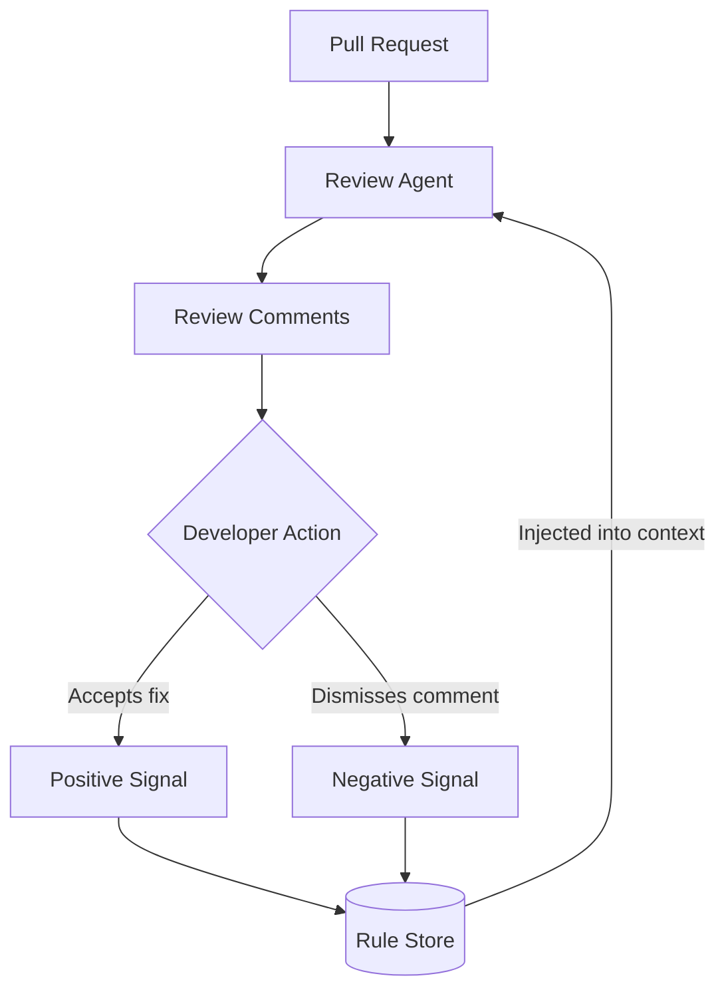

# Self-Improving Code Review Agents — Learned Rules

> Code review agents that persist rules extracted from accepted and rejected PR feedback, improving future reviews without manual reconfiguration.

## The problem

A first-generation review agent treats every PR as a fresh start. It flags the same false positives your team has dismissed dozens of times, misses patterns your codebase convention already handles, and produces a noise-to-signal ratio that degrades trust. This includes the systematic [overcorrection bias](../patterns/anti-patterns/llm-review-overcorrection.md), where LLMs misclassify correct code as non-compliant. The agent does not learn.

The cause is feedback disposal: when a developer dismisses a comment or accepts a fix, that signal is discarded. The agent behaves the same way on the next PR as it did on the first. An [empirical study of 278,790 code review conversations across 300 open-source projects](https://arxiv.org/abs/2603.15911) found that teams adopt AI agent suggestions at a much lower rate than suggestions from human reviewers. The gap persists in part because agents cannot adjust their defaults to team-specific dismissal patterns.

## The pattern

A self-improving review agent captures accept and reject signals from each review and turns them into persistent rules — Cursor's Bugbot is the canonical implementation. Each rule adjusts what the agent flags, or suppresses, on future reviews.

```mermaid
graph TD
    PR[Pull Request] --> Agent[Review Agent]
    Agent --> Comments[Review Comments]
    Comments --> Dev{Developer Action}
    Dev -->|Accepts fix| AcceptSignal[Positive Signal]
    Dev -->|Dismisses comment| RejectSignal[Negative Signal]
    AcceptSignal --> RuleStore[(Rule Store)]
    RejectSignal --> RuleStore
    RuleStore -->|Injected into context| Agent
```

The rule store builds up repository-specific knowledge: which patterns to catch and which false positives to suppress. The agent improves on this codebase as it processes more PRs.

## Cursor Bugbot implementation

Cursor's Bugbot applied this pattern in its [April 8, 2026 release](https://cursor.com/blog/bugbot-learning).

Bugbot learns rules from feedback. When a developer accepts a Bugbot suggestion, Bugbot extracts a rule and stores it. Dismissing a suggestion instead makes Bugbot record a suppression rule. Future reviews on the same repository apply the accumulated rule set.

The rules accumulate at scale. Since learned rules launched, more than 110,000 repositories have turned learning on. Cursor [reports a resolution rate nearing 78%](https://cursor.com/blog/bugbot-learning) — up from 52% at general availability in July 2025 — and attributes the rise to the accumulated rule set sharpening detection and reducing false positives.

The same release also [added MCP support](https://cursor.com/changelog/04-08-26). Bugbot can connect to MCP servers for more context during review: project documentation, team conventions, or codebase-specific data from tools like GitHub, GitLab, and Linear. That extra context lets its analysis reach beyond the PR diff.

## What rules capture

Rules extracted from feedback fall into two categories:

| Signal | Rule type | Effect |
|--------|-----------|--------|
| Developer accepts fix | Positive rule | Reinforce: flag this pattern in future reviews |
| Developer dismisses comment | Suppression rule | Filter: do not flag this pattern in future reviews |

Over time, suppression rules reduce the false positive rate. Positive rules sharpen detection of patterns the team cares about. The agent shifts toward the team's established conventions rather than the model's default priors. Cursor's aggregate data across the 110,000+ repos that turned learning on shows [more than 44,000 rules generated](https://cursor.com/blog/bugbot-learning). Resolution rates climbed from 52% at general availability in July 2025 to near 80% by April 2026.

## Building this pattern without Bugbot

The mechanism generalizes beyond Cursor: any review agent with structured output can implement it.

1. Capture feedback. Store each comment with its file context, the suggested change, and the developer's response (accepted, dismissed, ignored).
2. Extract rules. After enough signals on a pattern, summarize them into a compact rule: "Do not flag missing JSDoc on private functions in this repo" or "Always flag direct `process.env` access outside config files."
3. Inject rules into context. Prepend the rule set to the review agent's system prompt or context window before each run.
4. Review rules periodically. Rules can encode stale conventions. Build a review step — human or automated — to prune rules that no longer reflect team standards.

## Limitations

Rules encode team blind spots. If a team consistently dismisses a class of security warning, the agent learns to suppress it. The rule system amplifies existing review culture, good or bad.

Suppression rules degrade over time. A rule that was correct 6 months ago may become wrong after a refactor. Without a TTL or periodic review, stale suppression rules cause the agent to miss real issues.

Rule quality depends on signal clarity. "Dismiss" means different things: incorrect finding, not applicable here, low priority, or simply annoying. Without structured dismiss reasons, rule extraction conflates these signals.

## Key Takeaways

- Before adopting a review agent, check whether it persists rules between PRs: one that resets every run cannot converge on your team's conventions
- Bugbot's resolution-rate gain tracked its rule store's growth across 110,000+ repos: expect a freshly enabled agent to take time to reach the same accuracy
- Track why a suggestion was dismissed, not just that it was — a flat accept/reject signal cannot separate 'wrong' from 'low priority'
- You do not need Bugbot's MCP integration to build this: a comment log plus a step that reinjects extracted rules into context is enough
- Without maintenance, rules encode blind spots and stale conventions — the rule set itself needs periodic review

## Related

- [Review-Then-Implement Loop](review-then-implement-loop.md)
- [Review Feedback to Rule Loop](review-feedback-to-rule-loop.md) — the composing counterpart: this page tunes reviewer defaults, that one promotes an invariant into the harness
- [Agent-Assisted Code Review](agent-assisted-code-review.md)
- [Signal Over Volume in AI Review](signal-over-volume-in-ai-review.md)
- [Tiered Code Review](tiered-code-review.md)
- [Agentic Code Review Architecture](agentic-code-review-architecture.md)
- [LLM Code Review Overcorrection](../patterns/anti-patterns/llm-review-overcorrection.md)
- [Committee Review Pattern](committee-review-pattern.md)
