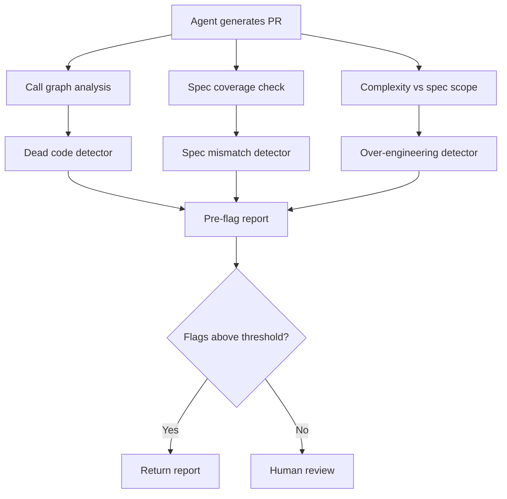

# Predicting Reviewable Code: Pre-Flagging Functions Reviewers Will Delete

> AI-generated code produces functions that are routinely deleted during PR review; predictive models can identify likely-to-be-deleted functions before reviewers spend time examining them.

## The Review Burden Shift

Agentic coding tools shift work from writing to reviewing. When an agent generates a PR, reviewers must examine code they will ultimately delete — dead code, over-engineered helpers, spec-mismatched implementations. [arXiv:2602.17091](https://arxiv.org/abs/2602.17091) shows that AI-generated PRs contain a notable portion of functions deleted during review, and that deletion reasons produce distinct structural characteristics predictable with AUC 87.1%.

The implication: reviewers are spending time on code that a pre-filter could have flagged first.

## Deletion Reason Categories

Functions deleted in review fall into three categories with distinct structural signatures [unverified — the category names "Dead code," "Over-engineering," and "Spec mismatch" are the author's taxonomy and may not match the exact terminology used in the cited paper]:

**Dead code**: Functions generated but never called from the PR's entry points. They are structurally identifiable by missing call graph edges.

**Over-engineering**: Functions that introduce abstraction the spec did not require — utility helpers, base classes, factory patterns for single-instantiation objects. They are identifiable by generality exceeding the immediate use case.

**Spec mismatch**: Functions that implement a different behavior than the spec required — wrong signature, wrong return type, wrong preconditions. They are identifiable by divergence from the spec's type contracts.

Each category requires a different remediation signal sent back to the agent.

## Applying Predictive Pre-Flagging

Before routing a generated PR to human review, run structural analysis to identify high-deletion-probability functions:



The pre-flag report tells the reviewer where to focus. It optionally returns flagged functions to the agent for regeneration before human time is spent.

## Implications for Agent Scope Instructions

The research outcome is a direct input to agent prompting. You can configure your agent's scope instructions to target each deletion category:

- **Emit only called code**: Require that generated functions are reachable from specified entry points
- **Match spec scope**: Instruct the agent not to abstract beyond what the spec requires in the current task
- **Declare external dependencies explicitly**: Use these signals to flag functions that depend on context outside the PR rather than letting the agent silently generate them

Fewer generated functions that survive review is a better outcome than more generated functions with higher deletion rate.

## Reviewer Workflow Adaptation

When pre-flagging is not integrated into the pipeline, human reviewers can apply the same mental model manually:

- Check call graph coverage first: is every generated function called?
- Compare function count against spec complexity: does the implementation scope match the ask?
- Verify type signatures against the spec before reading implementation bodies

This ordering surfaces the likely deletions before investing in line-by-line reading.

## Example

The following script demonstrates dead code detection by checking call graph reachability. It identifies functions in a generated module that are never called from the PR's entry point — the most mechanically detectable deletion category.

```python
import ast
import sys
from pathlib import Path

def get_defined_functions(source: str) -> set[str]:
    tree = ast.parse(source)
    return {node.name for node in ast.walk(tree) if isinstance(node, ast.FunctionDef)}

def get_called_functions(source: str) -> set[str]:
    tree = ast.parse(source)
    return {node.func.id for node in ast.walk(tree)
            if isinstance(node, ast.Call) and isinstance(node.func, ast.Name)}

def flag_dead_code(filepath: str) -> list[str]:
    source = Path(filepath).read_text()
    defined = get_defined_functions(source)
    called = get_called_functions(source)
    # Entry point functions (e.g. main, handler) are excluded from the dead-code check
    entry_points = {"main", "handler", "lambda_handler"}
    dead = defined - called - entry_points
    return sorted(dead)

if __name__ == "__main__":
    dead = flag_dead_code(sys.argv[1])
    if dead:
        print("Pre-flag: likely dead code (never called within module):")
        for fn in dead:
            print(f"  - {fn}")
        sys.exit(1)
    print("No dead code detected.")
```

Running this against a generated module before routing to review:

```bash
python flag_dead_code.py generated_module.py
# Pre-flag: likely dead code (never called within module):
#   - build_cache_key
#   - _legacy_format
```

These two functions would be candidates for deletion. Returning this report to the agent — rather than a human reviewer — eliminates the review cycle for spec-mismatched generated code before a human sees it.

## Key Takeaways

- AI-generated PRs shift the bottleneck from writing to reviewing; predictive pre-filtering reduces the cost of that shift
- Functions deleted for dead code, over-engineering, and spec mismatch have distinct structural characteristics that are statistically predictable
- Agent scope instructions should target the root causes: require reachability, prohibit over-abstraction, match spec scope exactly
- Pre-flag reports returned to the agent before human review reduce total review cost

## Related

- [Agent-Assisted Code Review](agent-assisted-code-review.md)
- [Agent-Authored PR Integration and Merge Predictors](agent-authored-pr-integration.md)
- [Agentic Code Review Architecture](agentic-code-review-architecture.md)
- [Committee Review Pattern](committee-review-pattern.md)
- [Diff-Based Review Over Output Review](diff-based-review.md)
- [Signal Over Volume in AI Review](signal-over-volume-in-ai-review.md)
- [Tiered Code Review: AI-First with Human Escalation](tiered-code-review.md)
- [PR Description Style as a Lever for Agent PR Merge Rates](pr-description-style-lever.md)
- [Review-Then-Implement Loop](review-then-implement-loop.md)
- [Risk-Based Task Sizing for Agent Verification Depth](../verification/risk-based-task-sizing.md)
- [Specification as Prompt](../instructions/specification-as-prompt.md)
- [Trust Without Verify](../anti-patterns/trust-without-verify.md)
- [Abstraction Bloat](../anti-patterns/abstraction-bloat.md) — the training incentive that produces over-engineered code and drives the over-engineering deletion category
- [Agent PR Volume vs. Value](agent-pr-volume-vs-value.md)
- [Human-AI Review Synergy](human-ai-review-synergy.md)
