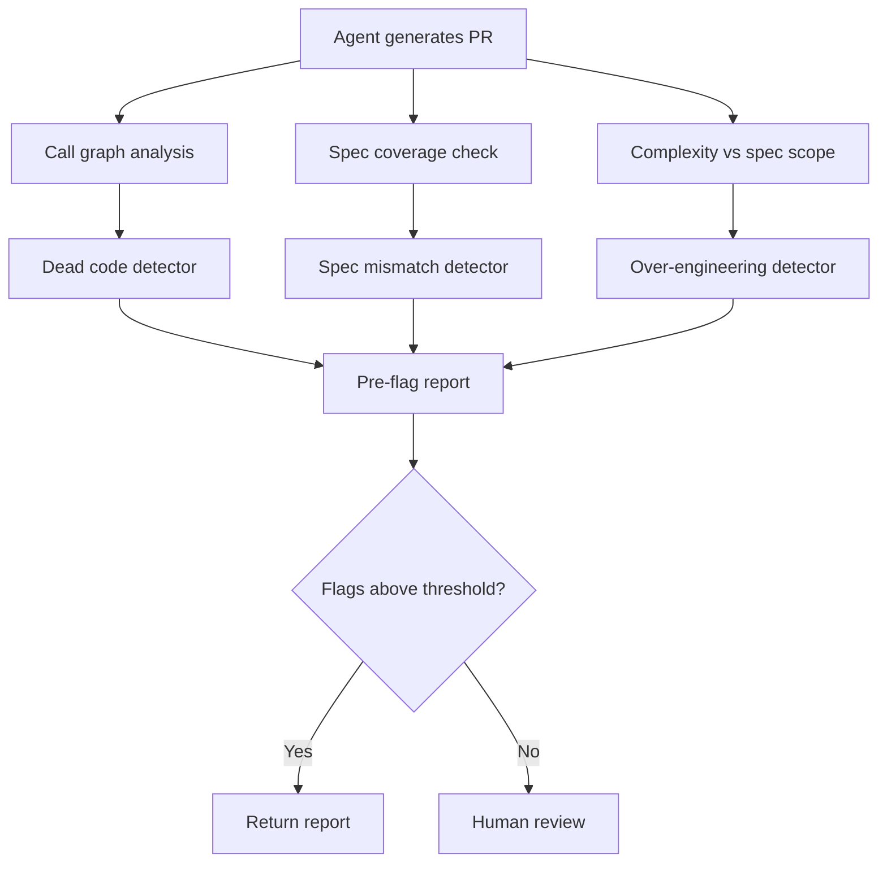

# Predicting Reviewable Code: Pre-Flagging Functions Reviewers Will Delete

> AI-generated code produces functions that are routinely deleted during PR review; predictive models can identify likely-to-be-deleted functions before reviewers spend time examining them.

## The review burden shift

Agentic coding tools shift work from writing to reviewing. When an agent generates a PR, reviewers must examine code they will ultimately delete — dead code, over-engineered helpers, spec-mismatched implementations. [arXiv:2602.17091](https://arxiv.org/abs/2602.17091v1) shows AI-generated PRs contain a notable portion of functions deleted during review, with deletion reasons producing distinct structural characteristics predictable at AUC 87.1%. Reviewers are spending time on code a pre-filter could have flagged first.

## Deletion reason categories (author-derived taxonomy)

[arXiv:2602.17091](https://arxiv.org/abs/2602.17091) identifies structural features that distinguish deleted from surviving functions: method name length, lines of code, Halstead volume, and call count. It does not name deletion-reason categories. The taxonomy below is author-derived, organizing those structural signals into three practitioner-facing buckets to make the predictors actionable. Treat the category names as framing, not findings.

Dead code: functions generated but never called from the PR's entry points. This maps to the paper's call-count signal — functions with fewer inbound references ([arXiv:2602.17091](https://arxiv.org/abs/2602.17091)).

Over-engineering: functions that introduce abstraction the spec did not require — utility helpers, base classes, factory patterns for single-instantiation objects. This maps to the paper's three strongest predictors (longer method names, higher line counts, greater Halstead volume) ([arXiv:2602.17091](https://arxiv.org/abs/2602.17091)), which together signal more generated code than the task required.

Spec mismatch: functions that implement different behavior than the spec required — wrong signature, wrong return type, wrong preconditions. The paper does not identify this directly. We include it because type-contract divergence is a separate failure mode that structural metrics alone will not catch.

Each bucket calls for a different remediation signal sent back to the agent.

## Why it works

Structural metrics expose scope overreach before a reviewer reads a single line. [arXiv:2602.17091](https://arxiv.org/abs/2602.17091v1) found the strongest predictors of deletion are method name length (word count), total lines of code, and Halstead volume — all proxies for "more was generated than the task required." A function with a long descriptive name and high Halstead volume encodes more conceptual surface area than a focused one. That excess surface area is what reviewers remove. The model reaches AUC 87.1% using only these static, syntax-level features — it needs no semantic understanding of the spec to flag probable deletions.

## Applying predictive pre-flagging

Before routing a generated PR to human review, run structural analysis to identify high-deletion-probability functions:


```mermaid
graph TD
    A[Agent generates PR] --> B[Call graph analysis]
    B --> C[Dead code detector]
    A --> D[Spec coverage check]
    D --> E[Spec mismatch detector]
    A --> F[Complexity vs spec scope]
    F --> G[Over-engineering detector]
    C --> H[Pre-flag report]
    E --> H
    G --> H
    H --> I{Flags above threshold?}
    I -->|Yes| J[Return report]
    I -->|No| K[Human review]
```

The pre-flag report tells the reviewer where to focus. It can also return flagged functions to the agent for regeneration before a human spends time on them.

## Implications for agent scope instructions

The research outcome is a direct input to agent prompting. Configure your agent's scope instructions to target each deletion category:

- Emit only called code: require that generated functions are reachable from specified entry points
- Match spec scope: instruct the agent not to abstract beyond what the current task requires
- Declare external dependencies explicitly: flag functions that depend on context outside the PR rather than letting the agent silently generate them

Fewer generated functions that survive review beats more functions with a higher deletion rate.

## Example

This script demonstrates dead code detection via call-graph reachability — identifying functions in a generated module never called from the PR's entry point, the most mechanically detectable deletion category.

```python
import ast
import sys
from pathlib import Path

def get_defined_functions(source: str) -> set[str]:
    tree = ast.parse(source)
    return {node.name for node in ast.walk(tree) if isinstance(node, ast.FunctionDef)}

def get_called_functions(source: str) -> set[str]:
    tree = ast.parse(source)
    return {node.func.id for node in ast.walk(tree)
            if isinstance(node, ast.Call) and isinstance(node.func, ast.Name)}

def flag_dead_code(filepath: str) -> list[str]:
    source = Path(filepath).read_text()
    defined = get_defined_functions(source)
    called = get_called_functions(source)
    # Entry point functions (e.g. main, handler) are excluded from the dead-code check
    entry_points = {"main", "handler", "lambda_handler"}
    dead = defined - called - entry_points
    return sorted(dead)

if __name__ == "__main__":
    dead = flag_dead_code(sys.argv[1])
    if dead:
        print("Pre-flag: likely dead code (never called within module):")
        for fn in dead:
            print(f"  - {fn}")
        sys.exit(1)
    print("No dead code detected.")
```

Running this against a generated module before routing to review:

```bash
python flag_dead_code.py generated_module.py
# Pre-flag: likely dead code (never called within module):
#   - build_cache_key
#   - _legacy_format
```

These two functions would be candidates for deletion. Returning this report to the agent — rather than a human reviewer — eliminates the review cycle for spec-mismatched generated code before a human sees it.

## When this backfires

Pre-flagging adds value when the cost of reviewer time exceeds the cost of running structural analysis, but several conditions undermine that trade-off:

- Infrastructure and setup functions: functions not yet called within the PR — setup hooks, migration helpers, exported API surface — will appear as dead code to a call-graph analyzer. Treat entry-point configuration as a first-class parameter.
- Cross-file call graphs are expensive: dead code detection that only inspects the generated module (as in the `flag_dead_code` example above) misses legitimate calls from existing files. Building a full project call graph adds pipeline latency and may require language-specific tooling.
- Single-study generalization risk: the AUC 87.1% result comes from one codebase and one AI model. Feature importance will differ across languages, project types, and model generations — validate false-positive rates locally before routing suppressions to the agent.
- False negatives pass bad code unexamined: a 12.9% error rate leaves roughly 1-in-8 deletable functions unflagged. Reviewers who lean on the report may skip unflagged code too quickly. A missed deletion then costs more to catch.
- False positives block valid abstractions: a utility called only once looks like over-engineering by metrics but may be essential for testability or extension. Flags routed back to the agent can regenerate away intentional design decisions — the inverse risk to the [abstraction bloat](../patterns/anti-patterns/abstraction-bloat.md) the pattern targets.
- Feedback loop without calibration: returning flags for regeneration without calibrating "spec scope" can cause under-generation in later tasks. A regeneration limit and human fallback prevent loops.

## Key Takeaways

- A 12.9% false-negative rate means roughly 1 in 8 deletable functions pass unflagged, so pre-filtering complements human review rather than replacing it
- The paper shows deletion likelihood is statistically predictable from structural features (method name length, LOC, Halstead volume, call count); the dead-code, over-engineering, and spec-mismatch grouping is author-derived framing, not a paper result
- Agent scope instructions should target the root causes: require reachability, prohibit over-abstraction, match spec scope
- Pre-flag reports returned to the agent before human review cut total review cost

## Related

- [Agent-Assisted Code Review](agent-assisted-code-review.md)
- [Agentic Code Review Architecture](agentic-code-review-architecture.md)
- [Diff-Based Review Over Output Review](diff-based-review.md)
- [Signal Over Volume in AI Review](signal-over-volume-in-ai-review.md)
- [Tiered Code Review: AI-First with Human Escalation](tiered-code-review.md)
- [Risk-Based Task Sizing for Agent Verification Depth](../verification/risk-based-task-sizing.md)
- [Abstraction Bloat](../patterns/anti-patterns/abstraction-bloat.md) — the training incentive that produces over-engineered code and drives the over-engineering deletion category
- [Agent PR Volume vs. Value](agent-pr-volume-vs-value.md)
