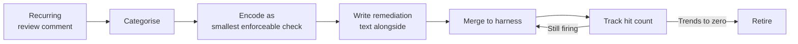

# Review-Feedback-to-Rule Loop: Promoting Recurring PR Comments into Harness Rules

> Promote a recurring review comment into a harness rule once it fires across 3+ PRs — then retire it when the hit count hits zero.

## When a Comment Becomes a Signal

A recurring review comment is evidence of an unencoded invariant — the rule lives in one reviewer's head, and every PR pays the cost of re-deriving it. The promotion threshold — same comment across three or more PRs in a window — is load-bearing: one or two occurrences is a hypothesis, three or more is a pattern. The walkinglabs harness engineering curriculum encodes this loop as a first-class practice ([walkinglabs — review-feedback-to-rule](https://github.com/walkinglabs/learn-harness-engineering/blob/main/docs/en/lectures/lecture-10-why-end-to-end-testing-changes-results/code/review-feedback-to-rule.md)).

## The Loop



### 1. Categorise the comment

Rule placement must match the comment's category. Promoting a semantic check to a regex linter is a category error — it fires on legitimate exceptions and erodes trust in the lint stack.

| Comment category | Encoding layer |
|---|---|
| Style or formatting | Linter rule (ESLint, Ruff, etc.) |
| Architectural boundary | AST/import check, dependency graph rule |
| Safety or correctness invariant | Pre-completion checklist entry, type or runtime check |
| Spec or contract violation | Evaluator rubric line, integration test |

### 2. Encode the smallest enforceable check

Pick the cheapest mechanism that fires deterministically. A one-line lint rule beats a multi-file AST plugin when both would work. Over-engineering adds maintenance cost the retirement step cannot recover.

### 3. Write the remediation text

A rule that says `no fs in renderer` without saying *what to do instead* relocates the bottleneck from review to comprehension. The source pairs the lint rule with explicit remediation: "Use the preload bridge" ([walkinglabs](https://github.com/walkinglabs/learn-harness-engineering/blob/main/docs/en/lectures/lecture-10-why-end-to-end-testing-changes-results/code/review-feedback-to-rule.md)).

The shape that works:

```
ERROR: Service layer cannot import from UI layer.
  Move shared logic to a Provider in src/providers/,
  or restructure to keep UI-specific code in src/ui/.
  See docs/architecture/layer-rules.md for the dependency diagram.
```

What is wrong, what to do instead, where the rationale lives — see [Feedback as Capability Equalizer](../agent-design/feedback-capability-equalizer.md).

### 4. Track hit count and retire

Every rule has a finite shelf life. Refactors obviate boundaries, model upgrades eliminate failure modes, conventions solidify until no one would write the violation. Without retirement, the rule library accumulates dead weight and the priority-saturation failure mode of [standards as agent instructions](../instructions/standards-as-agent-instructions.md) kicks in: when every rule has equal weight, nothing signals priority and adherence degrades.

Periodic decay pairs this loop with [harness impermanence](../agent-design/harness-impermanence.md): rules whose hits trend toward zero are deletion candidates. Annotate each rule with its obsolescence condition — the observable signal that it has done its job.

## Why Mechanical Enforcement Beats Repeated Comments

Anthropic separates the modes explicitly: "Unlike CLAUDE.md instructions which are advisory, hooks are deterministic and guarantee the action happens" ([Claude Code best practices](https://code.claude.com/docs/en/best-practices)). The distinction holds for review comments versus lint rules — a reviewer's eye is probabilistic, a mechanical check fires every time. LangChain's harness changes lifted Terminal Bench 2.0 from 52.8% to 66.5%, with self-verification among the high-impact components ([LangChain](https://blog.langchain.com/improving-deep-agents-with-harness-engineering/)); mechanical pre-merge checks are the human-team analogue.

## What This is Not

Distinct from [learned review rules](learned-review-rules.md): the Cursor Bugbot pattern adjusts the *reviewer's behaviour* by extracting rules from accept/reject signals. This loop promotes the invariant out of the reviewer entirely — into the lint stack, checklist, or evaluator rubric. The two compose: Bugbot tunes reviewer defaults; this loop drains high-frequency comments before they reach review.

Distinct from [incident-to-eval synthesis](../verification/incident-to-eval-synthesis.md), which converts production failures into regression tests — the trigger and enforcement layer differ.

## Example

A team's reviewer leaves the same comment on six PRs over two weeks: *"This handler swallows the database error. Re-throw or wrap it with context — silent failures here cause the on-call to chase ghosts."*

Trigger fires (6 ≥ 3). Categorise: safety/correctness invariant, not style. Encoding choice: an AST check is wrong here (the violation is semantic — "swallows error" depends on whether the catch block does anything with the error); a pre-completion checklist line is the right layer.

Add to `.claude/checklists/pre-merge.json`:

```json
{
  "id": "ERR01",
  "severity": "HIGH",
  "check": "Every catch block in src/handlers/ either re-throws, logs at error level, or wraps the error with context. Empty or comment-only catch blocks fail.",
  "remediation": "Re-throw the error, wrap it with `new HandlerError(message, { cause: err })`, or log via `ctx.logger.error({ err }, 'handler failed')` before returning a 5xx. See docs/architecture/error-handling.md."
}
```

Six weeks later, the on-call dashboard shows no silent-handler-failure incidents and the rule's hit count has stayed at zero for the last fifteen PRs. Retirement candidate: the convention has stuck; the rule has done its job. Either delete it or move it to a lower-severity advisory log.

## When This Backfires

- **Premature promotion**: encoding after one or two occurrences freezes a hypothesis as a rule. Suppression comments proliferate and the rule's signal degrades.
- **Wrong enforcement layer**: a semantic check forced into a regex linter fires on every legitimate exception — get the layer wrong and the rule becomes the new recurring noise source.
- **Remediation text omitted or stale**: a rule without "what to do instead" is a finger-wag. Developers and agents both stall, suppress, or copy-paste workarounds.
- **No retirement discipline**: the lint stack accumulates. Adherence degrades as instruction volume grows — context rot means models recall earlier rules less accurately as context fills ([Anthropic context engineering](https://www.anthropic.com/engineering/effective-context-engineering-for-ai-agents)). Priority saturation makes individual rules unreliable.

## Key Takeaways

- Three or more occurrences of the same review comment is the trigger — fewer is a hypothesis, not a pattern.
- Categorise before encoding: style → linter, boundary → AST check, safety → pre-completion checklist, spec → evaluator rubric. Wrong layer is a recurring-noise source.
- Remediation text is non-optional. A rule that says *what is wrong* without *what to do instead* relocates the bottleneck instead of removing it.
- Hooks and mechanical checks are deterministic; CLAUDE.md instructions and review comments are advisory. Promotion converts advisory into enforced.
- Pair promotion with retirement. Rules whose hit count trends to zero have done their job — delete them before priority saturation degrades the rest.

## Related

- [Learned Review Rules](learned-review-rules.md) — adjacent automation: the reviewer agent extracts rules from accept/reject signals
- [Deferred Standards Enforcement via Review Agents](deferred-standards-enforcement.md) — where post-hoc-checkable standards live once promoted out of CLAUDE.md
- [Feedback as Capability Equalizer](../agent-design/feedback-capability-equalizer.md) — why structured remediation text outperforms raw error output
- [Pre-Completion Checklists](../verification/pre-completion-checklists.md) — one of the encoding layers for promoted rules
- [Incident-to-Eval Synthesis](../verification/incident-to-eval-synthesis.md) — the production-failure analogue of this review-time loop
- [Harness Impermanence](../agent-design/harness-impermanence.md) — the retirement discipline that keeps promoted rules from accumulating
- [Standards as Agent Instructions](../instructions/standards-as-agent-instructions.md) — the priority-saturation failure mode that retirement prevents
- [Enforcing Agent Behavior with Hooks](../instructions/enforcing-agent-behavior-with-hooks.md) — deterministic enforcement layer for promoted rules
