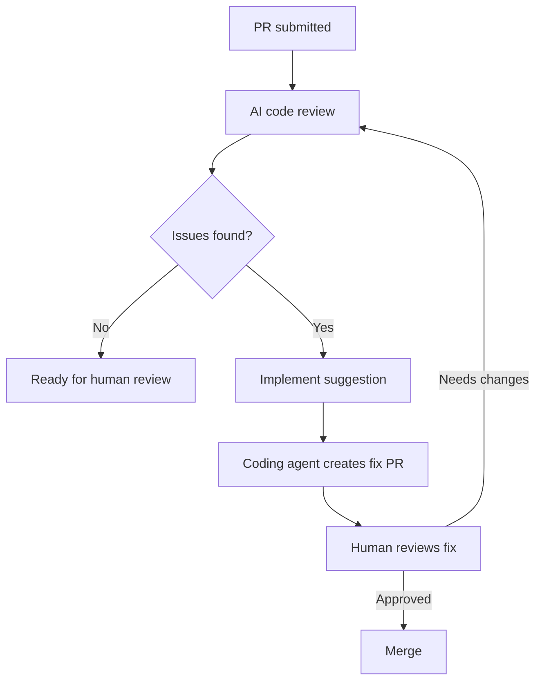

# Review-Then-Implement Loop

> Close the loop between AI code review and code generation — the reviewer identifies issues, a coding agent implements fixes, and a human reviews the result.

!!! info "Also known as"
    Agent Self-Review Loop, Agent Review Loops

## The Pattern

Traditional code review produces feedback you must manually act on: read the comment, understand the issue, write the fix, push again, wait for re-review. The review-then-implement loop collapses this cycle by connecting the reviewer directly to a coding agent that implements the suggested fix.



## How GitHub Implements This

GitHub Copilot code review includes an **Implement suggestion** feature (currently in public preview) that bridges review and implementation. The [documented workflow](https://docs.github.com/copilot/using-github-copilot/code-review/using-copilot-code-review) operates as follows:

1. Copilot code review identifies issues and provides suggested changes on a PR
2. On a review comment, you click **Implement suggestion**
3. A draft comment is created where you can instruct Copilot to address the specific feedback
4. The [Copilot coding agent creates a new pull request against the branch](https://docs.github.com/en/copilot/concepts/agents/code-review) with the suggestions applied
5. You review the fix PR and merge

This feature requires enabling the public preview for tools in Copilot code review and the Copilot coding agent.

The coding agent's implementation PR is separate from the original — it targets the same branch but contains only the fixes. This preserves a clean audit trail: the original PR shows findings, and the fix PR shows what changed.

## Where the Loop Applies

The pattern is most effective for **mechanical fixes** — the class of review feedback that has a clear, unambiguous resolution:

- Style violations with a known correct form
- Missing null checks or error handling on identified code paths
- Unused imports or variables flagged by the reviewer
- Type narrowing or assertion additions
- Test coverage gaps where the test structure is straightforward

Architectural feedback — "this should be split into two services" or "consider an event-driven approach here" — requires human judgment. The pattern's value comes from recognizing this boundary and automating only the mechanical side.

## Building the Pattern in Other Tools

For agents outside GitHub's integrated ecosystem, the same loop can be constructed:

1. **Review agent produces structured output.** Each finding includes a description, affected file/line range, severity, and a proposed fix (code diff or instruction).
2. **Orchestrator filters implementable findings.** Findings with concrete proposed fixes and severity below "architectural" are routed to a coding agent. Findings requiring design decisions are surfaced to you as comments only.
3. **Coding agent applies fixes.** The agent receives the finding and proposed fix, applies it, runs tests, and commits. If tests fail after applying the fix, the finding is escalated back to human review rather than iterated on indefinitely.
4. **Review the aggregate result.** You see both the review findings and the implemented fixes in a single view.

Cap automated fix attempts at one pass. If the coding agent's fix does not resolve the finding cleanly (tests fail, new issues introduced), escalate to human review. Recursive fix-review loops for mechanical issues rarely converge after the first attempt [unverified].

## Limitations

**[Human-in-the-loop](../workflows/human-in-the-loop.md) is structural, not optional.** You click "Implement suggestion" — the agent does not autonomously decide which findings to act on. This preserves your authority over which changes proceed.

**Fix quality depends on review quality.** If the reviewer misidentifies an issue or proposes an incorrect fix, the coding agent implements the wrong change. Your review of the fix PR is the safety net.

## Example

A review agent scans a pull request and produces structured findings:

```json
{
  "findings": [
    {
      "file": "src/auth/session.py",
      "line": 42,
      "severity": "medium",
      "category": "error-handling",
      "description": "Missing null check on `token` before calling `decode()`",
      "proposed_fix": "Add `if token is None: raise AuthError('No token provided')` before line 42",
      "implementable": true
    },
    {
      "file": "src/auth/session.py",
      "line": 15,
      "severity": "high",
      "category": "architecture",
      "description": "Session validation should be extracted into a dedicated middleware",
      "proposed_fix": null,
      "implementable": false
    }
  ]
}
```

The orchestrator routes each finding based on `implementable`:

- **Finding 1** (`implementable: true`) is sent to the coding agent. The agent adds the null check, runs `pytest tests/auth/`, confirms tests pass, and commits the fix to a new branch.
- **Finding 2** (`implementable: false`) is surfaced as a comment on the PR for human review. No automated fix is attempted.

The result: the null-check fix appears in a separate PR targeting the same branch. You review one small diff that addresses one specific finding. The architectural suggestion stays as a comment for you to evaluate.

## Key Takeaways

- Connect AI code review to a coding agent so review findings can be implemented automatically for mechanical issues
- GitHub Copilot's "Implement suggestion" feature creates a fix PR from review comments, collapsing the review-fix-re-review cycle
- The pattern applies to mechanical fixes (style, missing checks, test gaps) — not architectural or design feedback
- Your authority is preserved: you decide which suggestions to implement and review the result
- Cap automated fix attempts at one pass — escalate to human review if the fix does not resolve cleanly

## Unverified Claims

- Recursive fix-review loops for mechanical issues rarely converge after the first attempt `[unverified]`

## Related

- [Agent Self-Review Loop](../agent-design/agent-self-review-loop.md)
- [Signal Over Volume in AI Review](signal-over-volume-in-ai-review.md)
- [Evaluator-Optimizer Pattern](../agent-design/evaluator-optimizer.md)
- [Agent-Assisted Code Review](agent-assisted-code-review.md)
- [Empowerment Over Automation](../agent-design/empowerment-over-automation.md)
- [PR Description Style as a Lever for Agent PR Merge Rates](pr-description-style-lever.md)
- [Predicting Which AI-Generated Functions Will Be Deleted](predicting-reviewable-code.md)
- [Agentic Code Review Architecture](agentic-code-review-architecture.md)
- [Tiered Code Review](tiered-code-review.md)
- [Diff-Based Review](diff-based-review.md)
- [Agent-Authored PR Integration](agent-authored-pr-integration.md)
- [Committee Review Pattern](committee-review-pattern.md)
- [Human-AI Review Synergy](human-ai-review-synergy.md)
- [Agent PR Volume vs. Value](agent-pr-volume-vs-value.md)
