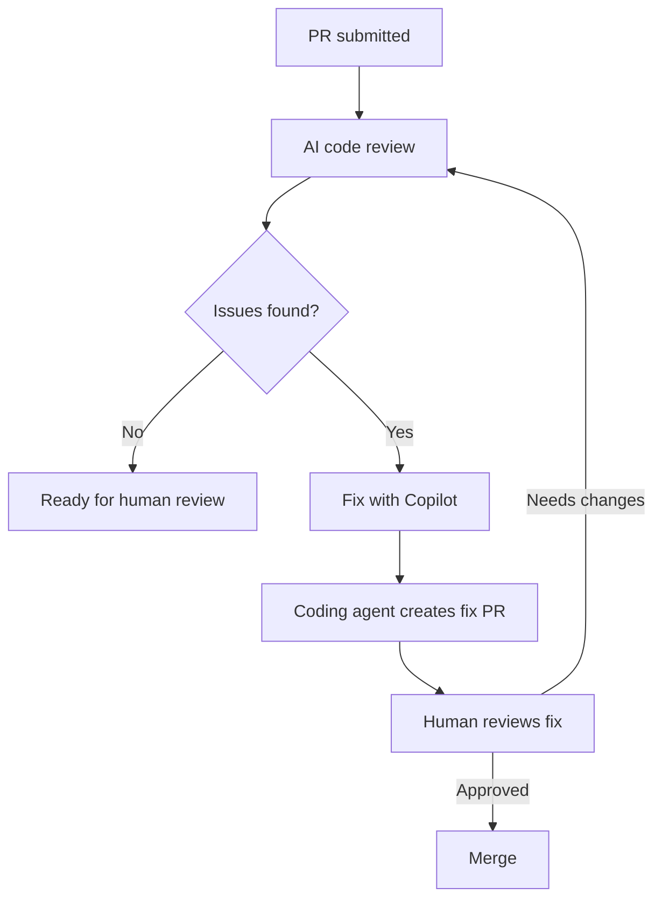

# Review-Then-Implement Loop for AI Agent Development

> Close the loop between AI code review and code generation: a reviewer identifies issues, a coding agent implements fixes, and a human reviews the result.

!!! info "Also known as"
    Agent Self-Review Loop, Agent Review Loops

## The pattern

Traditional code review produces feedback you act on by hand: read the comment, understand the issue, write the fix, push again, wait for re-review. The review-then-implement loop collapses this cycle. It connects the reviewer directly to a coding agent that implements the suggested fix.


```mermaid
graph TD
    A[PR submitted] --> B[AI code review]
    B --> C{Issues found?}
    C -->|No| D[Ready for human review]
    C -->|Yes| E[Fix with Copilot]
    E --> F[Coding agent creates fix PR]
    F --> G[Human reviews fix]
    G -->|Approved| H[Merge]
    G -->|Needs changes| B
```

## How GitHub implements this

GitHub Copilot code review includes a **Fix with Copilot** button that bridges review and implementation. The [Copilot code review workflow](https://docs.github.com/copilot/using-github-copilot/code-review/using-copilot-code-review) runs as follows:

1. Copilot code review identifies issues and suggests changes on a PR.
2. On a review comment, you select **Fix with Copilot**.
3. A dialog appears. You tell Copilot to address the feedback and choose how to apply it.
4. The [Copilot coding agent](https://docs.github.com/en/copilot/concepts/agents/code-review) applies fixes directly to the existing PR, or opens a new pull request against the branch.
5. You review the result and merge.

The coding agent can target the existing PR branch or create a separate child PR. You choose in the dialog. A child PR keeps a clean audit trail: the original PR shows the findings, and the fix PR shows what changed.

## Where the loop applies

The pattern works best for mechanical fixes. It applies to review feedback that has a clear, unambiguous resolution:

- Style violations with a known correct form
- Missing null checks or error handling on identified code paths
- Unused imports or variables flagged by the reviewer
- Type narrowing or assertion additions
- Test coverage gaps where the test structure is straightforward

Architectural feedback (for example, "this should be split into two services" or "consider an event-driven approach here") requires human judgment. The pattern's value comes from recognizing this boundary and automating only the mechanical side.

## Building the pattern in other tools

You can build the same loop for agents outside GitHub's integrated tooling:

1. Review agent produces structured output. Each finding carries a description, the affected file and line range, a severity, and a proposed fix (a code diff or an instruction).
2. Orchestrator filters implementable findings. It routes findings with a concrete proposed fix and severity below "architectural" to a coding agent. It surfaces findings that need design decisions to you as comments only.
3. Coding agent applies fixes. The agent takes the finding and proposed fix, applies it, runs the test suite (`pytest`), and commits. If tests fail after the fix, the agent escalates the finding back to human review rather than retrying without limit.
4. Review the combined result. You see both the review findings and the applied fixes in one view.

Cap automated fix attempts at one pass. If the coding agent's fix does not resolve the finding cleanly (tests fail, or new issues appear), escalate to human review rather than looping. Each extra automated pass risks new issues while masking the original. The cost of a wrong fix compounds faster than the benefit of avoiding a human review.

## The CLI-flag variant: in-process auto-fix

The dialog-mediated loop above keeps review and apply on separate surfaces. A tighter variant collapses them: the same agent run that scores the diff also writes the corrected version. Claude Code's `/code-review --fix` ships this shape at the CLI-tool tier, targeting "reuse, simplification, and efficiency suggestions": classes where the fix has a known shape (`extract helper`, `remove unused`, `inline expression`) ([Claude Code 2026-05-27 changelog](https://code.claude.com/docs/en/changelog)). `/simplify` is the cleanup-only sibling that runs the reuse / simplification / efficiency / altitude review and applies the fixes, skipping the bug-hunting pass `/code-review --fix` carries. The architectural move mirrors `cargo clippy --fix` for compiler-class lints ([Clippy usage docs](https://doc.rust-lang.org/stable/clippy/usage.html)) and LSP code actions for editor-tier refactors via `codeAction/resolve` ([LSP 3.17 specification](https://microsoft.github.io/language-server-protocol/specifications/lsp/3.17/specification/)).

Because there is no separate dispatch surface, three pre-conditions are load-bearing before wiring it in:

- The rubric is calibrated on template-shaped findings. Applying against a freshly tuned heuristic with no false-positive baseline imports an unknown error rate as a working-tree mutation. The empirical floor: AI suggestions on 278,790 PRs were adopted at 16.6% versus 56.5% for humans, with "over half of unadopted suggestions from AI agents either incorrect or addressed through alternative fixes" ([arxiv:2603.15911](https://arxiv.org/abs/2603.15911v1)). A meaningful fraction should not be applied at all.
- The working tree is clean, or the flag refuses. The precedent is `cargo fix`, which errors on a dirty tree and requires explicit `--allow-dirty` / `--allow-staged` / `--allow-no-vcs` flags ([Cargo documentation on DeepWiki](https://deepwiki.com/rust-lang/cargo/9.2-code-fixing)). Without that guard the apply step destroys the recoverable state needed to inspect or revert the patch.
- Design-judgment findings are out of scope. Design disagreements are the dominant failure mode for unmerged agentic PRs (10 of 32 qualitatively analyzed in [arxiv:2602.19441](https://arxiv.org/abs/2602.19441v1)). A `--fix` invocation that surfaces "extract this into a service" and then writes the extraction has converted a judgment call into a done deal.

The load-bearing claim is not the keystroke saving but that review and apply can share state safely: the rubric's confidence on a finding transfers without re-inspection to confidence on the patch. This is the same amortization argument behind [Batched Suggestion Application](batched-suggestion-application.md), applied one tier higher: there the batch is the unit of human adjudication; here the rubric is. Idempotency is the rollback proxy: re-running `--fix` on a clean tree must be a no-op, otherwise the rubric is not stable enough to trust. Two runs against the same diff that produce different patches mean "the fix" is not a reproducible artifact unless the model and rubric are pinned.

## The cloud-agent variant: direct-apply review comments

A third variant sits between the dialog loop and the CLI flag: the maintainer classifies agent-eligible comments and a cloud agent pushes one fix commit back to the existing PR branch, then re-requests review. GitHub shipped it on 2026-05-19 by renaming "Implement suggestion" to "Fix with Copilot" and adding a pre-action dialog with three controls: apply directly to the PR or open a new PR targeting the branch, model selection, and optional steering instructions ([GitHub Changelog, 19 May 2026](https://github.blog/changelog/2026-05-19-easily-apply-copilot-code-review-feedback-with-copilot-cloud-agent)). "Fix batch with Copilot" in the PR Overview comment dispatches a tick-selected set of review comments in one cloud agent run.

The contract is human-classifies, agent-applies, human-re-reviews, in four steps:

1. Classify. The maintainer reads the Copilot review comments, tagged High / Medium / Low severity and grouped to remove duplicates ([GitHub Changelog, 12 May 2026](https://github.blog/changelog/2026-05-12-copilot-code-review-comment-experience-improvements)), and decides which are agent-eligible.
2. Dispatch. Fix with Copilot on a single comment, or Fix batch on a selection. The dialog selects direct-apply or spin-off PR.
3. Push. The cloud agent applies the change in its sandbox and pushes one commit to the existing branch (or opens a separate fix PR targeting it) ([GitHub Changelog, 19 May 2026](https://github.blog/changelog/2026-05-19-easily-apply-copilot-code-review-feedback-with-copilot-cloud-agent)).
4. Re-request review. The agent does not run a second pass on its own output.

Three conditions keep the variant from eroding the merge-rate signal it protects:

- Comment classification is human-set, not agent-inferred. The best published comment-intent classifier reaches 59.3% accuracy on a 1,828-comment dataset ([arXiv:2307.03852](https://arxiv.org/abs/2307.03852v1)). Automated routing would import a ~40% misclassification rate.
- The agent pushes a new commit, never a rebase or force push. Force pushes are the strongest negative predictor of merge across 33,596 agent-authored PRs ([arXiv:2602.19441](https://arxiv.org/abs/2602.19441v1)). Reviewer engagement is the strongest positive predictor in the same cohort, so preserving the reviewer's branch context is what makes re-review tractable.
- The contract terminates after one push. Re-triggering the agent on its own commits produces unbounded iteration (the same circuit-breaker problem documented for [one-click CI auto-fix](../workflows/one-click-ci-auto-fix.md)).

The cross-tool equivalent (anthropics/claude-code-action, invoked by `@claude` on a PR) pushes to the existing branch and updates a single status comment, and explicitly cannot submit formal PR reviews or approvals ([claude-code-action capabilities-and-limitations.md](https://github.com/anthropics/claude-code-action/blob/main/docs/capabilities-and-limitations.md)). Both vendors converge on this shape. Use direct-apply for unambiguous mechanical comments and spin-off PR for ambiguous or cross-cutting changes the reviewer needs to inspect as a discrete diff. One caution specific to the cloud-agent surface: agentic GitHub Actions that consume PR comments are an injection surface, with 519 such vulnerabilities found across 10,792 repos ([arXiv:2605.07135](https://arxiv.org/abs/2605.07135v1)). The human click is the load-bearing mitigation; policies that let non-maintainer comments auto-dispatch remove it.

## Limitations

[Human-in-the-loop](../workflows/human-in-the-loop.md) is structural, not optional. You click "Fix with Copilot". The agent does not decide on its own which findings to act on. You keep authority over which changes proceed.

Fix quality depends on review quality. If the reviewer misidentifies an issue or proposes a wrong fix, the coding agent implements the wrong change. Your review of the fix PR is the safety net.

## Example

A review agent scans a pull request and produces structured findings:

```json
{
  "findings": [
    {
      "file": "src/auth/session.py",
      "line": 42,
      "severity": "medium",
      "category": "error-handling",
      "description": "Missing null check on `token` before calling `decode()`",
      "proposed_fix": "Add `if token is None: raise AuthError('No token provided')` before line 42",
      "implementable": true
    },
    {
      "file": "src/auth/session.py",
      "line": 15,
      "severity": "high",
      "category": "architecture",
      "description": "Session validation should be extracted into a dedicated middleware",
      "proposed_fix": null,
      "implementable": false
    }
  ]
}
```

The orchestrator routes each finding based on `implementable`:

- Finding 1 (`implementable: true`) is sent to the coding agent. The agent adds the null check, runs `pytest tests/auth/`, confirms tests pass, and commits the fix to a new branch.
- Finding 2 (`implementable: false`) is surfaced as a comment on the PR for human review. No automated fix is attempted.

The result: the null-check fix appears in a separate PR targeting the same branch. You review one small [diff that addresses one specific finding](diff-based-review.md). The architectural suggestion stays as a comment for you to evaluate.

## FAQ

**Why should the fixing agent add a commit instead of force-pushing?**

Force pushes are the strongest negative predictor of merge across 33,596 agent-authored PRs, and reviewer engagement is the strongest positive predictor in the same cohort ([arXiv:2602.19441](https://arxiv.org/abs/2602.19441v1)). A new commit preserves the reviewer's branch context so re-review stays tractable; rewriting history destroys the diff they were reading.

**Can the tool decide which review comments the agent fixes?**

Keep classification human-set. The best published comment-intent classifier reaches 59.3% accuracy on a 1,828-comment dataset ([arXiv:2307.03852](https://arxiv.org/abs/2307.03852v1)), so automated routing would import roughly a 40% misclassification rate into the dispatch step. The maintainer's click is also the load-bearing mitigation against comment-borne prompt injection on agentic GitHub Actions.

**What has to be true before enabling an in-process `--fix` flag?**

Three preconditions: the rubric is calibrated on template-shaped findings, the working tree is clean or the flag refuses (the `cargo fix` precedent), and design-judgment findings stay out of scope. Re-running the flag on a clean tree must be a no-op: idempotency is the rollback proxy, and two different patches for one diff mean the rubric is not stable enough to apply.

## Key Takeaways

- A finding is safe to route automatically only with two things present: a concrete proposed fix and a severity rated below architectural
- Picking a child PR over landing on the existing branch keeps the review findings and the applied fix as two separate, inspectable diffs
- The dividing line is whether the fix has one unambiguous resolution: style violations, missing checks, and test-coverage gaps qualify; splitting a service into two does not
- The system never applies a fix on its own initiative: every "Fix with Copilot" click is a decision you make
- Cap automated fix attempts at one pass and escalate to human review if the fix does not resolve cleanly: each extra pass risks new issues while masking the original

## Related

- [Agent Self-Review Loop](agent-self-review-loop.md)
- [Signal Over Volume in AI Review](signal-over-volume-in-ai-review.md)
- [Evaluator-Optimizer Pattern](../patterns/agent-design/evaluator-optimizer.md)
- [Agent-Assisted Code Review](agent-assisted-code-review.md)
- [Agentic Code Review Architecture](agentic-code-review-architecture.md)
- [Tiered Code Review](tiered-code-review.md)
- [Diff-Based Review](diff-based-review.md)
- [Batched Suggestion Application](batched-suggestion-application.md)
  - long-form
