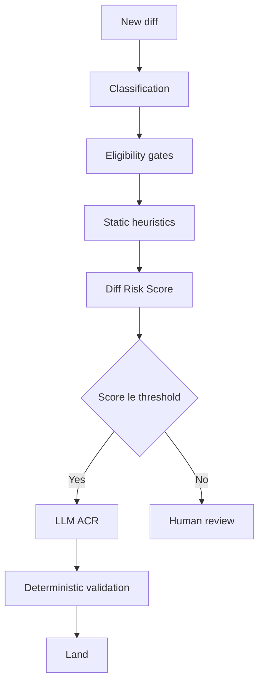

# Risk-Score Threshold Calibration for Auto-Approval

> Expose the auto-approval cutoff on a learned diff-risk score as an explicit yield-vs-safety knob, with revert and incident telemetry to recalibrate it.

## The Pattern

A learned diff-risk model assigns each diff a numeric score predicting the likelihood of revert or production incident. A single percentile threshold separates auto-approved diffs from those routed to human review. Moving the threshold up automates more diffs at strictly higher marginal risk; moving it down trades automation yield for safety. The point on the curve is an operator choice, not a property of the model.

This is distinct from two adjacent patterns. [Tiered code review](tiered-code-review.md) routes by *static path criticality* — auth and payment paths escalate regardless of score. [Tunable per-PR effort](tunable-review-effort.md) lets a reviewer or routing policy pick High vs. Default review depth per PR. Threshold calibration is the *organization-wide* dial on a learned score that decides whether human review happens at all.

## How RADAR Implements It

Meta's RADAR system is the documented industrial case. It chains six stages:

1. Diff classification by authorship and source type
2. Eligibility gates (deterministic exclusions)
3. Static heuristics
4. Machine-learned **Diff Risk Score**
5. LLM-based Automated Code Review
6. Deterministic validation before landing

The Diff Risk Score is where the calibration knob sits. Diffs at or below the chosen percentile of the score distribution proceed; diffs above it route to a human ([arXiv:2605.30208](https://arxiv.org/abs/2605.30208)).

## What Calibration Buys

Published RADAR metrics show the yield/safety tradeoff numerically. At Meta scale (535K+ diffs reviewed, 331K+ landed without manual intervention), relaxing the Diff Risk Score threshold from the 25th to the 50th percentile raised approval rate to 60.31% ([arXiv:2605.30208](https://arxiv.org/abs/2605.30208)). Safety outcomes versus the non-RADAR baseline:

| Metric | RADAR vs. baseline |
|--------|-------------------|
| Revert rate | ~1/3 |
| Production incident rate | ~1/50 |
| Median time-to-close | reduced over 330% |
| Median review wall time | reduced 35% |

Source: [arXiv:2605.30208](https://arxiv.org/abs/2605.30208).

The knob is meaningful because the empirical revert-rate distribution across the score is monotonic — each percentile bucket reverts at a measurable rate, so each threshold move corresponds to a known marginal change in expected reverts per 1,000 diffs. The deterministic validation stage at the end provides a final backstop for cases the score under-rates.

## Why It Works

Risk calibration works because three things are true at once. First, a learned risk score with monotonic revert-rate distribution converts an opaque "is this safe?" question into a numeric trade-off where moving the threshold up shifts the marginal automated approval to a strictly riskier diff than the previous marginal one ([arXiv:2605.30208](https://arxiv.org/abs/2605.30208)). Second, organization-scale telemetry — revert and incident counts attributable to each score bucket — funds recalibration when the underlying diff distribution drifts. Third, a deterministic validation pass at the end of the funnel catches the cases where the model under-estimates risk, so the threshold is not the sole safety boundary.

Without all three, the dial degrades. A monotonic score without telemetry is a guess in a fancy hat. Telemetry without deterministic validation makes every score miscalibration a production incident before the next training run.

## Prerequisites

Calibration requires infrastructure the pattern's industrial provenance can hide. Before adopting it:

- **Revert/incident telemetry per score bucket** — without per-percentile observation, the curve is unmeasured and the threshold is a hope.
- **Deterministic validation backstop** — a final check (linters, type checks, sandboxed test execution) catches score under-estimates before they land. Without it, the threshold is the only safety boundary.
- **Stable feature signals** — Diff Risk Score features assume authorship, churn, and blast radius are stably observable. Microservice sprawl with rotating owners degrades feature quality.
- **Periodic recalibration cadence** — the diff distribution shifts as the codebase, tooling, and AI-author mix change. A threshold set in Q1 will not be the right threshold in Q4.

A small or low-telemetry team that adopts the pattern without these inherits an opaque knob with no way to know which direction to turn it.

## When This Backfires

- **Small / low-telemetry teams** cannot measure revert rate or incident rate per percentile bucket. The threshold becomes a guess, and any reported safety number is unverifiable. Static path-based routing via [tiered code review](tiered-code-review.md) gives equivalent safety at lower operational overhead in this regime.
- **Regulated domains** (medical devices, automotive safety, financial compliance) often mandate documented human sign-off on every change. Auto-approval at any risk percentile may violate audit requirements regardless of empirical safety.
- **Calibration-aware adversaries** — a contributor who knows the feature space can structure malicious diffs to land in the auto-approved tier. Single-knob calibration optimizes for the average diff distribution, not a worst-case adversary.
- **Novel architectural styles** — risk scores trained on prior diff distributions misclassify the first wave of a new framework or AI-generated pattern. The model is correct on average and wrong on the new thing.
- **Ground-truth deficiencies cap the dial.** Independent work argues no amount of threshold tuning compensates when human review labels themselves encode workflow constraints rather than objective risk ([arXiv:2604.24525](https://arxiv.org/abs/2604.24525)). Static analysis baselines have measured false-negative rates around 50% on real vulnerable commits, with 22% triggering no warning at all ([Endor Labs: False Negatives in SAST](https://www.endorlabs.com/learn/false-negatives-in-sast-hidden-risks-behind-the-noise)) — when an upstream stage is that noisy, threshold tuning on the downstream score moves the visible curve without necessarily moving the actual one.
- **CRA-only credibility gap** — empirical work on agent-only code review found a 23-point merge rate gap (45.20% vs. 68.37%) versus human-reviewed PRs in open-source contexts ([arXiv:2604.03196](https://arxiv.org/abs/2604.03196)). Meta's deterministic-validation backstop and corporate trust loop may not transfer to organizations without equivalent guardrails.

## Example

What the published RADAR data point looks like as a calibration curve. The paper reports two operating points directly — the 25th and 50th percentile thresholds — plus the baseline comparison:

| Percentile threshold | Auto-approve rate | Revert rate | Incident rate |
|----------------------|-------------------|-------------|---------------|
| 25th | not reported | ~1/3 of baseline | ~1/50 of baseline |
| 50th | 60.31% | ~1/3 of baseline | ~1/50 of baseline |
| Non-RADAR baseline | — | reference | reference |

Source: [arXiv:2605.30208](https://arxiv.org/abs/2605.30208). The aggregated safety figures (revert ~1/3, incident ~1/50) are reported across RADAR-reviewed diffs without per-percentile breakouts in the abstract material.

A team adopting the pattern in their own environment would build the equivalent table from their own telemetry: bucket diffs by score percentile, compute observed revert rate and incident rate per bucket against a non-auto-approved baseline, and pick the threshold where the marginal revert/incident cost crosses the team's tolerance line. The decision is now an explicit operator choice tied to local numbers, not a hidden assumption inside the model. Without that local telemetry, there is no curve to read — only the vendor's published point.

## Key Takeaways

- Risk-score threshold calibration converts auto-approval into an explicit yield-vs-safety knob; moving the threshold up automates more diffs at strictly higher marginal risk.
- The pattern requires per-bucket revert/incident telemetry, a deterministic-validation backstop, and stable feature signals. Without all three, the knob is opaque.
- RADAR's published numbers (revert rate ~1/3 baseline, incident rate ~1/50, 60.31% approval at 50th percentile) come from Meta-scale infrastructure — counter-evidence shows the dial degrades when ground-truth labels or upstream signals are noisy.
- Calibration is distinct from static path-tiering (tiered code review) and per-PR effort dials (tunable review effort) — the three patterns compose rather than substitute.
- Regulated domains, small teams, and calibration-aware adversaries are explicit out-of-scope conditions; choose path-based or human-mandatory routing instead.

## Related

- [Tiered Code Review](tiered-code-review.md) — static path-criticality routing; the alternative when telemetry to calibrate a learned score does not exist
- [Tunable Effort Levels for Code Review Agents](tunable-review-effort.md) — per-PR operator-set effort dial; composes with risk-score calibration but operates on different inputs
- [CRA-Only Review and the Merge Rate Gap](cra-merge-rate-gap.md) — counter-evidence on agent-only review credibility in open-source contexts
- [Signal Over Volume in AI Review](signal-over-volume-in-ai-review.md) — design principle for the LLM ACR stage that follows the risk-score gate
- [Agent-Assisted Code Review](agent-assisted-code-review.md) — broader framing for the AI-first pass that RADAR's ACR stage instantiates
- [Risk-Based Shipping](../verification/risk-based-shipping.md) — analogous risk-tier reasoning applied to deployment rather than review

## Sources

- [arXiv:2605.30208](https://arxiv.org/abs/2605.30208) — Adams et al. (May 2026): "Automating Low-Risk Code Review at Meta: RADAR, Risk Calibration, and Review Efficiency"
- [arXiv:2604.24525](https://arxiv.org/abs/2604.24525) — "Understanding the Limits of Automated Evaluation for Code Review Bots in Practice"
- [arXiv:2604.03196](https://arxiv.org/abs/2604.03196) — Chowdhury et al. (2026): empirical study of code review agents in pull requests
- [Endor Labs: False Negatives in SAST](https://www.endorlabs.com/learn/false-negatives-in-sast-hidden-risks-behind-the-noise) — measured false-negative rates in static analysis baselines
