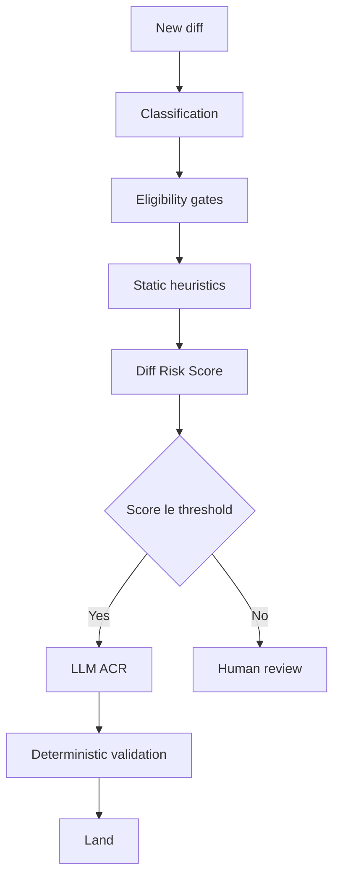

# Risk-Score Threshold Calibration for Auto-Approval

> Expose the auto-approval cutoff on a learned diff-risk score as an explicit yield-vs-safety knob, with revert and incident telemetry to recalibrate it.

## The pattern

A learned diff-risk model scores each diff by likelihood of revert or production incident. A single percentile threshold separates auto-approved diffs from those routed to human review ([arXiv:2605.30208](https://arxiv.org/abs/2605.30208)). Moving it up automates more diffs at strictly higher marginal risk. Moving it down trades yield for safety. The point on the curve is an operator choice, not a property of the model.

This pattern differs from two adjacent ones. [Tiered code review](tiered-code-review.md) routes by static path criticality — auth and payment paths escalate regardless of score. [Tunable per-PR effort](tunable-review-effort.md) picks review depth per PR. Threshold calibration is the organization-wide dial on a learned score that decides whether human review happens at all.

## How RADAR implements it

Meta's RADAR system is the documented industrial case. It chains six stages:

1. Diff classification by authorship and source type
2. Eligibility gates (deterministic exclusions)
3. Static heuristics
4. Machine-learned Diff Risk Score
5. LLM-based Automated Code Review
6. Deterministic validation before landing

The Diff Risk Score is where the calibration knob sits. Diffs at or below the chosen percentile proceed. Diffs above it route to a human reviewer ([arXiv:2605.30208](https://arxiv.org/abs/2605.30208)).

## What calibration buys

Published RADAR metrics quantify the tradeoff. At Meta scale (535K+ diffs reviewed, 331K+ landed without manual intervention), relaxing the threshold from the 25th to the 50th percentile raised approval rate to 60.31% ([arXiv:2605.30208](https://arxiv.org/abs/2605.30208)). Safety outcomes versus the non-RADAR baseline:

| Metric | RADAR vs. baseline |
|--------|-------------------|
| Revert rate | ~1/3 |
| Production incident rate | ~1/50 |
| Median time-to-close | reduced over 330% |
| Median review wall time | reduced 35% |

Source: [arXiv:2605.30208](https://arxiv.org/abs/2605.30208).

## Why it works

Risk calibration works because three things hold at once. First, the empirical revert-rate distribution across the score is monotonic, so each threshold move maps to a known marginal change in expected reverts ([arXiv:2605.30208](https://arxiv.org/abs/2605.30208)). Second, organization-scale telemetry — revert and incident counts per score bucket — funds recalibration when the diff distribution drifts. Third, a deterministic validation pass catches model under-estimates, so the threshold is not the sole safety boundary. Remove any one and the dial degrades: a monotonic score without telemetry is unmeasured; telemetry without validation makes every miscalibration a production incident.

## Prerequisites

Calibration requires infrastructure the pattern's industrial provenance can hide:

- Revert and incident telemetry per score bucket — without per-percentile observation, the curve is unmeasured.
- Deterministic validation backstop — linters, type checks, and sandboxed test execution catch score under-estimates before they land.
- Stable feature signals — authorship, churn, and blast-radius features must be stably observable ([arXiv:2605.30208](https://arxiv.org/abs/2605.30208)). Microservice sprawl with rotating owners degrades feature quality.
- Periodic recalibration cadence — the diff distribution shifts as the codebase, tooling, and AI-author mix change. A threshold set in Q1 will not be right in Q4.

Adopting the pattern without these inherits an opaque knob with no way to know which direction to turn it.

## When this backfires

- Small or low-telemetry teams cannot measure revert or incident rate per percentile bucket, so the threshold becomes an unverifiable guess. Static path-based routing via [tiered code review](tiered-code-review.md) gives equivalent safety at lower overhead here.
- Regulated domains (medical devices, automotive safety, financial compliance) often mandate documented human sign-off on every change, so auto-approval may violate audit requirements regardless of empirical safety.
- Calibration-aware adversaries can structure malicious diffs to land in the auto-approved tier. Single-knob calibration optimizes for the average diff, not a worst-case adversary.
- Novel architectural styles break the score — models trained on prior distributions misclassify the first wave of a new framework or AI-generated pattern: correct on average, wrong on the new thing.
- Ground-truth deficiencies cap the dial. No threshold tuning compensates when human review labels encode workflow constraints rather than objective risk ([arXiv:2604.24525](https://arxiv.org/abs/2604.24525)). Static analysis baselines have measured ~50% false-negative rates on real vulnerable commits, 22% triggering no warning ([Endor Labs: False Negatives in SAST](https://www.endorlabs.com/learn/false-negatives-in-sast-hidden-risks-behind-the-noise)) — when an upstream stage is that noisy, tuning the downstream score moves the visible curve without moving the actual one.
- CRA-only credibility gap — agent-only review showed a 23-point merge-rate gap (45.20% versus 68.37%) compared with human-reviewed PRs in open source ([arXiv:2604.03196](https://arxiv.org/abs/2604.03196)). Meta's validation backstop and corporate trust loop may not transfer without equivalent guardrails.

## Example

The published RADAR data as a calibration curve. The paper reports two operating points — the 25th and 50th percentile thresholds — plus the baseline:

| Percentile threshold | Auto-approve rate | Revert rate | Incident rate |
|----------------------|-------------------|-------------|---------------|
| 25th | not reported | ~1/3 of baseline | ~1/50 of baseline |
| 50th | 60.31% | ~1/3 of baseline | ~1/50 of baseline |
| Non-RADAR baseline | — | reference | reference |

Source: [arXiv:2605.30208](https://arxiv.org/abs/2605.30208). The aggregated safety figures (revert ~1/3, incident ~1/50) are reported across RADAR-reviewed diffs without per-percentile breakouts.

A team reproduces this from its own telemetry: bucket diffs by score percentile, compute revert and incident rate per bucket against a non-auto-approved baseline, and pick the threshold where marginal cost crosses its tolerance line. Without local telemetry there is no curve to read — only the vendor's published point.

## Key Takeaways

- Risk-score threshold calibration converts auto-approval into an explicit yield-vs-safety knob; moving it up automates more diffs at strictly higher marginal risk.
- The pattern requires per-bucket revert/incident telemetry, a deterministic-validation backstop, and stable feature signals. Without all three, the knob is opaque.
- RADAR's published numbers (revert rate ~1/3 baseline, incident rate ~1/50, 60.31% approval at 50th percentile) come from Meta-scale infrastructure — counter-evidence shows the dial degrades when ground-truth labels or upstream signals are noisy.
- Calibration is distinct from static path-tiering (tiered code review) and per-PR effort dials (tunable review effort) — the three patterns compose rather than substitute.
- Regulated domains, small teams, and calibration-aware adversaries are explicit out-of-scope conditions; choose path-based or human-mandatory routing instead.

## Related

- [Tiered Code Review](tiered-code-review.md) — static path-criticality routing; the alternative when telemetry to calibrate a learned score does not exist
- [Tunable Effort Levels for Code Review Agents](tunable-review-effort.md) — per-PR operator-set effort dial; composes with risk-score calibration but operates on different inputs
- [CRA-Only Review and the Merge Rate Gap](cra-merge-rate-gap.md) — counter-evidence on agent-only review credibility in open-source contexts
- [Signal Over Volume in AI Review](signal-over-volume-in-ai-review.md) — design principle for the LLM ACR stage that follows the risk-score gate
- [Agent-Assisted Code Review](agent-assisted-code-review.md) — broader framing for the AI-first pass that RADAR's ACR stage instantiates
- [Risk-Based Shipping](../verification/risk-based-shipping.md) — analogous risk-tier reasoning applied to deployment rather than review
- [Audit-Budget Allocation for Agent Fleets](../verification/audit-budget-allocation-agent-fleets.md) — the same allocation problem when the ranking signal is the agent's own confidence rather than a learned diff-risk score

## Sources

- [arXiv:2605.30208](https://arxiv.org/abs/2605.30208) — Adams et al. (May 2026): "Automating Low-Risk Code Review at Meta: RADAR, Risk Calibration, and Review Efficiency"
- [arXiv:2604.24525](https://arxiv.org/abs/2604.24525) — "Understanding the Limits of Automated Evaluation for Code Review Bots in Practice"
- [arXiv:2604.03196](https://arxiv.org/abs/2604.03196) — Chowdhury et al. (2026): empirical study of code review agents in pull requests
- [Endor Labs: False Negatives in SAST](https://www.endorlabs.com/learn/false-negatives-in-sast-hidden-risks-behind-the-noise) — measured false-negative rates in static analysis baselines
