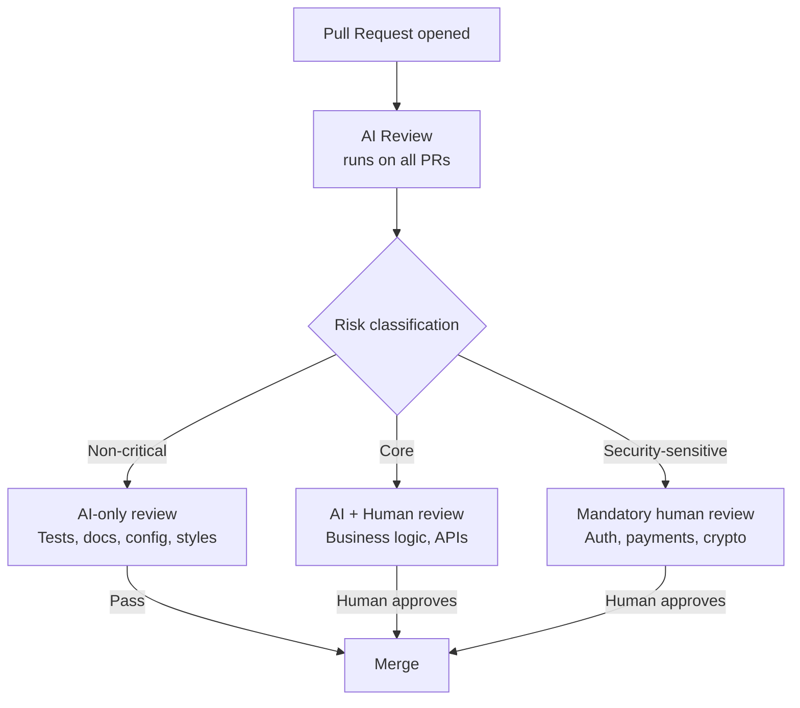

# Tiered Code Review: AI-First with Human Escalation

> Route review effort by risk: AI handles the first pass on everything, non-critical code merges after AI-only review, and critical code escalates to mandatory human review.

## The Problem

AI-generated code is [increasing PR volume](agent-pr-volume-vs-value.md). PRs are [~18% larger and change failure rates are up ~30%](https://addyo.substack.com/p/code-review-in-the-age-of-ai) compared to human-only codebases. Review is now the rate limiter. Applying the same human review depth to every change does not scale.

Tiered code review treats review as a **risk-routing problem**: classify code by criticality, then match review effort to risk level.

## How It Works



Three tiers, each with a different review bar:

| Tier | Code types | Review requirement | Merge gate |
|------|-----------|-------------------|------------|
| **Automated** | Tests, docs, config, CSS, migrations | AI review only | AI passes, CI green |
| **AI + Human** | Business logic, API contracts, data models | AI first pass + human approval | CODEOWNERS approval |
| **Human-only** | Auth, payments, cryptography, PII handling | Mandatory human review | Security team approval |

## Real-World Implementations

**OpenAI Codex team** runs AI review automatically via GitHub webhook when a PR transitions from draft to review. Their custom review model achieves [~90% accuracy (nine out of ten comments identify valid issues)](https://newsletter.pragmaticengineer.com/p/how-codex-is-built). Non-critical code merges after AI-only review; core agent code and open source components require mandatory human review.

**GitHub Copilot code review** reached [60M+ reviews](https://github.blog/ai-and-ml/github-copilot/60-million-copilot-code-reviews-and-counting/) and can be enabled automatically on all PRs at org/repo level. It surfaces actionable feedback in 71% of reviews and says nothing in the remaining 29%.

**Claude Code** provides [automated security review](https://claude.com/blog/automate-security-reviews-with-claude-code) via CLI and GitHub Actions. Anthropic uses this internally as a CI gate, catching RCE and SSRF vulnerabilities before merge.

## Implementing with GitHub Native Tools

GitHub does not offer path-based review routing natively. Approximate tiered review by layering three existing mechanisms:

### 1. Enable automatic AI review

Configure [Copilot automatic code review](https://docs.github.com/en/copilot/how-tos/use-copilot-agents/request-a-code-review/configure-automatic-review) at the repository or org level. This covers the AI-first pass on all PRs.

### 2. Define CODEOWNERS for critical paths

```
# .github/CODEOWNERS

# Tier 3: Security-sensitive — requires security team
/src/auth/           @security-team
/src/payments/       @security-team
/src/crypto/         @security-team

# Tier 2: Core business logic — requires domain owner
/src/api/            @backend-team
/src/models/         @backend-team
/src/services/       @backend-team

# Tier 1: Non-critical — no CODEOWNERS entry
# Tests, docs, config get AI review only
```

### 3. Set branch protection rules

Require CODEOWNERS approval in branch protection. PRs that touch only Tier 1 paths (no CODEOWNERS match) need only AI review and passing CI. PRs touching Tier 2 or 3 paths require the designated human reviewers.

## Severity-Driven Merge Gates

Within each tier, classify AI findings by severity to prevent critical issues from drowning under cosmetic noise:

| Severity | Effect | Example |
|----------|--------|---------|
| **Action Required** | Blocks merge | SQL injection, auth bypass, data loss risk |
| **Recommended** | Advisory, mergeable | Missing error handling, suboptimal algorithm |
| **Minor Suggestion** | Optional | Naming improvements, style preferences |

This [severity-driven pattern](https://www.qodo.ai/blog/5-ai-code-review-pattern-predictions-in-2026/) keeps the merge gate meaningful. Only Action Required findings on critical paths block the pipeline.

## Classification Framework

The hardest part of tiered review is deciding what counts as "critical." Start with these heuristics:

- **Security boundary**: Does this code handle authentication, authorization, encryption, or PII? Human review required.
- **Financial impact**: Does this code process payments, calculate billing, or manage subscriptions? Human review required.
- **Blast radius**: Does a bug here affect all users or a single feature? Higher [blast radius](../security/blast-radius-containment.md) demands human review.
- **Reversibility**: Can a mistake be rolled back in minutes, or does it corrupt persistent state? Irreversible changes need human eyes.

Non-critical is everything else: tests, docs, configuration, CSS, build scripts, and reversible migrations.

## Example

A monorepo with `src/auth/`, `src/api/`, and `tests/` directories uses all three tiers in a single GitHub Actions workflow:

```yaml
# .github/workflows/tiered-review.yml
name: Tiered Review Gate
on:
  pull_request:
    types: [opened, synchronize, ready_for_review]

jobs:
  classify:
    runs-on: ubuntu-latest
    outputs:
      tier: ${{ steps.classify.outputs.tier }}
    steps:
      - uses: actions/checkout@v4
      - id: classify
        run: |
          FILES=$(gh pr diff ${{ github.event.pull_request.number }} --name-only)
          if echo "$FILES" | grep -qE '^src/(auth|payments|crypto)/'; then
            echo "tier=3" >> "$GITHUB_OUTPUT"
          elif echo "$FILES" | grep -qE '^src/(api|models|services)/'; then
            echo "tier=2" >> "$GITHUB_OUTPUT"
          else
            echo "tier=1" >> "$GITHUB_OUTPUT"
          fi
        env:
          GH_TOKEN: ${{ secrets.GITHUB_TOKEN }}

  ai-review:
    runs-on: ubuntu-latest
    steps:
      - uses: actions/checkout@v4
      - name: Run AI review
        run: |
          # Copilot automatic review is configured at repo level;
          # this step runs supplementary checks (linting, security scan)
          npm run lint
          npm run security:scan

  gate:
    needs: [classify, ai-review]
    runs-on: ubuntu-latest
    steps:
      - name: Enforce tier gate
        run: |
          TIER=${{ needs.classify.outputs.tier }}
          if [ "$TIER" -ge 2 ]; then
            echo "Tier $TIER — CODEOWNERS approval required before merge"
          else
            echo "Tier 1 — AI review and CI sufficient"
          fi
```

Pair this with the CODEOWNERS file from the implementation section above. Tier 1 PRs (tests, docs, config) merge after AI review and green CI. Tier 2 and 3 PRs wait for the designated human reviewers defined in CODEOWNERS.

## Key Takeaways

- Tiered review is a risk-routing problem — classify code by criticality, then match review depth to risk
- AI review runs on everything; human review is reserved for costly or irreversible mistakes
- Layer CODEOWNERS + branch protection + automatic AI review to approximate tiered review on GitHub today
- Severity-driven merge gates prevent critical findings from drowning in noise

## Unverified Claims

- Exact percentage improvement in review throughput from tiered AI-first review is not established in any source `[unverified]`

## Related

- [Signal Over Volume in AI Review](signal-over-volume-in-ai-review.md)
- [Agentic Code Review Architecture](agentic-code-review-architecture.md)
- [Committee Review Pattern](committee-review-pattern.md)
- [Agent Self-Review Loop](../agent-design/agent-self-review-loop.md)
- [Risk-Based Shipping](../verification/risk-based-shipping.md)
- [Agent-Assisted Code Review](agent-assisted-code-review.md)
- [Review-Then-Implement Loop](review-then-implement-loop.md)
- [Diff-Based Review Over Output Review](diff-based-review.md)
- [Agent-Authored PR Integration and Merge Predictors](agent-authored-pr-integration.md)
- [PR Description Style as a Lever for Merge Rates](pr-description-style-lever.md)
- [Predicting Reviewable Code](predicting-reviewable-code.md)
- [Human-AI Review Synergy](human-ai-review-synergy.md)
- [Agent PR Volume vs. Value](agent-pr-volume-vs-value.md)
