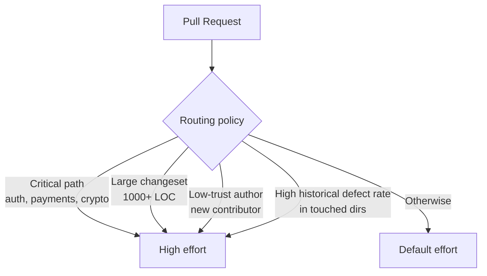

# Tunable Effort Levels for Code Review Agents

> Expose review depth as a per-PR dial backed by a published bug-discovery curve, so reviewers and routing policies trade thoroughness against cost where it matters.

## The Primitive

A tunable code-review agent ships with named effort levels — each pinning a point on a published bug-discovery curve. A reviewer or routing policy picks one per PR.

Cursor's Bugbot externalised this dial on [2026-05-11](https://cursor.com/changelog/05-11-26):

| Level | Bug-discovery rate | Reviewer-stated trade-off |
|-------|-------------------|-------------------------|
| Default | 0.7 bugs/run | Optimised for efficiency and speed |
| High | 0.95 bugs/run | "More reasoning time; more expensive and slower, but finds more bugs" |
| Custom | Operator-defined | Natural-language policy: "Describe when Bugbot should use default or high effort" |

High finds [35% more bugs at constant 80% resolution rate](https://cursor.com/blog/may-2026-bugbot-changes) — additional flags are addressed at merge time, not silently dismissed.

The per-PR analogue of [heuristic effort scaling](../agent-design/heuristic-effort-scaling.md) (agent-tiered per query) and [interactive effort sliders](../agent-design/interactive-effort-sliders.md) (operator-tiered per turn) — here the unit is one PR and the decision sits with a reviewer or routing policy.

## Why a Dial, Not a Constant

Single-calibration agents force a compromise. Calibrate for thoroughness and routine PRs drown in commentary — developers [override more than 30% of flags](https://www.codeant.ai/blogs/ai-code-review-false-positives) until the tool is functionally disabled. Calibrate for signal and the agent misses real regressions in high-stakes code.

GitHub Copilot's review began as the implicit binary form: in [29% of reviews the agent stays silent and in 71% it surfaces actionable feedback](https://github.blog/ai-and-ml/github-copilot/60-million-copilot-code-reviews-and-counting/). A multi-level dial generalises it — silence is the lowest rung, deep agentic exploration the highest. By mid-2026 Copilot had externalised the dial too: admins set a per-repository analysis tier of `low` — the fast, cost-efficient default — or a new `medium` tier that routes complex logic, security-sensitive code, and cross-service changes to a higher-reasoning model ([GitHub, 2026-06-02](https://github.blog/changelog/2026-06-02-shape-copilot-code-review-around-your-team/)). Cursor binds the choice to one PR, Copilot to one repository — coarser-grained, but the same effort-routing primitive.

## Calibration is the Pattern

Effort labels are hedge words without a published curve.

Cursor publishes two metrics:

- **Bug-discovery rate** — bugs found per run, measured on `BugBench`, a curated benchmark of real diffs with human-annotated bugs ([Building Bugbot](https://cursor.com/blog/building-bugbot))
- **Resolution rate** — share of flagged bugs authors address at merge, classified by an LLM-as-judge validated against humans

Holding resolution rate constant across levels is the calibration commitment: High costs more but does not flood with low-quality flags. Resolution rate gates whether the higher-effort flags are useful.

## Routing Axes

The dial composes with structured routing across four axes:



- **File-path criticality** — auth, payment, or crypto paths route to High. Same axis [tiered code review](tiered-code-review.md) uses for human escalation.
- **Change size** — diffs above an LOC threshold route to High.
- **Author trust** — first-time contributors or external forks route to High. Same signal CODEOWNERS already encodes.
- **Historical defect rate** — directories with elevated post-merge bug rates route to High. Vendor exposes no signal; encode in Custom.

Cursor's Custom level encodes this as a natural-language policy evaluated [per PR](https://cursor.com/changelog/05-11-26).

## Cost-Performance Tie

High-effort review on critical paths is cheaper than post-merge remediation. Cursor's [per-run pricing is $1.00-$1.50 by PR size](https://cursor.com/blog/may-2026-bugbot-changes), and effort levels require usage-based billing.

The arithmetic only holds when routing concentrates High on high-stakes runs. A reviewer toggling High on every PR pays the premium and accumulates the alert fatigue the dial existed to avoid.

## When This Backfires

- **Resolution rate is not precision.** It counts both "developer fixed it" and "developer made it go away." The 35%-more-bugs claim at High does not rule out more false positives that authors muted. Teams needing a precision floor ([security under 3% FPR, style under 2%](https://www.codeant.ai/blogs/ai-code-review-false-positives)) measure noise themselves.
- **Routing policy drift in Custom.** Natural-language Custom is an instruction file with the same [primacy and drift issues](../instructions/system-prompt-altitude.md). A correct policy in May 2026 may misroute six months later, and no eval is exposed by default.
- **High-effort default creates alert fatigue.** [Signal over volume](signal-over-volume-in-ai-review.md) is the dominant trust factor. Pinning High at the policy level burns attention on routine PRs and un-funds the high-stakes runs the dial protects.
- **Cost-blind defaults.** Without per-PR cost ranges, reviewers toggle High on everything, collapsing the dial back to a fixed-pipeline calibration.
- **No vendor-provided author or defect-rate signal.** Cursor exposes path-based routing but not author-trust or directory-defect-rate routing. Teams encode those manually in Custom, with no audit trail.

Tunable effort assumes a published curve and a routing policy that concentrates the higher tier on the runs that pay for it. Without both, the dial reduces to per-PR cost optionality with no signal benefit.

## Example

A monorepo with mixed-risk paths uses a Custom policy to concentrate High effort:

```
Use High effort when:
- The PR touches src/auth/, src/payments/, or src/crypto/
- The diff exceeds 500 lines
- The author has fewer than 10 merged PRs in this repo
- More than half the changed files have had a post-incident commit in the last 90 days

Use Default effort otherwise.
```

A 30-line fix in `tests/integration/` from a long-tenured engineer runs at Default — 0.7 bugs/run, fast, and silence on style reads as real silence. A 1,200-line refactor touching `src/auth/session.ts` from a first-time contributor runs at High — 0.95 bugs/run, and the reviewer reads each flag knowing the routing concentrated effort here on purpose.

Pinning Default at the team level and letting Custom escalate inverts biasing-up: it preserves the silence-as-output contract for routine work while making the higher tier opt-in by policy, not per-PR clicking.

## Key Takeaways

- Effort levels in code review agents are the per-PR analogue of [heuristic effort scaling](../agent-design/heuristic-effort-scaling.md) and [interactive effort sliders](../agent-design/interactive-effort-sliders.md), but with the unit of work bound to one PR and the decision delegated to a reviewer or routing policy.
- The dial is meaningful only with a published bug-discovery curve. Effort labels without numbers are hedge words.
- Resolution rate gates whether the higher-effort flags are useful; published rates are not the same as precision, and teams that need a precision floor measure it themselves.
- Routing policies concentrate High on the axes that pay for it — file-path criticality, change size, author trust, historical defect rate. Pinning High globally collapses the pattern back to a fixed-pipeline calibration.
- Custom natural-language policies are themselves drift-prone instruction surfaces. Treat them like CLAUDE.md: review periodically, gate changes through eval.

## Related

- [Tiered Code Review](tiered-code-review.md) — path-based effort routing as the human-review counterpart
- [Signal Over Volume in AI Review](signal-over-volume-in-ai-review.md) — why silence is a valid output and why High-by-default backfires
- [Self-Improving Code Review Agents — Learned Rules](learned-review-rules.md) — Bugbot's other published lever, complementary to per-PR effort
- [Heuristic Effort Scaling](../agent-design/heuristic-effort-scaling.md) — agent-decided effort tiers, the alternative to operator-set per-PR levels
- [Interactive Effort Sliders](../agent-design/interactive-effort-sliders.md) — per-turn reasoning budget control in Claude Code `/effort`
- [Cost-Aware Agent Design](../agent-design/cost-aware-agent-design.md) — broader cost-routing context
