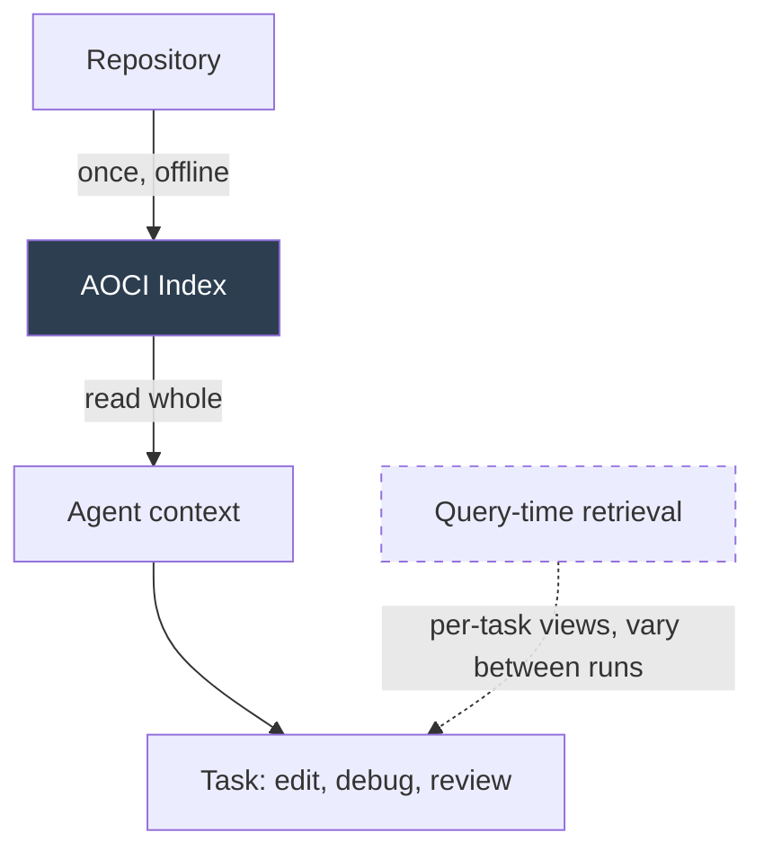

# AOCI: Symbolic-Semantic Repository Indexing

> A persistent repository blueprint where each entry pairs symbolic architectural coordinates with semantic content describing function, dependencies, and constraints — read in a single pass before any task to give the agent global structure before it makes local decisions.

## The Orientation Problem AOCI Targets

Retrieval, summarization, and agent exploration each construct a *different view at query time*. The view varies between runs, and what persists is typically ad-hoc. Without global repository structure, agents tend to focus narrowly on specific files and settle into local optimums. ([Liu et al., 2026](https://arxiv.org/abs/2605.02421); [Preprints 202510.0924](https://www.preprints.org/manuscript/202510.0924))

AOCI (AI-Oriented Code Indexing) inverts this. The index is built once, persists across runs, is independent of any particular query, and is read whole before the task begins. ([Liu et al., 2026](https://arxiv.org/abs/2605.02421))

## The Symbolic-Semantic Split

Each AOCI entry has two components:

| Component | Purpose | Example content |
|-----------|---------|-----------------|
| **Symbolic** | Architectural coordinates — where this thing sits in the system | Module path, layer, dependencies, public surface |
| **Semantic** | What it does and why — function, constraints, key design decisions | Role, invariants, error model, intended consumers |

The symbolic component is what an AST or call-graph extractor would produce. The semantic component is what an architect would write in an ADR. AOCI's contribution is treating them as a single artifact the LLM consumes together. ([Liu et al., 2026](https://arxiv.org/abs/2605.02421))



## How It Differs From Adjacent Approaches

AOCI sits alongside two patterns already on this site:

| Approach | When the index is built | What enters context | Best when |
|----------|------------------------|---------------------|-----------|
| **AOCI blueprint** | Once, offline; persistent | The whole index, read in a single pass before any task | Stable architecture; agent needs global frame before local edits |
| **[Repository Map](repository-map-pattern.md)** (tree-sitter + PageRank) | Per session, token-fitted | Top-ranked symbols sized to a budget; ranking is task-personalised | Large stable codebases; need cross-file orientation under tight token budgets |
| **[Repository-Level Retrieval](repository-level-retrieval-code-generation.md)** | Per query | Top-k chunks scored against the current task | The relevant slice is small and the task is well-specified |
| **Agentic search** (Claude Code's choice) | Never — no index | Whatever the agent fetches via Glob, Grep, Read | Living repos where freshness matters more than structure ([Vadim, 2025](https://vadim.blog/claude-code-no-indexing)) |

The repo map is still query-shaped (PageRank personalization weights files being edited). RAG is fully query-shaped. AOCI is *query-independent* — the same index serves every task, which is the point.

## Reported Results

In the AOCI paper's evaluation across 4 projects, 3 LLMs, and 6 context conditions (2,160 evaluations), AOCI ranked second only to a theoretical upper-bound oracle. On 19 industrial tasks across 5 systems, AOCI produced zero final-state defects, while mainstream agent-based tools introduced defects in 12 tasks and consumed 4–130x more tokens (p < 0.001). The performance gap widens with task complexity. ([Liu et al., 2026](https://arxiv.org/abs/2605.02421))

These figures come from one team's evaluation and are not yet independently replicated. Treat them as a directional signal, not a settled benchmark.

## When This Backfires

- **Rapidly-changing monorepos** — index decay outpaces rebuild cadence; the blueprint misleads more than it orients. The same failure mode flagged for [tree-sitter repo maps](repository-map-pattern.md#when-this-backfires) applies and is worse here because the AOCI artifact is heavier to rebuild.
- **Heavy metaprogramming or runtime code generation** — symbolic extraction misses methods generated by Rails `method_missing`, Python metaclasses, or macro-heavy Rust; the symbolic half of every entry lies.
- **Small or flat codebases** — under ~20 files the agent can read the whole repo directly; building a separate blueprint adds cost without orientation gain.
- **Large-context models on medium repos** — when the model can hold the codebase plus task in context, AOCI's compression introduces truncation risk for no benefit.
- **Single-source evidence** — the strong reported numbers come from one paper; teams adopting on those numbers alone are extrapolating from one team's setup.

## Example

A representative AOCI entry for an authentication service in a Python monorepo might look like:

```yaml
# Symbolic component — architectural coordinates
path: src/auth/auth_service.py
layer: domain-service
imports: [src/models/user, src/crypto/jwt, src/config]
public_surface:
  - AuthService.authenticate(user_id, token) -> AuthResult
  - AuthService.refresh_token(token) -> TokenPair
  - AuthService.revoke_session(session_id) -> None

# Semantic component — function and constraints
role: "Sole entry point for credential verification and session lifecycle"
invariants:
  - "All authenticate() calls must go through rate-limit middleware"
  - "Tokens are signed with the active key only; previous keys verify but never sign"
error_model: "Returns AuthResult with explicit failure reason; never raises on bad credentials"
intended_consumers: [AuthMiddleware, AdminPanel.session_admin]
design_decisions:
  - "Sessions are server-side; tokens are opaque references, not JWT claims"
```

An agent reading this before any task knows the architectural role, the invariants it must preserve, and the consumers whose contract it must not break — without having retrieved a single line of implementation. The implementation itself is fetched on demand once the agent decides which file to edit.

## Key Takeaways

- AOCI is a query-independent blueprint built once and read whole — not a retrieval method and not a token-fitted token map.
- Each entry pairs symbolic architectural coordinates with semantic content describing function and constraints — both halves are required.
- Position AOCI as a third option alongside agentic search and per-query retrieval; choose by codebase stability, repo size, and model context window.
- Reported results are strong but single-source — adopt with verification, not as a settled benchmark.

## Related

- [Repository Map Pattern](repository-map-pattern.md) — token-fitted symbol map; same orientation goal, different artifact and lifecycle
- [Repository-Level Retrieval for Code Generation](repository-level-retrieval-code-generation.md) — per-query retrieval strategies AOCI sits beside
- [Semantic Context Loading](semantic-context-loading.md) — LSP-driven symbol navigation as a complement once the agent locates a target
- [Seeding Agent Context](seeding-agent-context.md) — codebase-side breadcrumbs that play the same orientation role for agentic-search agents
- [Layered Context Architecture](layered-context-architecture.md) — where a persistent blueprint fits among other context sources
- [Discoverable vs Non-Discoverable Context](discoverable-vs-nondiscoverable-context.md) — what belongs in a persistent artifact vs. left for the agent to find
