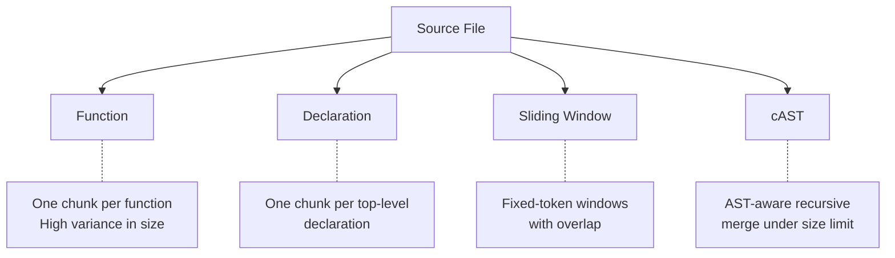

# Chunking Strategy for RAG-Based Code Completion

> Function-based chunking is the wrong default for line-level retrieval-augmented code completion; Sliding Window and cAST sit on the cost-quality Pareto frontier, and doubling cross-file context length matters more than any choice between them.

## The Counter-Intuitive Result

Practitioner guides recommend chunking code along function or class boundaries to preserve semantic units, citing the failure mode where a sliding window cuts a function mid-body and severs its return type from the call site ([Stack Overflow, 2024](https://stackoverflow.blog/2024/12/27/breaking-up-is-hard-to-do-chunking-in-rag-applications/)). A controlled empirical study running 864 settings across four chunking strategies, four retrievers, five generators, and nine parameter configurations on RepoEval and CrossCodeEval reports the opposite: function chunking underperforms every other strategy by 3.57-5.64 percentage points on RepoEval, with Cliff's delta of -1.0, and never lands on the cost-quality Pareto frontier ([Wu et al., 2026](https://arxiv.org/abs/2605.04763)).

The other three strategies — Declaration, Sliding Window, and cAST — produce statistically indistinguishable results across retriever-generator pairs. Sliding Window and cAST dominate the Pareto frontier on both benchmarks; Declaration sits just behind on cost-quality.

## The Four Strategies Compared



| Strategy | What it produces | Pareto position | Failure mode |
|----------|-----------------|----------------|--------------|
| **Function** | One chunk per function body | Dominated on every retriever-generator pair | High chunk-size variance distorts embedding similarity scores |
| **Declaration** | One chunk per top-level declaration (function, class, import block) | Near-Pareto, statistically tied with the next two | Polyglot repos where declarations vary wildly across languages |
| **Sliding Window** | Fixed-token windows with overlap | Pareto-optimal on both benchmarks | Splits semantic units; surfaces overlapping near-duplicates |
| **cAST** | Recursively merged AST nodes capped by chunk size ([Zhang et al., 2025](https://arxiv.org/abs/2506.15655)) | Pareto-optimal on both benchmarks | Silent failure on languages without an AST parser |

## Why Function Chunking Loses

Two effects compound. First, function chunks have high size variance — a 5-line getter and a 500-line handler embed into the same vector space, distorting cosine-similarity scores during retrieval ([Wu et al., 2026](https://arxiv.org/abs/2605.04763)). Second, line-level completion benchmarks reward retrieving short fragments similar to the cursor's surrounding lines, not whole functions. Sliding windows produce many overlapping candidates at the right granularity; function chunks force one coarse retrieval unit per function.

The mechanism generalises: retrieval works best when chunk size matches the granularity of the task's relevance signal. Whole-function generation tasks (SWE-bench style) likely flip this conclusion, because the generation unit is the function — but the controlled study tested line-level completion on RepoEval and CrossCodeEval, which is the task shape that drives inline completion suggestions in IDE-integrated assistants.

## The Larger Lever: Context Length

Strategy choice among the non-function options changes outcomes by a few percentage points. Doubling cross-file context length from 2,048 to 8,192 tokens delivers up to 4.2 percentage points of improvement on the same benchmarks ([Wu et al., 2026](https://arxiv.org/abs/2605.04763)) — larger than the gap between Sliding Window/cAST and Declaration. Chunk size itself has a weaker, non-monotonic effect: bigger is not consistently better, and the optimum varies by retriever.

Allocate optimisation effort accordingly: pick any non-function strategy, then spend the remaining budget extending cross-file context length within the model's effective range (see [Context Window Dumb Zone](context-window-dumb-zone.md) for the upper bound).

## When the Default Inverts

The controlled study's finding is qualified by task shape and repository structure. The opposite recommendation — prefer function-respecting chunks — holds in these conditions:

- **Whole-function generation tasks**: SWE-bench-style benchmarks where the output is an entire function body align retrieval and generation units; cAST's reported +4.3 pp Recall@5 and +2.67 pp Pass@1 on those tasks ([Zhang et al., 2025](https://arxiv.org/abs/2506.15655)) reflect this alignment.
- **Polyglot repositories with patchy parser coverage**: AST-based chunking needs a language-specific parser. The cAST paper demonstrates the method on Python, Java, JavaScript, TypeScript, Go, C++, and Rust ([Zhang et al., 2025](https://arxiv.org/abs/2506.15655)); files outside that set fall back to non-structural splitting, so Sliding Window is safer when the repo mixes supported languages with Bicep, HCL, or proprietary DSLs.
- **Very long functions**: function chunking's variance problem amplifies as individual functions grow ([Wu et al., 2026](https://arxiv.org/abs/2605.04763)).

## What to Configure

- **Default**: Sliding Window with overlap, sized to a fraction of the retriever's effective context.
- **Mature-parser languages**: cAST for Python, Java, TypeScript, Go.
- **Avoid as a default**: Function chunking for line-level completion; reserve it for whole-function generation pipelines.
- **First**: extend cross-file context from 2k to 4k to 8k before re-tuning chunking strategy or chunk size.

## Key Takeaways

- Function-based chunking is dominated by every other strategy on line-level code completion benchmarks (3.57-5.64 pp gap on RepoEval) — the most "natural" code unit is the worst chunking choice for this task ([Wu et al., 2026](https://arxiv.org/abs/2605.04763)).
- Sliding Window and cAST sit on the cost-quality Pareto frontier; Declaration is statistically tied with both.
- Cross-file context length doubling delivers up to 4.2 pp — a larger gain than choosing among the non-function strategies. Optimise context length before chunking strategy.
- Chunk size has a non-monotonic effect; tune by retriever, not by intuition.
- The default inverts for whole-function generation tasks and parser-incomplete polyglot repos.

## Example

The controlled study reports that on RepoEval, switching from function chunking to any of Declaration, Sliding Window, or cAST gives a 3.57–5.64 pp lift in completion quality, while doubling cross-file context from 2,048 to 8,192 tokens gives up to 4.2 pp on top of that ([Wu et al., 2026](https://arxiv.org/abs/2605.04763)). A retrieval pipeline that ships function chunking with 2k context is leaving roughly two independent levers on the table.

**Before** — function chunking, 2k context (the dominated configuration):

```yaml
chunker:
  strategy: function
  language: python
retriever:
  top_k: 5
  context_tokens: 2048
```

**After** — sliding-window chunking, 8k context (the Pareto-optimal configuration on the controlled study's frontier):

```yaml
chunker:
  strategy: sliding_window
  window_tokens: 256
  overlap_tokens: 64
retriever:
  top_k: 5
  context_tokens: 8192
```

The chunking change moves the configuration onto the Pareto frontier; the context-length change moves along it. Re-evaluate on a held-out task slice before committing — the controlled study's directionality is robust on RepoEval and CrossCodeEval, but task shape matters (see "When the Default Inverts").

## Related

- [Repository-Level Retrieval for Code Generation](repository-level-retrieval-code-generation.md) — covers the retrieval-strategy hierarchy (lexical, semantic, graph, hybrid); chunking is orthogonal to that choice
- [Repository Map Pattern](repository-map-pattern.md) — AST + PageRank symbol selection; complementary structural-retrieval technique that operates on symbols, not chunks
- [AOCI: Symbolic-Semantic Repository Indexing](aoci-symbolic-semantic-indexing.md) — query-independent blueprint approach; alternative to chunk-based retrieval
- [Semantic Context Loading](semantic-context-loading.md) — LSP-based retrieval that bypasses chunking entirely for symbol-level navigation
- [Context Budget Allocation](context-budget-allocation.md) — framework for deciding how much budget to spend on retrieved chunks versus other context
- [Context Window Dumb Zone](context-window-dumb-zone.md) — upper bound on the context-length lever; doubling helps until quality degrades
- [Token-Efficient Code Generation](token-efficient-code-generation.md) — reduces token cost of generated code, complementary to retrieval-side chunking choices
