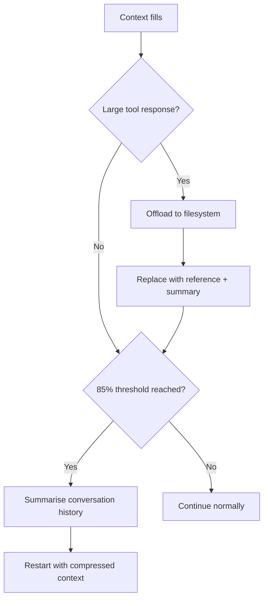

# Context Compression Strategies: Offloading and Summarisation

> Long-running agents accumulate context that eventually fills the window. Tiered compression — offloading large payloads and summarising history — lets agents continue working without losing task continuity.

## The Problem

Long-horizon tasks generate context from conversation turns, tool inputs, and tool outputs. Without compression, the agent truncates arbitrarily or the session fails. The goal is to preserve task intent and critical state while discarding low-value content.

## Tiered Compression

LangChain's Deep Agents framework implements three compression tiers, applied in order as context pressure increases:



### Tier 1: Offload Large Tool Responses

Replace large tool payloads (full files, API responses, search results) with a filesystem reference and brief summary. The full content goes to disk; the agent re-reads it when needed.

This preserves recoverability without keeping content in active context. The threshold for offloading is configurable; frameworks typically set it in the range of tens of thousands of tokens, above which keeping content in active context yields diminishing attention returns.

### Tier 2: Summarise Conversation History

When context fills further, summarise prior conversation turns. The summary should preserve:

- The agent's current task and objective
- Key artifacts created or modified
- Decisions made and their rationale
- Next steps

Discard: exploratory turns, superseded instructions, resolved errors, intermediate reasoning that did not affect outcomes.

The agent restarts with the summary as its prior context. [Anthropic's context engineering guide](https://www.anthropic.com/engineering/effective-context-engineering-for-ai-agents) identifies this as "compaction" — a core strategy for long-horizon tasks.

### Image Preservation During Compaction

Claude Code's compaction preserves images in the summariser request, so visual context survives compression cycles. Image tokens also become eligible for prompt cache hits after compaction — making subsequent turns cheaper for image-heavy workflows.

## Progressive Five-Stage Compaction

OPENDEV extends the two-tier approach with Adaptive Context Compaction (ACC), a five-stage pipeline of progressively aggressive reduction strategies triggered at specific context budget thresholds ([Bui, 2026 §2.3.6](https://arxiv.org/abs/2603.05344)):

| Stage | Trigger | Action |
|-------|---------|--------|
| 1 — Warning | 70% budget | Log context pressure for monitoring; no data reduction |
| 2 — [Observation Masking](observation-masking.md) | 80% budget | Replace older tool results with compact reference pointers |
| 2.5 — Fast Pruning | 85% budget | Prune older tool outputs beyond recency window |
| 3 — Aggressive Masking | 90% budget | Shrink preservation window to only most recent outputs |
| 4 — Full Compaction | 99% budget | Serialize history to scratch file; LLM-summarize middle portion |

Recent tool outputs are preserved at full fidelity. An Artifact Index tracks all files touched during the session and is serialized into compaction summaries, so the agent remembers what it worked with after compression. The history archive path is injected into the summary so the agent can recover details on demand, making compaction effectively non-lossy ([Bui, 2026 §2.3.6](https://arxiv.org/abs/2603.05344)).

The key difference from a single-threshold approach: graduated stages let the agent degrade gracefully rather than hitting a single compression cliff where the full history is suddenly summarised in one pass.

## What to Preserve in Summaries

Summaries that only capture "what happened" without "what matters next" cause [objective drift](../anti-patterns/objective-drift.md). An effective summary structure:

| Section | Content |
|---------|---------|
| Objective | The original task and any scope changes |
| State | What has been built, changed, or decided |
| Constraints | Any constraints surfaced during the session |
| Next steps | The immediate next action |

## Why It Works

Transformer attention is computed over all tokens in the active window. As context grows, relevant signal competes with accumulated noise — redundant tool outputs, superseded reasoning, resolved errors — and retrieval precision degrades. Compression works by reducing this noise floor: offloading removes content that is addressable on demand but rarely needed, while summarisation distils decision rationale and state into a compact form the model can condition on reliably. The mechanism is selective discarding, not lossy encoding — the underlying artifacts remain on disk, so compaction is non-destructive for recoverable content.

## When This Backfires

Compression degrades task continuity when applied incorrectly:

- **Silent context loss**: Overly aggressive summarisation can drop subtle constraints whose importance only becomes apparent later in the task — the [Anthropic context engineering guide](https://www.anthropic.com/engineering/effective-context-engineering-for-ai-agents) recommends starting with maximum recall and iterating toward precision, not the reverse.
- **Premature compaction**: Triggering compaction too early (low threshold) forces unnecessary lossy summarisation when the context is still navigable; this can cause [objective drift](../anti-patterns/objective-drift.md) if the summary omits scope constraints.
- **Broken recoverability**: Offloaded payloads that are deleted or moved after compaction cannot be re-read on demand, making the approach worse than in-context storage. Ensure the observation store persists for the full session lifetime.
- **Compounding errors across cycles**: Each compaction cycle introduces summarisation error; long sessions with many cycles accumulate drift that a single summary cannot.

## Testing Compression

- **Threshold stress-testing**: lower the threshold artificially; verify task continuity through multiple cycles
- **Recoverability**: after offloading, verify the agent retrieves content when needed
- **Objective drift check**: after summarisation, verify the next action matches the original task

## Key Takeaways

- Tiered compression applies in sequence: offload large tool responses first, then summarise history.
- Five-stage compaction provides graduated degradation instead of a single compression cliff.
- Summaries must preserve task objective, current state, and next steps — not just action history.
- Offloading preserves recoverability; summarisation is lossy — retain decision rationale, not just outcomes.
- Claude Code's compaction preserves images, enabling cache reuse and visual context retention across cycles.

## Example

Pseudocode showing how tiered compression maps to agent configuration:

```python
# Pseudocode — illustrates the tiered compression pattern,
# not a specific framework's API.

agent = Agent(
    tools=[...],
    # Tier 1: offload tool responses above 20k tokens to disk
    max_observation_length=20_000,
    observation_store="./agent_observations/",
    # Tier 2: summarise at 85% context budget
    compaction_threshold=0.85,
    compaction_summary_prompt=(
        "Summarise: (1) current objective, (2) key artifacts created, "
        "(3) decisions made and rationale, (4) immediate next step."
    ),
)
```

The summariser prompt structure maps to the preservation table above: objective, state, constraints, next steps.

## Related

- [Context Engineering: The Discipline of Designing Agent Context](context-engineering.md)
- [Manual Compaction as Dumb Zone Mitigation](manual-compaction-dumb-zone-mitigation.md)
- [Context Window Dumb Zone](context-window-dumb-zone.md)
- [Error Preservation in Context](error-preservation-in-context.md)
- [Prompt Compression: Maximizing Signal Per Token](prompt-compression.md)
- [The Infinite Context](../anti-patterns/infinite-context.md)
- [Retrieval-Augmented Agent Workflows](retrieval-augmented-agent-workflows.md)
- [Context Budget Allocation: Every Token Has a Cost](context-budget-allocation.md)
- [Lost in the Middle: The U-Shaped Attention Curve](lost-in-the-middle.md)
- [Goal Recitation: Countering Drift in Long Sessions](goal-recitation.md)
- [Layered Context Architecture](layered-context-architecture.md)
- [Prompt Caching as Architectural Discipline](prompt-caching-architectural-discipline.md)
- [Phase-Specific Context Assembly](phase-specific-context-assembly.md)
- [Prompt Cache Economics Across Providers](prompt-cache-economics.md)
- [Structure Prompts with Static Content First to Maximize Cache Hits](static-content-first-caching.md)
- [Context Priming](context-priming.md)
- [Attention Sinks](attention-sinks.md)
- [Discoverable vs Non-Discoverable Context](discoverable-vs-nondiscoverable-context.md)
