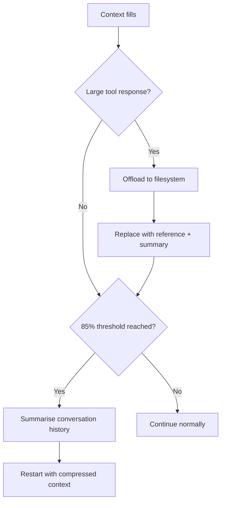

# Context Compression Strategies: Offloading and Summarisation

> Long-running agents accumulate context that eventually fills the window. Tiered compression — offloading large payloads and summarising history — lets agents continue working without losing task continuity.

## The Problem

Long-horizon tasks accumulate context from conversation turns, tool inputs, and tool outputs. Without compression, the agent truncates arbitrarily or the session fails. Compression preserves task intent and critical state while discarding low-value content.

## Tiered Compression

LangChain's Deep Agents framework implements three compression tiers, applied in order as context pressure increases ([Context Management for Deep Agents](https://blog.langchain.com/context-management-for-deepagents/)):



### Tier 1: Offload Large Tool Responses

Replace large tool payloads (full files, API responses, search results) with a filesystem reference and brief summary. Full content goes to disk; the agent re-reads it when needed. This preserves recoverability without holding payloads in active context. Thresholds are configurable — frameworks typically set them in the tens of thousands of tokens.

### Tier 2: Summarise Conversation History

When context fills further, summarise prior turns. Preserve current objective, key artifacts, decisions and rationale, and next steps. Discard exploratory turns, superseded instructions, resolved errors, and intermediate reasoning that did not affect outcomes. The agent restarts with the summary as prior context — [Anthropic's context engineering guide](https://www.anthropic.com/engineering/effective-context-engineering-for-ai-agents) calls this "compaction" and identifies it as a core strategy for long-horizon tasks.

### Image Preservation During Compaction

Claude Code's compaction preserves images in the summariser request, so visual context survives compression cycles. Image tokens also become eligible for prompt cache hits after compaction — making subsequent turns cheaper for image-heavy workflows.

## Progressive Five-Stage Compaction

OPENDEV extends the two-tier approach with Adaptive Context Compaction (ACC), a five-stage pipeline triggered at specific context budget thresholds ([Bui, 2026 §2.3.6](https://arxiv.org/abs/2603.05344)):

| Stage | Trigger | Action |
|-------|---------|--------|
| 1 — Warning | 70% budget | Log context pressure for monitoring; no data reduction |
| 2 — [Observation Masking](observation-masking.md) | 80% budget | Replace older tool results with compact reference pointers |
| 2.5 — Fast Pruning | 85% budget | Prune older tool outputs beyond recency window |
| 3 — Aggressive Masking | 90% budget | Shrink preservation window to only most recent outputs |
| 4 — Full Compaction | 99% budget | Serialize history to scratch file; LLM-summarize middle portion |

Recent tool outputs stay at full fidelity. An Artifact Index serialized into compaction summaries tracks every file touched, and the history archive path is injected into the summary — making compaction effectively non-lossy ([Bui, 2026 §2.3.6](https://arxiv.org/abs/2603.05344)).

Graduated stages let the agent degrade incrementally rather than hitting a single compression cliff where the full history collapses at once.

## What to Preserve in Summaries

Summaries that only capture "what happened" without "what matters next" cause [objective drift](../anti-patterns/objective-drift.md). An effective summary structure:

| Section | Content |
|---------|---------|
| Objective | The original task and any scope changes |
| State | What has been built, changed, or decided |
| Constraints | Any constraints surfaced during the session |
| Next steps | The immediate next action |

## Why It Works

Transformer attention is computed over all tokens in the window. As context grows, relevant signal competes with accumulated noise — redundant tool outputs, superseded reasoning, resolved errors — and retrieval precision degrades. Compression reduces this noise floor: offloading removes content that is addressable on demand but rarely needed; summarisation distils decision rationale and state into a compact form the model can condition on. The mechanism is selective discarding, not lossy encoding — artifacts remain on disk, so compaction is non-destructive for recoverable content.

## When This Backfires

Compression degrades task continuity when applied incorrectly:

- **Silent context loss**: Aggressive summarisation drops subtle constraints whose importance only emerges later — [Anthropic's context engineering guide](https://www.anthropic.com/engineering/effective-context-engineering-for-ai-agents) recommends starting with maximum recall and iterating toward precision, not the reverse.
- **Premature compaction**: A too-low threshold forces lossy summarisation when context is still navigable, causing [objective drift](../anti-patterns/objective-drift.md) if scope constraints are omitted.
- **Broken recoverability**: Offloaded payloads deleted or moved after compaction cannot be re-read, making the approach worse than in-context storage. The observation store must persist for the full session lifetime.
- **Compounding errors across cycles**: Each cycle introduces summarisation error; long sessions accumulate drift a single summary cannot undo.

## Testing Compression

- **Threshold stress-testing**: lower the threshold; verify task continuity across cycles
- **Recoverability**: after offloading, verify the agent retrieves content on demand
- **Objective drift check**: after summarisation, verify the next action matches the original task

## Key Takeaways

- Tiered compression applies in sequence: offload large tool responses first, then summarise history.
- Five-stage compaction provides graduated degradation instead of a single compression cliff.
- Summaries must preserve task objective, current state, and next steps — not just action history.
- Offloading preserves recoverability; summarisation is lossy — retain decision rationale, not just outcomes.
- Claude Code's compaction preserves images, enabling cache reuse and visual context retention across cycles.

## Example

Pseudocode showing how tiered compression maps to agent configuration:

```python
# Pseudocode — illustrates the tiered compression pattern,
# not a specific framework's API.

agent = Agent(
    tools=[...],
    # Tier 1: offload tool responses above 20k tokens to disk
    max_observation_length=20_000,
    observation_store="./agent_observations/",
    # Tier 2: summarise at 85% context budget
    compaction_threshold=0.85,
    compaction_summary_prompt=(
        "Summarise: (1) current objective, (2) key artifacts created, "
        "(3) decisions made and rationale, (4) immediate next step."
    ),
)
```

The summariser prompt structure maps to the preservation table above: objective, state, constraints, next steps.

## Related

- [Manual Compaction as Dumb Zone Mitigation](manual-compaction-dumb-zone-mitigation.md)
- [Post-Compaction Re-read Protocol](../instructions/post-compaction-reread-protocol.md) — restoring instruction-file fidelity after compaction summaries paraphrase rules
- [Context Window Dumb Zone](context-window-dumb-zone.md)
- [Prompt Compression: Maximizing Signal Per Token](prompt-compression.md)
- [Context Budget Allocation: Every Token Has a Cost](context-budget-allocation.md)
- [Lost in the Middle: The U-Shaped Attention Curve](lost-in-the-middle.md)
- [Goal Recitation: Countering Drift in Long Sessions](goal-recitation.md)
- [The Infinite Context](../anti-patterns/infinite-context.md)
- [Context Window Diagnostic Tooling](context-window-diagnostic-tooling.md)
