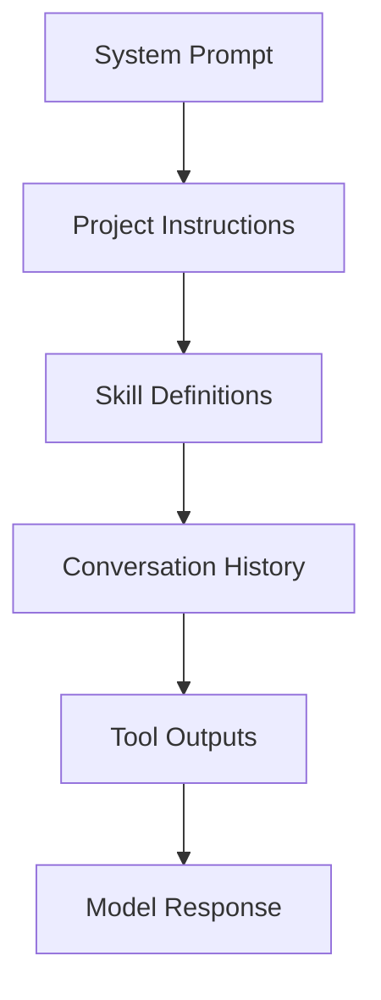

# Context Engineering: The Discipline of Designing Agent Context

> Context engineering is the practice of designing what information enters a model's context window, how it is structured, and what is excluded — to maximise the quality and reliability of agent output.

## What Context Engineering Is

[Latent Patterns](https://latentpatterns.com/glossary) defines context engineering as "the discipline of designing, managing, and optimizing the information placed into a language model's context window to maximize the quality and reliability of its output."

The context window is the agent's entire world. Every output it produces is a function of what is in that window — not what exists in the codebase or the developer's intent, but what was explicitly placed in context.

[Anthropic frames this](https://www.anthropic.com/engineering/effective-context-engineering-for-ai-agents) as finding "the smallest set of high-signal tokens that maximize the likelihood of your desired outcome." Signal density, not volume.

## The Layers of Agent Context

Agent context is a stack of layers, each with different persistence and purpose:

| Layer | Content | Loaded when |
|-------|---------|-------------|
| System prompt | Role, constraints, core behaviour | Always |
| Project instructions | Conventions, repo structure, standards | Session start |
| Skill definitions | Tool descriptions and invocation metadata | Session start |
| Skill content | Full skill instructions | On invocation |
| Conversation history | Prior turns, compressed as needed | Accumulated |
| Tool outputs | Results from tool calls | Per tool call |

Each layer has an opportunity cost: every token it occupies displaces reasoning, instructions, or task-relevant content.

## Token Economics

Context space is finite. Every inclusion is an exclusion. This reframes context management as resource allocation:

- **System prompt tokens** should carry high-leverage, durable instructions — not examples that could be on-demand
- **Skill content** loaded lazily avoids consuming budget until needed (see [Agent Skills Standard](../standards/agent-skills-standard.md))
- **Tool outputs** should return concise, structured results — verbose responses displace reasoning capacity
- **Conversation history** accumulates and degrades quality — [compaction](https://latentpatterns.com/glossary) (lossy summarisation of older turns) frees space but requires preserving task-critical information

## Context Pollution

[Context pollution](../anti-patterns/session-partitioning.md) — irrelevant context accumulated across unrelated tasks — competes with relevant content for attention. An agent loaded with 50 potentially-relevant files produces worse output on the 2 actually-relevant files than one loaded with only those 2. [unverified]

The diagnostic question: "Does this improve the agent's output on this specific task?" If no, it is pollution.

Common sources:

- Speculative preloading of reference material
- Tool responses returning full data structures when only a summary is needed
- Accumulated history with superseded instructions
- Project-level instructions that duplicate the system prompt

## The Scope of the Discipline

Context engineering subsumes several concerns often treated separately:

- **[Prompt engineering](../training/foundations/prompt-engineering.md)** — designing individual instructions within the context
- **Skill design** — what tool descriptions expose vs. load on-demand
- **Agent architecture** — whether sub-agents handle retrieval to isolate pollution from the coordinator
- **Memory management** — what is preserved across sessions, what is summarised, what is discarded

[Anthropic identifies](https://www.anthropic.com/engineering/effective-context-engineering-for-ai-agents) three complementary approaches: compaction (lossy summarisation), structured note-taking (persistent external memory), and sub-agent architectures (returning condensed summaries to a coordinator).

## Key Takeaways

- The context window is the agent's complete world — what is not in it does not exist for the agent.
- Optimise for signal density, not volume: "the smallest set of high-signal tokens that maximize the likelihood of your desired outcome."
- Every context layer has a cost — lazy loading, compaction, and sub-agent isolation manage that cost.
- Context engineering subsumes prompt engineering, skill design, agent architecture, and memory management.

## Example

A coding agent is tasked with refactoring a large repository. Naively, it loads the entire codebase into context — 200 files, 80,000 tokens — before writing a single line. The result: the model attends to irrelevant modules, misses the 3 files that actually need changing, and produces a diff that touches the wrong abstractions.

Applying context engineering:

1. **System prompt** carries only role and constraints (500 tokens). No examples, no reference docs.
2. **Skill content** for the refactor pattern loads on invocation — not at session start.
3. **Retrieval** fetches a repository map (file names + signatures, ~2,000 tokens) rather than file bodies.
4. **Tool calls** return only the 3 relevant files on demand (6,000 tokens total) — not the full repo.
5. **Conversation history** is compacted after each major step, preserving decisions and discarding superseded instructions.

Total context used at any point: ~9,000 tokens. The agent produces a correct, targeted diff on the first attempt.

The key decisions were about exclusion: what not to load, when not to load it, and what to summarise rather than retain verbatim.

## Related

- [Retrieval-Augmented Agent Workflows](retrieval-augmented-agent-workflows.md)
- [Context Compression Strategies: Offloading and Summarisation](context-compression-strategies.md)
- [Manual Compaction as Dumb Zone Mitigation](manual-compaction-dumb-zone-mitigation.md)
- [The Infinite Context](../anti-patterns/infinite-context.md)
- [Context Priming](context-priming.md)
- [Layered Context Architecture](layered-context-architecture.md)
- [Lost in the Middle](lost-in-the-middle.md)
- [Semantic Context Loading](semantic-context-loading.md)
- [Prompt Compression](prompt-compression.md)
- [Seeding Agent Context](seeding-agent-context.md)
- [Attention Sinks](attention-sinks.md)
- [Context Budget Allocation](context-budget-allocation.md)
- [Context Window Dumb Zone](context-window-dumb-zone.md)
- [Discoverable vs Non-Discoverable Context](discoverable-vs-nondiscoverable-context.md)
- [Dynamic System Prompt Composition](dynamic-system-prompt-composition.md)
- [Phase-Specific Context Assembly](phase-specific-context-assembly.md)
- [Prompt Layering: How Instructions Stack and Override](prompt-layering.md)
- [Filter and Aggregate in the Execution Environment](filter-aggregate-execution-env.md)
- [Repository Map Pattern](repository-map-pattern.md)
- [Prompt Chaining](prompt-chaining.md)
- [Observation Masking](observation-masking.md)
- [Goal Recitation](goal-recitation.md)
- [Prompt Cache Economics](prompt-cache-economics.md)
- [Context Hub: On-Demand Versioned API Docs for Coding Agents](context-hub.md)
- [Error Preservation in Context](error-preservation-in-context.md)
- [Context-Injected Error Recovery](context-injected-error-recovery.md)
- [Prompt Caching: Architectural Discipline for Agents](prompt-caching-architectural-discipline.md)
- [Static Content First: Maximizing Prompt Cache Hits](static-content-first-caching.md)
- [Disable Attribution Headers to Preserve KV Cache in Local Inference](kv-cache-invalidation-local-inference.md)
- [Environment Specification as Context](environment-specification-as-context.md)
- [Instruction-Guided Code Completion](instruction-guided-code-completion.md)
- [Repository-Level Retrieval for Code Generation](repository-level-retrieval-code-generation.md)
- [Structured Domain Retrieval: Knowledge Graphs and Case-Based Reasoning](structured-domain-retrieval.md)
- [Token-Efficient Code Generation: Structural Beats Prompting](token-efficient-code-generation.md)
