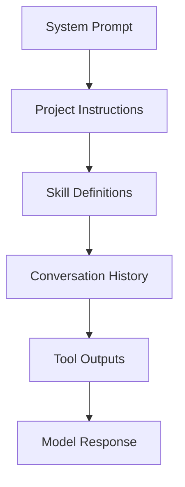

# Context Engineering: The Practice of Shaping Agent Context

> Context engineering designs what enters a model's context window, how it is structured, and what is excluded — to maximize output quality.

## What context engineering is

[Latent Patterns](https://latentpatterns.com/glossary) defines context engineering as "the discipline of designing, managing, and optimizing the information placed into a language model's context window to maximize the quality and reliability of its output."

The context window is the agent's entire world. Every output is a function of what sits in that window. It depends on what you place in context, not on what exists in the codebase or what you intended.

[Anthropic frames this](https://www.anthropic.com/engineering/effective-context-engineering-for-ai-agents) as finding "the smallest set of high-signal tokens that maximize the likelihood of your desired outcome." Signal density beats volume.

## The layers of agent context

Agent context is a stack of layers, each with different persistence:

```mermaid
graph TD
    A[System Prompt] --> B[Project Instructions]
    B --> C[Skill Definitions]
    C --> D[Conversation History]
    D --> E[Tool Outputs]
    E --> F[Model Response]
```

| Layer | Content | Loaded when |
|-------|---------|-------------|
| System prompt | Role, constraints, core behavior | Always |
| Project instructions | Conventions, repo structure, standards | Session start |
| Skill definitions | Tool descriptions and invocation metadata | Session start |
| Skill content | Full skill instructions | On invocation |
| Conversation history | Prior turns, compressed as needed | Accumulated |
| Tool outputs | Results from tool calls | Per tool call |

Each layer has an opportunity cost: every token displaces reasoning, instructions, or task-relevant content. This is not just a capacity constraint, because [attention is non-uniform](https://arxiv.org/abs/2307.03172). Models attend strongly to content near the start and end of the context window, and poorly to content in the middle. Irrelevant tokens do not produce neutral noise. They dilute attention on relevant tokens, which degrades the output measurably.

## Token economics

Context space is finite. Every inclusion is an exclusion:

- System prompt tokens carry durable, high-value instructions, not examples that could load on demand
- Skill content loaded lazily avoids spending budget until needed ([Agent Skills Standard](../standards/agent-skills-standard.md))
- Tool outputs return concise, structured results, because verbose responses displace reasoning capacity
- Conversation history accumulates and degrades quality, so [compaction](https://latentpatterns.com/glossary) (lossy summarization of older turns) frees space but has to preserve task-critical facts

## Context pollution

[Context pollution](../patterns/anti-patterns/session-partitioning.md) — irrelevant context accumulated across unrelated tasks — competes with relevant content for attention. An agent loaded with 50 potentially-relevant files produces worse output on the 2 actually-relevant files than one loaded with only those 2 — a pattern confirmed by [Liu et al. (2023)](https://arxiv.org/abs/2307.03172), who found multi-document QA accuracy drops 30%+ as distractors increase. Semantically related but inapplicable instructions are a specific form of this: see [Distractor Interference](../patterns/anti-patterns/distractor-interference.md).

The diagnostic question: "Does this improve output on this specific task?" If no, it is pollution.

Common sources:

- Speculative preloading of reference material
- Tool responses returning full data structures when a summary suffices
- Accumulated history with superseded instructions
- Project-level instructions duplicating the system prompt

## The scope of the discipline

Context engineering covers several concerns usually treated separately:

- [Prompt engineering](../training/foundations/prompt-engineering.md) designs individual instructions within the context
- Skill design decides what tool descriptions expose, versus what loads on demand
- Agent architecture uses sub-agents to handle retrieval and isolate pollution from the coordinator
- Memory management decides what persists across sessions, what is summarized, and what is discarded

[Anthropic identifies](https://www.anthropic.com/engineering/effective-context-engineering-for-ai-agents) three complementary approaches: compaction (lossy summarization), structured note-taking (persistent external memory), and sub-agent architectures (condensed summaries returned to a coordinator).

## When this backfires

Context engineering introduces its own failure modes:

- Retrieval errors propagate: if the retrieval layer selects the wrong files, the agent has no fallback. Selective loading without reliable retrieval produces worse results than loading everything.
- Compaction loses critical state: lossy summarization discards information that turns out to be needed later. Compaction requires knowing in advance what is task-critical, which you cannot always tell at summarization time.
- Coordination adds overhead: [sub-agent architectures](context-budget-allocation.md) need well-designed handoff contracts. A coordinator that receives a poor summary from a sub-agent cannot recover the missing context.

The pattern assumes retrieval quality and compaction fidelity. When those assumptions fail, an unfiltered context is more reliable than a poorly filtered one.

## Key Takeaways

- The context window is the agent's complete world — what is absent does not exist.
- Optimize for signal density, not volume: "the smallest set of high-signal tokens that maximize the likelihood of your desired outcome."
- Every context layer has a cost — lazy loading, compaction, and sub-agent isolation manage that cost.
- Context engineering subsumes prompt engineering, skill design, agent architecture, and memory management.

## Example

A coding agent is tasked with refactoring a large repository. Naively, it loads the entire codebase into context — 200 files, 80,000 tokens — before writing a single line. The result: the model attends to irrelevant modules, misses the 3 files that actually need changing, and produces a diff that touches the wrong abstractions.

Applying context engineering:

1. The system prompt carries only role and constraints (500 tokens). No examples, no reference docs.
2. Skill content for the refactor pattern loads on invocation, not at session start.
3. Retrieval fetches a repository map (file names plus signatures, about 2,000 tokens) rather than file bodies.
4. Tool calls return only the 3 relevant files on demand (6,000 tokens total), not the full repo.
5. Conversation history is compacted after each major step, which preserves decisions and discards superseded instructions.

Total context used at any point: ~9,000 tokens. The agent produces a correct, targeted diff on the first attempt.

The key decisions were about exclusion: what not to load, when not to load it, and what to condense rather than retain verbatim.

## FAQ

**Does loading extra "might be relevant" files hurt output?**

Yes, measurably. Irrelevant tokens do not produce neutral noise — they dilute attention on the relevant ones. An agent loaded with 50 potentially-relevant files produces worse output on the 2 actually-relevant files than one loaded with only those 2, and [Liu et al. (2023)](https://arxiv.org/abs/2307.03172) found multi-document QA accuracy drops 30%+ as distractors increase.

**How do I decide what to cut?**

Ask one diagnostic question of every candidate inclusion: does this improve output on this specific task? If the answer is no, it is pollution. The usual sources are speculative preloading of reference material, tool responses returning full data structures where a summary suffices, accumulated history carrying superseded instructions, and project instructions duplicating the system prompt.

**When is an unfiltered context better than a filtered one?**

When retrieval quality or compaction fidelity cannot be relied on. Selective loading with a retrieval layer that picks the wrong files leaves the agent no fallback; lossy summarization discards state that only turns out to matter later; and a coordinator handed a poor sub-agent summary cannot recover the missing context.

## Related

- [Layered Context Architecture](layered-context-architecture.md)
- [Context Budget Allocation](context-budget-allocation.md)
- [Context Compression Strategies: Offloading and Summarization](context-compression-strategies.md)
- [Manual Compaction as Dumb Zone Mitigation](manual-compaction-dumb-zone-mitigation.md)
- [Lost in the Middle](lost-in-the-middle.md)
- [Retrieval-Augmented Agent Workflows](retrieval-augmented-agent-workflows.md)
- [Seeding Agent Context](seeding-agent-context.md)
- [Turn-Level Context Decisions: Continue, Rewind, Clear, Compact, or Delegate](turn-level-context-decisions.md)
- [Context Quality as a Leading Indicator of Agent Reliability](context-quality-audit.md)
