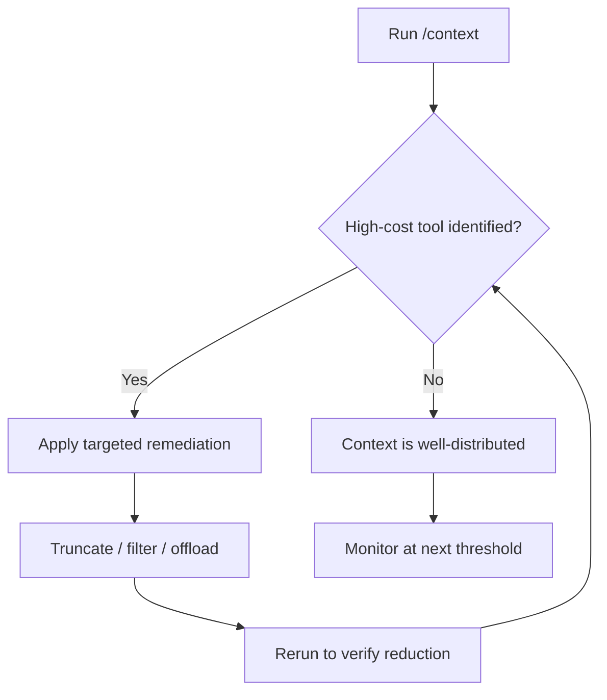

# Context-Window Diagnostic Tooling: Identifying Context-Heavy Tools

> Surface which tool calls are inflating the context window so you can optimize specific culprits rather than prune blindly.

## The Blind Optimization Problem

Agents accumulate context silently. Individual tool calls look cheap but compound: a large file read, verbose grep output, and an accumulated error trace can each inflate the window by thousands of tokens without any single call appearing expensive. Without per-tool attribution, you cannot tell whether the bottleneck is a file read, a search result, or an API response — so optimization becomes guesswork.

## Per-Tool Attribution

Claude Code's [`/context` command](https://code.claude.com/docs/en/changelog) (v2.1.74, 2026-03-12) surfaces exactly this: it identifies which tools are consuming the most context, flags memory bloat, and provides specific remediation suggestions alongside capacity warnings.

The command exposes:

- **Tool-level attribution** — which tool calls are consuming the most tokens
- **Memory bloat flags** — memory files that have grown unnecessarily large
- **Capacity warnings** — proximity to context limits with quantified headroom
- **Actionable tips** — specific suggestions per finding

This moves context management from reactive (compress when full) to diagnostic (identify and fix the culprit before compression becomes necessary).

## Common High-Cost Culprits

Per-tool attribution typically surfaces a short list of offenders:

| Tool type | Why it's expensive | Remediation |
|-----------|-------------------|-------------|
| Large file reads | Entire file enters context regardless of relevance | Truncate to relevant sections; use semantic loading |
| Verbose tool outputs | Grep results, build logs, test output without filtering | Add `--max-count`, pipe through filtering before surfacing |
| Accumulated error traces | Repeated errors with full stack traces compound quickly | Apply [error preservation](error-preservation-in-context.md) discipline — keep the first occurrence, drop duplicates |
| Memory files | CLAUDE.md or scratch files that grow unbounded across sessions | Periodically compact or reset memory entries |

## Diagnostic Flow

Run the diagnostic before applying [context compression strategies](context-compression-strategies.md). Compression without attribution risks discarding high-value content while leaving the actual inflator in place.

## Generalizing to Other Harnesses

The Claude Code `/context` command is the first known shipping implementation of per-tool attribution in a major AI coding harness [unverified — no other harness confirmed to surface this]. The pattern generalizes: any harness that tracks per-tool token contribution can expose the same diagnostic surface.

LangChain's Deep Agents framework monitors context budget thresholds and applies tiered compression, but attribution is internal to the compaction logic — it does not surface per-tool breakdowns to the developer [unverified — based on published documentation]. [Bui (2026)](https://arxiv.org/abs/2603.05344) describes OPENDEV's Adaptive Context Compaction, which logs context pressure beginning at 70% budget, but without per-tool attribution visible to the practitioner.

For harnesses without built-in diagnostics, instrument at the tool-call boundary: log token counts before and after each tool invocation, then aggregate by tool type to identify the distribution. A simple diff of token count per tool call surfaces the same attribution data.

## Key Takeaways

- Per-tool context attribution enables targeted optimization — you fix the culprit, not the symptoms.
- The most common high-cost tools are large file reads, verbose tool outputs, and unbounded memory files.
- Diagnose before compressing: compression without attribution can discard valuable content while leaving the inflator in place.
- For harnesses without built-in diagnostics, instrument token counts at the tool-call boundary.

## Related

- [Context Compression Strategies](context-compression-strategies.md)
- [Context Budget Allocation: Every Token Has a Cost](context-budget-allocation.md)
- [Observation Masking: Filter Tool Outputs from Context](observation-masking.md)
- [Manual Compaction as Dumb Zone Mitigation](manual-compaction-dumb-zone-mitigation.md)
- [Error Preservation in Context](error-preservation-in-context.md)
- [Context Window Dumb Zone](context-window-dumb-zone.md)
- [Context Window Anxiety](context-window-anxiety.md)
