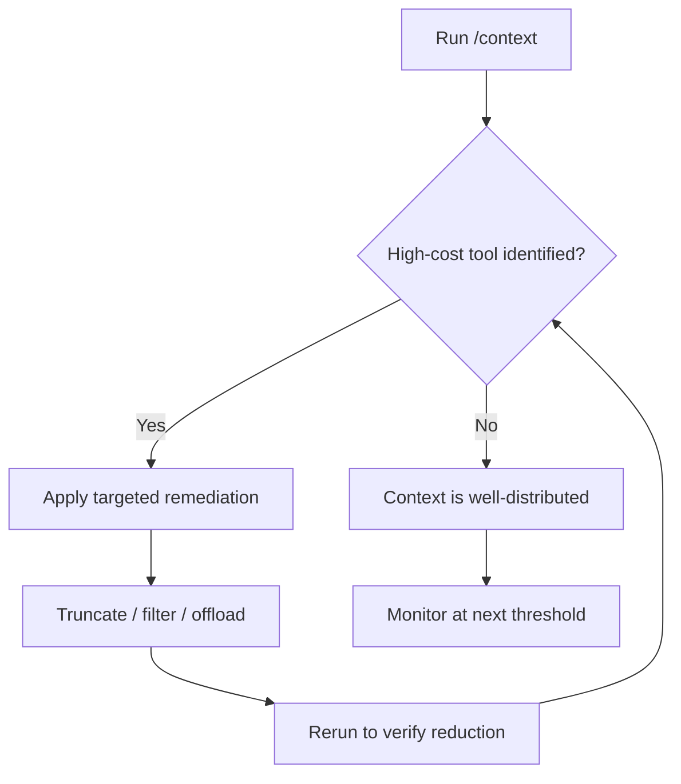

# Context-Window Diagnostic Tooling: Identifying Context-Heavy Tools

> Surface which tool calls are inflating the context window so you can optimize specific culprits rather than prune blindly.

Context-window diagnostic tooling is a class of commands that attribute token consumption to the specific tool calls, memory files, or outputs responsible — so an agent developer can shrink the actual culprit rather than guess. Claude Code's [`/context` command](https://code.claude.com/docs/en/changelog) (v2.1.74, 2026-03-12) is the first developer-facing example to ship in a major harness.

## The Blind Optimization Problem

Agents accumulate context silently. A large file read, verbose grep output, and an accumulated error trace each inflate the window by thousands of tokens without any single call appearing expensive. Without per-tool attribution, you cannot tell whether the bottleneck is a file read, a search result, or an API response — so optimization becomes guesswork.

## Per-Tool Attribution

The `/context` command identifies which tools are consuming the most context, flags memory bloat, and provides specific remediation suggestions alongside capacity warnings.

The command exposes:

- **Tool-level attribution** — which tool calls are consuming the most tokens
- **Memory bloat flags** — memory files that have grown unnecessarily large
- **Capacity warnings** — proximity to context limits with quantified headroom
- **Actionable tips** — specific suggestions per finding

This moves context management from reactive (compress when full) to diagnostic (identify and fix the culprit before compression becomes necessary).

## Common High-Cost Culprits

Per-tool attribution typically surfaces a short list of offenders:

| Tool type | Why it's expensive | Remediation |
|-----------|-------------------|-------------|
| Large file reads | Entire file enters context regardless of relevance | Truncate to relevant sections; use [semantic loading](semantic-context-loading.md) |
| Verbose tool outputs | Grep results, build logs, test output without filtering | Add `--max-count`, pipe through filtering before surfacing |
| Accumulated error traces | Repeated errors with full stack traces compound quickly | Apply [error preservation](error-preservation-in-context.md) discipline — keep the first occurrence, drop duplicates |
| Memory files | CLAUDE.md or scratch files that grow unbounded across sessions | Periodically compact or reset memory entries |

## Diagnostic Flow

Run the diagnostic before applying [context compression strategies](context-compression-strategies.md). Compression without attribution risks discarding high-value content while leaving the actual inflator in place.

## Generalizing to Other Harnesses

`/context` exposes tool-call attribution directly to the developer rather than compressing behind the scenes. No other major AI coding harness currently documents an equivalent developer-facing diagnostic. The pattern generalizes: any harness that tracks per-tool token contribution can expose the same surface.

LangChain's [Deep Agents framework](https://github.com/langchain-ai/deepagents) handles long contexts through auto-summarization but does not surface per-tool token breakdowns. [Bui (2026)](https://arxiv.org/abs/2603.05344) describes OPENDEV's Adaptive Context Compaction, which reduces older observations as usage grows — attribution logic is internal to the compactor, not visible to the practitioner.

For harnesses without built-in diagnostics, instrument at the tool-call boundary: log token counts before and after each invocation, then aggregate by tool type.

## Why It Works

Aggregate context metrics (total tokens used, percentage full) tell you *that* you have a problem but not *which tool* caused it. Token counts are additive and stable: each tool call appends a fixed delta that persists for the session. Per-tool attribution exposes the delta at invocation time, so skew is visible immediately — one tool type dominating the distribution pinpoints the bottleneck. The mechanism is measurement-then-act rather than compress-and-hope; the same principle as per-query profiling in databases.

## When This Backfires

Per-tool attribution is most useful when the expensive tool is also *avoidable*. It produces no actionable output when:

- **The tool cost is unavoidable** — a required full-repository scan or mandatory large-payload API response. Attribution identifies the culprit but offers no remediation.
- **Inflation is outside tool calls** — long conversation histories, large system prompts, or accumulated reasoning traces do not show up in per-tool attribution. The diagnostic reports modest tool costs while context is still full.
- **Short-lived or stateless agents** — if context resets between turns, instrumentation overhead rarely pays off; there is no compounding to diagnose.
- **Tool-sparse pipelines** — agents that call one or two tools repeatedly have a trivially uniform distribution; optimizing the single tool directly is faster.
- **The harness lacks attribution APIs** — most frameworks don't expose per-tool token counts. Manual instrumentation adds overhead and is impractical without dedicated observability infrastructure.

## Key Takeaways

- Per-tool context attribution enables targeted optimization — you fix the culprit, not the symptoms.
- The most common high-cost tools are large file reads, verbose tool outputs, and unbounded memory files.
- Diagnose before compressing: compression without attribution can discard valuable content while leaving the inflator in place.
- For harnesses without built-in diagnostics, instrument token counts at the tool-call boundary.

## Related

- [Context Compression Strategies](context-compression-strategies.md)
- [Context Budget Allocation: Every Token Has a Cost](context-budget-allocation.md)
- [Observation Masking: Filter Tool Outputs from Context](observation-masking.md)
- [Manual Compaction as Dumb Zone Mitigation](manual-compaction-dumb-zone-mitigation.md)
- [Error Preservation in Context](error-preservation-in-context.md)
- [Context Window Dumb Zone](context-window-dumb-zone.md)
- [Context Window Anxiety](context-window-anxiety.md)
- [Semantic Context Loading](semantic-context-loading.md)
