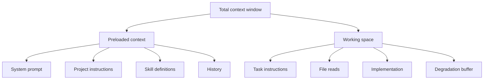

# Context Window Management: The Dumb Zone

> Output quality degrades as context fills, but the onset depends on task type — retrieval, reasoning, and code generation hit different thresholds.

!!! info "Also known as"
    **Context Rot**, **Context Window Dumb Zone**. For prescriptive allocation strategies, see [Context Budget Allocation](context-budget-allocation.md).

## What the Dumb Zone Is

As an agent's context fills, output quality drops. [Anthropic calls this "context rot"](https://www.anthropic.com/engineering/effective-context-engineering-for-ai-agents): pairwise token relationships stretch thin and reasoning quality degrades — "a performance gradient rather than a hard cliff" that appears "across all models."

## Why the 50% Rule Is Too Simple

The original heuristic — complete tasks within 50% of the context window — assumed degradation scales proportionally with window size. It does not. Degradation onset is closer to an **absolute token threshold** (roughly 32K-100K) than a fixed percentage, and varies sharply by task type.

[RULER](https://arxiv.org/abs/2404.06654) tested 17 models and found that larger claimed windows do not yield proportionally later degradation. Yi-34B (200K claimed) has only 32K effective context — 16%. GPT-4 (128K claimed) reaches 64K effective — 50%. Only half the models tested maintained satisfactory performance at 32K tokens.

## Task-Type Degradation Spectrum

Different task types degrade at different rates:

| Task Type | Benchmark | Effective Context | Finding |
|-----------|-----------|-------------------|---------|
| Simple retrieval (NIAH) | [Gemini 1.5 Technical Report](https://arxiv.org/abs/2403.05530) | >99% recall up to at least 10M tokens | Misleadingly optimistic for real tasks |
| Semantic retrieval | [NoLiMa](https://arxiv.org/abs/2502.05167) | 11/13 models below 50% baseline at 32K | Removing lexical cues causes collapse |
| Multi-hop retrieval | [RULER](https://arxiv.org/abs/2404.06654) | 16-50% of advertised window | Only best models reach 50% |
| Reasoning | [BABILong](https://arxiv.org/abs/2406.10149) | 10-20% of context window | "Popular LLMs effectively utilize only 10-20% of the context" |
| Code comprehension | [LongCodeBench](https://arxiv.org/abs/2505.07897) | Model-dependent (GPT-4.1 stable to 1M, others decline) | Some models improve with more context |
| Code bug fixing | [LongCodeBench](https://arxiv.org/abs/2505.07897) | Claude 3.5 Sonnet: 29% at 32K to 3% at 256K | Severe collapse for most models |

The [Chroma context rot study](https://research.trychroma.com/context-rot) confirmed that all 18 frontier models tested (including Claude Opus 4, GPT-4.1, Gemini 2.5 Pro) degrade with input length — non-uniformly by task type, similarity, and position, with no fixed threshold.

!!! warning "NIAH benchmarks are misleadingly optimistic"
    Standard needle-in-a-haystack tests use high lexical overlap between needle and question. [NoLiMa](https://arxiv.org/abs/2502.05167) removes this cue and finds 11 of 13 models drop below 50% baseline accuracy at just 32K tokens. Do not use NIAH results to justify large context loads.

## Practical Guidance

Size context budgets by task type, not a single percentage rule:

- **Retrieval-heavy tasks** (lookups, code search): Tolerate larger context loads, but prefer semantic similarity over stuffing.
- **Reasoning-heavy tasks** (multi-step planning, architecture): Keep total context under 32K tokens where possible. Effective window can be as low as 10-20% of the advertised limit.
- **Code generation and bug fixing**: Highly model-dependent. Test at your target context length before committing to a budget.

Claude Code's [auto-compaction triggers at ~95% of the context window](https://code.claude.com/docs/en/sub-agents#auto-compaction). Compact well before that — especially for reasoning tasks.

## Context Load Is Half the Problem

The dumb zone applies to total context, not just task instructions. System prompts, skill definitions, reference files, and conversation history all count. An agent starting a 20K-token task with 80K tokens of preloaded context is already in the degradation zone for reasoning tasks.

## Key Takeaways

- Context rot is a gradient, not a cliff — but starts earlier than most teams expect.
- Degradation onset is closer to absolute (~32K-100K tokens) than proportional to window size.
- Reasoning tasks degrade fastest (10-20% effective context); simple retrieval is most resilient.
- NIAH benchmarks dramatically overstate real-world context utilization.
- Size context budgets by task type, not a single percentage rule.

## Example

A Claude 3.5 Sonnet deployment uses a 200K-token context window. The team loads a 60K-token system prompt (role definition, tool specs, skill definitions), 20K tokens of project instructions, and 15K of recent conversation history — 95K preloaded before the first task token.

The agent then takes a multi-step reasoning task (architectural review): 5K task instructions + 30K of file reads = 35K task tokens. Total context: **130K tokens**.

According to BABILong benchmarks, reasoning tasks degrade to 10-20% effective utilization on most models. At 130K out of 200K (65% fill), the agent is operating well past the practical reasoning threshold. With Claude 3.5 Sonnet, code bug-fixing accuracy dropped from 29% at 32K to 3% at 256K — a similar degradation curve applies here.

**Revised budget**: Trim system prompt to 20K (remove rarely-used skills), limit history to 5K (rolling window), load only directly-relevant project files at 10K. Preloaded context drops to 35K, leaving 165K for the task — well inside the effective reasoning range.

## Unverified Claims

- The [claude-code-best-practice repository](https://github.com/shanraisshan/claude-code-best-practice) recommends manual `/compact` at 50%, but whether Anthropic endorses this specific threshold is unverified. [unverified]

## Related

- [Context Engineering: The Discipline of Designing Agent Context](context-engineering.md)
- [Context Budget Allocation: Every Token Has a Cost](context-budget-allocation.md)
- [Context Compression Strategies](context-compression-strategies.md)
- [Manual Compaction: Dumb Zone Mitigation](manual-compaction-dumb-zone-mitigation.md)
- [Lost in the Middle](lost-in-the-middle.md)
- [The Infinite Context](../anti-patterns/infinite-context.md)
- [Attention Sinks](attention-sinks.md)
- [Context Priming](context-priming.md)
- [Prompt Compression: Maximizing Signal Per Token](prompt-compression.md)
- [Observation Masking: Filter Tool Outputs from Context](observation-masking.md)
- [Layered Context Architecture](layered-context-architecture.md)
- [Discoverable vs Non-Discoverable Context](discoverable-vs-nondiscoverable-context.md)
