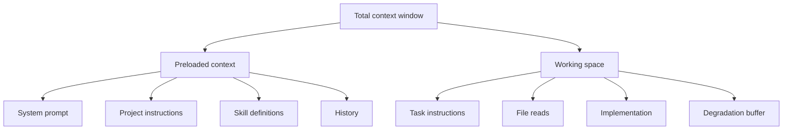

# Context Window Management: Understanding the Dumb Zone

> Output quality degrades as context fills, but the onset depends on task type — retrieval, reasoning, and code generation hit different thresholds.

Work through the [hands-on Dumb Zone lesson](https://learn.agentpatterns.ai/context-engineering/the-dumb-zone/), a guided walkthrough with quizzes.

!!! info "Also known as"
    Context Rot, Context Window Dumb Zone. For prescriptive allocation strategies, see [Context Budget Allocation](context-budget-allocation.md).

## What the dumb zone is

As an agent's context fills, output quality drops. [Anthropic calls this "context rot"](https://www.anthropic.com/engineering/effective-context-engineering-for-ai-agents): pairwise token relationships weaken and reasoning degrades. The result is "a performance gradient rather than a hard cliff" that appears "across all models."

## Why the 50% rule is too simple

The original heuristic — complete tasks within 50% of the context window — assumed degradation scales with window size. It does not. Degradation onset sits closer to an absolute token threshold (roughly 32K to 100K) than a fixed percentage, and it varies by task type.

[RULER](https://arxiv.org/abs/2404.06654v3) tested 17 models and found larger claimed windows do not yield proportionally later degradation. Yi-34B (200K claimed) has only 32K effective context — 16%. GPT-4 (128K claimed) reaches 64K effective — 50%. Only half the tested models maintained satisfactory performance at 32K tokens.

## Task-type degradation spectrum

| Task Type | Benchmark | Effective Context | Finding |
|-----------|-----------|-------------------|---------|
| Simple retrieval (NIAH) | [Gemini 1.5 Technical Report](https://arxiv.org/abs/2403.05530v5) | >99% recall up to at least 10M tokens | Misleadingly optimistic for real tasks |
| Semantic retrieval | [NoLiMa](https://arxiv.org/abs/2502.05167v3) | 11/13 models below 50% baseline at 32K | Removing lexical cues causes collapse |
| Multi-hop retrieval | [RULER](https://arxiv.org/abs/2404.06654v3) | 16-50% of advertised window | Only best models reach 50% |
| Reasoning | [BABILong](https://arxiv.org/abs/2406.10149v2) | 10-20% of context window | "Popular LLMs effectively utilize only 10-20% of the context" |
| Code comprehension | [LongCodeBench](https://arxiv.org/abs/2505.07897) | Model-dependent (GPT-4.1 stable to 1M, others decline) | Some models improve with more context |
| Code bug fixing | [LongCodeBench](https://arxiv.org/abs/2505.07897v3) | Claude 3.5 Sonnet: 29% at 32K to 3% at 256K | Severe collapse for most models |

The [Chroma context rot study](https://research.trychroma.com/context-rot) confirmed all 18 frontier models tested (including Claude Opus 4, GPT-4.1, Gemini 2.5 Pro) degrade with input length. Degradation is non-uniform: it varies by task type, similarity, and position, with no fixed threshold.

!!! warning "NIAH benchmarks are misleadingly optimistic"
    Standard needle-in-a-haystack tests use high lexical overlap between needle and question. [NoLiMa](https://arxiv.org/abs/2502.05167v3) removes this cue and finds 11 of 13 models drop below 50% accuracy at 32K tokens. Do not use NIAH results to justify large context loads.

## Practical guidance

Size context budgets by task type, not a single percentage rule:

- Retrieval-heavy tasks (lookups, code search): tolerate larger context, but prefer semantic similarity over stuffing.
- Reasoning-heavy tasks (multi-step planning, architecture): keep total context under 32K tokens where possible. The effective window can be 10-20% of the advertised limit.
- Code generation and bug fixing: highly model-dependent. Test at your target context length before you commit to a budget.

Claude Code's [auto-compaction triggers at ~95% of the window](https://code.claude.com/docs/en/sub-agents#auto-compaction). Compact well before that, especially for reasoning tasks. Towards Data Science describes [session-level "governed context" tactics for managing context rot in Claude Code](https://towardsdatascience.com/governed-context-managing-context-rot-in-claude-code/). These tactics deliberately govern and refresh what stays in the window before the token limit is reached, rather than waiting for auto-compaction to intervene.

## Context load is half the problem

The dumb zone applies to total context, not just task instructions. System prompts, skill definitions, reference files, and conversation history all count.

```mermaid
graph TD
    A[Total context window] --> B[Preloaded context]
    A --> C[Working space]
    B --> D[System prompt]
    B --> E[Project instructions]
    B --> F[Skill definitions]
    B --> G[History]
    C --> H[Task instructions]
    C --> I[File reads]
    C --> J[Implementation]
    C --> K[Degradation buffer]
```

## Key Takeaways

- Treat degrading output as a context-budget signal, not an isolated mistake — quality erosion starts earlier than most teams expect.
- Set the budget from the absolute range (roughly 32K to 100K tokens), then check it against your task type — a bigger advertised window does not buy proportionally more usable space.
- When budgets are tight, trim reasoning-task context first — it reaches its ceiling well before retrieval or code tasks reach theirs.
- Validate a context-window claim against a task-specific benchmark (RULER, NoLiMa, BABILong), not a NIAH headline number, before sizing a budget around it.

## Example

A Claude 3.5 Sonnet deployment uses a 200K-token context window. The team loads a 60K-token system prompt (role definition, tool specs, skill definitions), 20K tokens of project instructions, and 15K of recent conversation history. That is 95K preloaded before the first task token.

The agent then takes a multi-step reasoning task (architectural review): 5K task instructions + 30K of file reads = 35K task tokens. Total context: 130K tokens.

According to BABILong benchmarks, reasoning tasks degrade to 10-20% effective utilization on most models. At 130K out of 200K (65% fill), the agent is operating well past the practical reasoning threshold. With Claude 3.5 Sonnet, code bug-fixing accuracy dropped from 29% at 32K to 3% at 256K — a similar degradation curve applies here.

Revised budget: trim the system prompt to 20K (remove rarely-used skills), limit history to 5K (rolling window), and load only directly relevant project files at 10K. Preloaded context drops to 35K, leaving 165K for the task — well inside the effective reasoning range.

## When this backfires

The guidance to keep reasoning-task context under 32K tokens is conservative, and it may be too restrictive:

- Current-generation frontier models improve on this curve. Research benchmarks like RULER and BABILong reflect model generations from 2023 to 2024. Models released since then show measurable improvements at longer context lengths. Apply the 32K ceiling to the model version you actually deploy, not the benchmark generation.
- The 32K ceiling applies to reasoning tasks only. Applying it to retrieval-heavy or code-comprehension tasks discards legitimate context capacity — simple retrieval benchmarks show >99% recall well past 32K. Over-compacting these tasks adds needless summarization loss.
- Compaction has its own failure mode. [Compressing a long context into a shorter summary](context-compression-strategies.md) discards detail. For multi-step tasks that depend on specific prior outputs, aggressive compaction can drop critical intermediate state. Test compaction fidelity before you apply a blanket early-compact policy.
- The auto-compaction threshold is configurable. Claude Code's auto-compaction triggers at ~95%, and `CLAUDE_AUTOCOMPACT_PCT_OVERRIDE` lets teams lower it. Setting it to 50% is common advice, but it adds a fixed overhead cost on every session regardless of task type or actual degradation onset.

## FAQ

**Does the dumb zone only apply to what I put in the task prompt?**

No. It applies to total context, not just task instructions: system prompts, skill definitions, reference files, and conversation history all count against the same window. A deployment that preloads a 60K-token system prompt, 20K of project instructions, and 15K of recent history spends 95K tokens before the first task token arrives.

**Should I apply the 32K reasoning ceiling to every task?**

No — it applies to reasoning-heavy work only. Applying it to retrieval-heavy or code-comprehension tasks discards legitimate capacity. Simple retrieval benchmarks show over 99% recall well past 32K, and over-compacting adds needless summarization loss. Frontier models released since the benchmark generation also improve on the curve, so calibrate against the model version you actually deploy.

**Is compacting early always the safer choice?**

No. Compressing a long context into a shorter summary discards detail, and multi-step tasks that depend on specific prior outputs can lose critical intermediate state. Claude Code's auto-compaction triggers at about 95%, and `CLAUDE_AUTOCOMPACT_PCT_OVERRIDE` lets teams lower it. But a blanket 50% setting adds fixed overhead on every session regardless of task type. Test compaction fidelity first.

## Related

- [Context Engineering: The Discipline of Designing Agent Context](context-engineering.md)
- [Context Budget Allocation: Every Token Has a Cost](context-budget-allocation.md)
- [Context Compression Strategies](context-compression-strategies.md)
- [Manual Compaction: Dumb Zone Mitigation](manual-compaction-dumb-zone-mitigation.md)
- [Context Window Anxiety: Countering Premature Task Closure](context-window-anxiety.md)
- [Context Window Diagnostic Tooling](context-window-diagnostic-tooling.md) — observability for context fill; the measurement counterpart to this page's degradation mechanism
- [Lost in the Middle](lost-in-the-middle.md)
- [The Infinite Context](../patterns/anti-patterns/infinite-context.md)
- [Attention Sinks](attention-sinks.md)
